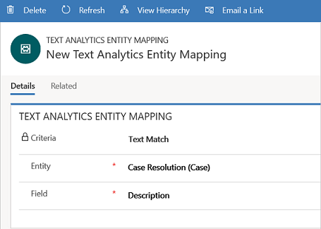
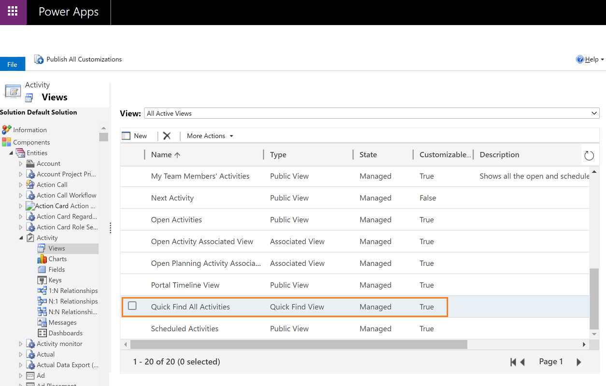
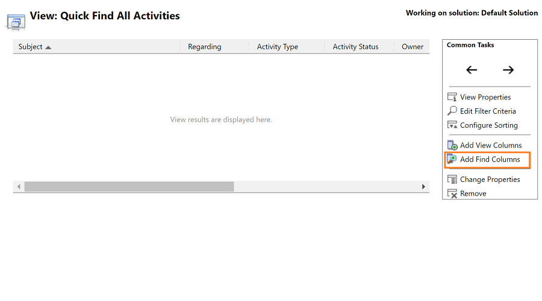
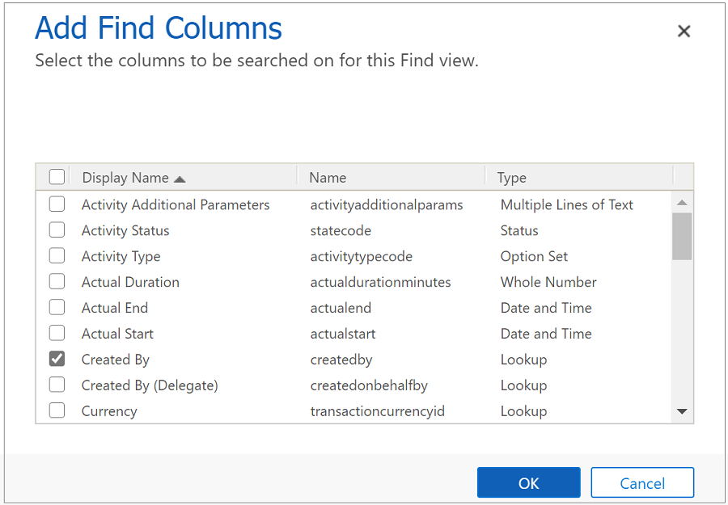
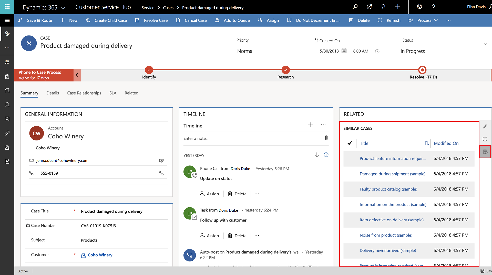

# Use advanced similarity rules to view similar case suggestions

Quickly support your customers by viewing similar cases suggestions in the Customer Service Hub. As an administrator, you can now configure criteria using advanced similarity rules, so that agents can view cases similar to their current case and resolve customer issues in first contact and within minimal time frame. This helps to reduce operational cost and in turn increase customer satisfaction.

If an agent is working on a support case, they can view similar cases in the **Related** section of the current case, and resolve their case quickly. With the help of Relevance search, they can use keywords or key phrases in a service case to quickly find related cases and use them to resolve customer issues.
  
## Similar case suggestion scenario

Gilda is resolving an issue where a customer is not able to book a travel package on the portal. To assist the customer quickly, she seeks guidance by looking for similar cases in the **Similar cases** tab in the **Related** section of the current case.

Based on configured data input, the Relevance search mechanism filters the cases using key phrases and suggests a list of cases that Gilda can refer. She selects a relevant case and glances through the details. She is able to resolve the customer issue with this suggested case. She can also link the case to the current case for future reference. 

## Create a new similarity rule to view similar cases

 Set up automatic suggestion of similar cases by creating advanced similarity rules. The rules you create use the Relevance search mechanism.

[!INCLUDE[proc_more_information](../includes/proc-more-information.md)] [Use Relevance Search for faster, comprehensive search results](../basics/relevance-search-results.md)

> [!IMPORTANT]
> It is recommended to enable Relevance search for your org to see the most accurate suggestions for similar cases. [!INCLUDE[proc_more_information](../includes/proc-more-information.md)] [Understand how relevance search impacts search results](#understand-how-relevance-search-impacts-search-results)

1. Make sure you have the Customer Service Manager, System Administrator, or System Customizer security role or equivalent permissions.  
  
    #### Check your security role
  
    - [!INCLUDE[proc_follow_steps_in_link](../includes/proc-follow-steps-in-link.md)]  
  
    - [!INCLUDE[proc_dont_have_correct_permissions](../includes/proc-dont-have-correct-permissions.md)]  

2. In the Customer Service Hub sitemap, go to **Service Management** > **Advanced Similarity Rules**.

   The **Advanced Similarity Rules** page is displayed.

3. Select **New** on the command bar to create an advanced similarity rule.  

4. In the **Details** tab:
   - Fill in the fields in the new advanced similarity rule dialog box:

     |                   Item                   |                                                                                                                                                                                                      Description                                                                                                                                                                                                      |
     |------------------------------------------|-----------------------------------------------------------------------------------------------------------------------------------------------------------------------------------------------------------------------------------------------------------------------------------------------------------------------------------------------------------------------------------------------------------------------|
     |             Name (required)              |                                                                                                                                                                                             The name of the rule.                                                                                                                                                                                              |
     |         Source Entity (required)         |                                                                                                Select Case entity for similar cases suggestions.                                                                                                |
     |               Description                |                                                                                                                                                                                         A description of the similarity rule.                                                                                                                                                                                         |
     |Noise Key phrases|Provide noise key phrases separated by a semicolon ( ; ). These phrases will be filtered while searching for a similar case| 
      |         Filter Result by Status          |                                                                                                                                          Filter records by status                                                                                                                                          |
     |||
    - Select **Save** to save the rule.
  

      

  1. In the **Match Fields** tab:

     - Select **New Text Analytics Entity Mapping** to add a related text analytics entity mapping record to this rule.
     - Fill in the details in the **Details** tab in the new record. These values are used to determine the keywords or key phrases from source records using relevance search to match with target records using text search. This helps to achieve keyword-based similarity between source and target records.  

       |   Item   |                                                                                                                                                                                                                                                                                                                                                                            Description                                                                                                                                                                                                                                                                                                                                                                             |
       |----------|--------------------------------------------------------------------------------------------------------------------------------------------------------------------------------------------------------------------------------------------------------------------------------------------------------------------------------------------------------------------------------------------------------------------------------------------------------------------------------------------------------------------------------------------------------------------------------------------------------------------------------------------------------------------------------------------------------------------------------------------------------------------|
       | Criteria |                                                                                                                                      **Exact match**: All fields except single-line and multi-line text fields can be enabled for exact match.   [!INCLUDE[proc_more_information](../includes/proc-more-information.md)] [Enable a field for exact matching of similar records](#enable-a-field-for-exact-matching-of-similar-cases)    **Text match**:   Text in these fields is used for finding key phrases to match. For example, if you select **Case Title** or **Description**, text in these fields will be matched.                                                                                                                                       |
       |  Entity (required)  |                                                                                                                                               Choose an entity from the drop-down list to be used to create a text search rule to find matching records in Dynamics 365 apps.                                                                                                                                              |
       | Field (required) | Choose the  field to be used to create a text search rule to find matching target records.    Two types of fields are used for similarity analysis:   **Structured fields**:  Used for exact match on a field to field basis. All fields except Multiple Lines of Text are available for exact match. Each field can be used only once.   **Text fields**: Only fields of type Text or Option Set are available. For Option Set, the  corresponding label in the language of the user is used. Text fields are used for fuzzy match in similarity analysis with keywords/key phrase extraction. Each field can be used only once. |
       |||

       

5. Select **Save** to save the rule.

6. Select **Activate** from the command bar to activate the rule.

Similarly, add more mappings to view a comprehensive search of related records.

### Understand how relevance search impacts search results

See the below table to understand how search results are impacted when Relevance search is enabled or disabled.

|Relevance search disabled  |Relevance search enabled  |
|---------|---------|
|Considering similarity rules, search is performed across primary field of an entity.  |   Considering attributes configured in similarity rules,  search is performed on entity attributes configured for relevance search.   |
|For example,  if similarity rules are configured on Title and Category, comma-separated attribute text is passed to look for a match in the Case title of case entity.     |  For example,    if similarity rules are configured on Title and Category, and Relevance search is enabled on Description, the search is performed for Title and Category in the Description field of case entity.     |
|  |         |

### Enable a field for exact matching of similar cases

 Follow the below steps to enable a field for exact match of similar cases.

1. In Customer Service Hub, go to **Settings** > **Advanced Settings**. 
  
2. Select the **Settings** > **Customizations**.

3. On the **Customizations** page, select **Customize the System**.
  
   The **Information** page is displayed.

4. In the left pane, expand **Entities**, go to the entity you want to customize, expand it, and then select **Views**.
  
   A view page with a list of items is displayed.

5. Double-click **Quick Find </entity name>** for the entity. (Note: You might need to scroll down to find this option.)
  
    
   
   A view page is displayed.
  
6. On the right-hand side, select **Add Find Columns**.
   
   
  
   The **Add Find Columns** page is displayed.
   
7. Select the checkbox for the entity you want to be an exact match field.

   

8. Select **OK**

   You're returned to the **Quick Find </entity name>** page.

9. Select **Save and Close**.

   You're returned to the **Settings** page.
   
9. Select **Publish All Customizations** to finish enabling exact matching for the field.

> [!NOTE]
 >
 > For a field to be eligible for exact matching, it must meet the following criteria:
 > - It can't be a Primary Key.
 > - It can't be these types: String, Memo, Picklist, Boolean, Whole Number, Two Options, Date and Time, or Floating Point Number.
 > - It can be these types: Lookup, OptionSet, Customer, Owner, Status, State, Status Reason.

## See similar case suggestions in the Customer Service Hub

You can view the similar case suggestions in the Related section of the Customer Service Hub.

[!INCLUDE[proc_more_information](../includes/proc-more-information.md)] [See and manage related records in the Related section](customer-service-hub-user-guide-basics.md#related-section)
  
1. In the Customer Service Hub, navigate to **Service** > **Cases** and open a case from the **My Active Cases** view.
  
2. Select the **Similar Cases** in the **Related** section to view cases similar to the current case.  
  
   

 > [!NOTE]
 >
 > The "similar cases" action is not available in the business process flow in Customer Service Hub. As a workaround, you can customize the business process flow to add the action. For information about customizing the business process flow, see [Add an action to a business process flow](https://docs.microsoft.com/power-automate/create-business-process-flow#add-an-on-demand-action-to-a-business-process-flow).

### See also  

[Enable AI suggestions for similar cases and knowledge articles](csw-enable-ai-suggested-cases-knowledge-articles.md)  
[Related section in the Customer Service Hub](customer-service-hub-user-guide-basics.md#related-section)  
[Configure Customer Service](configure-cs.md)  

[!INCLUDE[footer-include](../includes/footer-banner.md)]