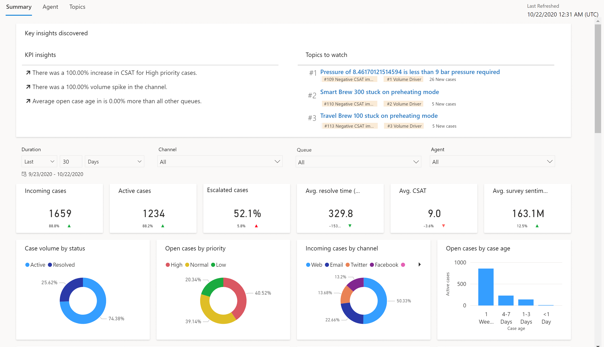
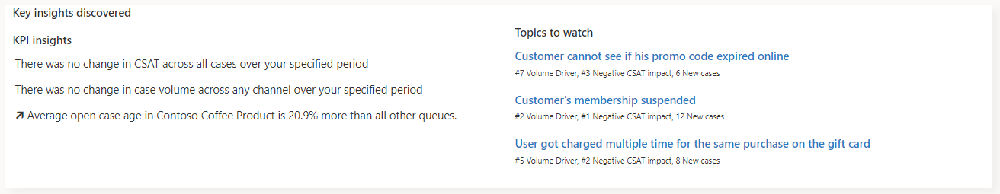

# Summary dashboard

The Summary dashboard gives you a broad overview of the customer service experience in your organization. It uses AI to provide insights into which topics are generating the highest volume and which topics are emerging with the highest rate of change in volume.

To view the Summary dashboard, go to customer service historical analytics and select **Summary** at the top of the workspace. 

The KPI summary dashboard includes a variety of charts with graphical views of your system's key performance indicators. 

The case volume drivers and emerging case volume by topic charts use natural language understanding to group support cases as topics that are a collection of related cases. These charts show you the customer support topics that are generating the most volume and emerging topics with the highest rate of change in volume, helping you identify areas for improvement that can have the greatest impact on system performance.

By default, the dashboard shows you KPIs for the past month and for all channels, queues, and agents in your system. The data filtering options allow you to select data for specific time periods, channels, queues, and agents. To filter data by duration, channel, queue, or agent, select a value from the respective drop-down list. 

> [!NOTE]
> If you switch to a different dashboard, the filter you specify persists and is applied to the data on all dashboards.

## Key insights card

The Key insights card has two areas.

- **KPI insights**: Important subjects that impact performance, such as CSAT pertaining to priority, volume pertaining to channel, and open cases pertaining to queues.

- **Topics to watch**: Topics that rank high across the three key areas to make it easier for customer service managers to discover top issues.
  

## Report details

The KPI summary charts summarize the key performance indicators for the specified time period and the percent change over the period. You can filter these areas by duration, channel, queue, and agent.

This table shows the key performance indicators that are displayed in the report.

| KPI    | Description     |
|----------|------------|
| Incoming cases    | The number of cases created to support customers.   |
| Active cases      | The number of cases that are currently open.        |
| Escalated cases   | The percentage of cases that have been escalated.   |
| Average resolve time    |   The average length of time taken by an agent to resolve the case.   |
| Average CSAT        | The average customer satisfaction score, based on Customer Voice survey submitted by the customer.   |
| Average survey sentiment   | The average sentiment score, based on Customer Voice survey written feedback submitted by the customer.   |

The following metrics are displayed in the charts.

| Chart    | Description     |
|----------|------------|
| Case volume by status    | A breakdown of case volume by status.   |
| Open cases by priority      | A case breakdown by priority level.        |
| Incoming cases by channel   | A case breakdown by channel.   |
| Open cases by age    |   A breakdown of cases by the amount of time in an open state.   |
| Average CSAT trend      | The year-over-year trend of case volume.   |
| Average survey sentiment trend   | The year-over-year trend of CSAT from Customer Voice survey responses.   |
| Top 10 volume topics      | The top 10 AI-discovered topics by case volume.   |
| Emerging case volume by topic      | The top emerging AI discovered topics based on increase in case volume .   |
| Case metrics by channel      | An overview of the core case metrics by channel.    |
| Case metrics    | Overview of core case metrics in relation to other metrics and date.   |

A blue up-and-down indicator next to the value indicates the percent change in a positive direction. A red indicator indicates the percent change in a negative direction.

### See also

- [Dashboard overview](customer-service-analytics-insights-csh.md)  
- [Agent dashboard](agent-dashboard-cs.md)  
- [Topics dashboard](topics-dashboard-cs.md) 

[!INCLUDE[footer-include](../includes/footer-banner.md)]