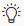
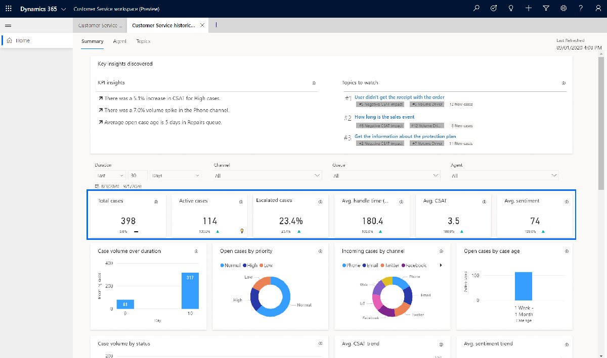

# Summary dashboard

The Summary dashboard gives you a broad overview of the customer service experience in your organization. It uses artificial intelligence (AI) technology to show you topics that are generating the highest volume and emerging topics with the highest rate of change in volume.

!(Summary dashboard](media/cs-insights-page.png "View the summary dashboard")

The KPI summary dashboard includes a variety of charts with graphical views of your system's key performance indicators. For information about each chart, click the link for the chart in the following list or scroll to locate the chart later in this topic. 

- [Key insights card](#key-insights-card) 
- KPI summary charts and additional KPI charts
- Case volume over duration chart
- Open cases by priority chart
- Incoming cases by channel chart 
- Open cases by base age chart 
- Case volume by status chart
- Avg. CSAT trend chart
- Avg. sentiment trend chart
- Top 10 volume topics chart
- Emerging case volume by topic chart
- Emerging case volume by topic chart
- Avg. incoming case time 24 hrs chart
- Case metrics by channel chart 

The Case volume drivers and Emerging topics charts use natural language understanding to group support cases as *topics* that are a collection of related cases. These charts show you the customer support topics that are generating the most volume and emerging topics with the highest rate of change in volume, helping you identify areas for improvement that can have the greatest impact on system performance.

By default, the dashboard shows you KPIs for the past month and for all products, channels, business units, and teams in your system. To change the time period, select a value from the **Time period** drop-down list at the top of the dashboard. You can select either past day, past week, or past month.

To filter data by product, channel, business unit, or team, select a value from the **Product**, **Channel**, **Business Unit**, or **Team** drop-down list. If you switch to a different dashboard, the filter you specify persists and is applied to the data on all dashboards. For more information on working with filters, see [Work with Customer Service Insights dashboards](use-dashboard-sample-data.md).

## Key insights card

The Key Insights Discovery card has two areas:

- KPI insights: Important subjects that impact performance 

- Topics to watch: Topics that rank high across the following three key areas are shown under **Topics to watch**, to make it easier for customer service managers to discover top issues:
  
- **Volume driver** shows topics with the largest volume of cases created in the selected time period.
- **Negative CSAT impact** shows topics that have the greatest negative impact on your total CSAT score. CSAT data is collected from surveys.
- The emerging rate gives you a "heads-up" about topics that have a high rate of new incoming cases in the selected time period.

When you select the light bulb , a short inline explanation of the reason for showing these topics is displayed with recommendations of possible actions to take.

## KPI summary charts

The KPI summary charts summarize the key performance indicators for the specified time period and the percent change over the period.

Description | Details
----------- | -------
Total cases | New cases created within the specified time period plus rollover cases (including all rollover cases that are active; and rollover cases that were resolved or canceled within the specified time period)
Resolutions | All cases resolved within specified time period
Escalations | All cases escalated within specified time period
SLA compliant | Of the total cases, the cases that are service-level-agreement (SLA) compliant (including rollover cases and new cases that are SLA compliant)
Average resolution time | The average resolution time of all cases resolved within specified time period
Average CSAT | The sum of customer satisfaction (CSAT) scores divided by the count of resolved cases that have CSAT values

A blue up-and-down indicator next to the value indicates the percent change in a positive direction. A red indicator indicates the percent change in a negative direction.

## Case breakdown chart

The Case breakdown chart shows the breakdown in support cases for the specified time period between new cases and backlog cases that were carried over from the previous time period. Backlog cases are support cases that were unresolved at the beginning of the specified time period.

Description | Details
----------- | -------
Case breakdown | Case breakdown by rollover cases (backlog) plus new cases for the specified time period

## Case priority chart

The Case priority chart shows the percentage breakdown for the specified time period between normal, low, and high-priority support cases.

Description | Details
----------- | -------
Case priority | Case breakdown by case priority

## Case channel chart

The Case channel chart shows the breakdown in support cases for the specified time period by support channel.

Description | Details
----------- | -------
Case channels | Case breakdown by channel

## Case tracking chart

The Case tracking chart shows the trend in the number of new support cases for the specified time period as well as the trend in the number of cases being resolved.

Description | Details
----------- | -------
New | The number of cases created each day for the specified time period
Resolved | The number of cases resolved each day for the specified time period

## Unresolved cases by age chart

The Unresolved cases by age chart shows the relative number of support cases for the specified time period by how many days ago they were created.

Description | Details
----------- | -------
Unresolved cases by age | Total unresolved cases by days unresolved

## Case volume drivers chart

The Case volume drivers chart uses artificial intelligence technology to group related support cases as support topics and then display topics in order of volume over the specified time period. This chart shows both the percent of total volume and number of cases for each topic.

Description | Details
----------- | -------
Topic | Artificial intelligence clustering of cases based on language understanding applied to case titles
Volume | The total cases associated with this topic divided by total cases
Total cases | The total cases associated with this topic

To see additional information about each topic, right-click the topic name, hover over **Drillthrough**, and then select **Topic drillthrough** to display the Topic details dashboard. For more information, see [Topic details dashboard](dashboard-topic-details.md).

## Emerging topics chart

The Emerging topics chart displays support topics that have a high volume of change in order of the change in volume over the specified time period. This chart shows the topics with high volume changes before they become popular topics.

Description | Details
----------- | -------
Topic | AI clustering of cases based on language understanding applied to case titles
Volume change | The incoming volume of cases associated with this topic in the current period minus the incoming volume of cases associated with this topic in the previous period
Total cases | The total cases associated with this topic

To see additional information about each topic, right-click the topic name, hover over **Drillthrough**, and then select **Topic drillthrough** to display the Topic details dashboard. For more information, see [Topic details dashboard](dashboard-topic-details.md).
