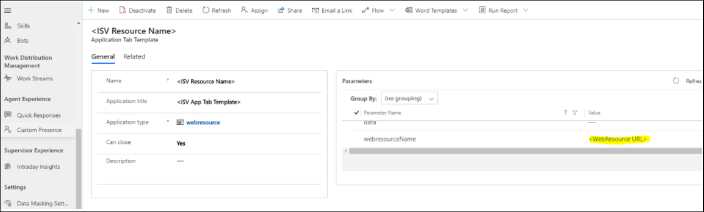
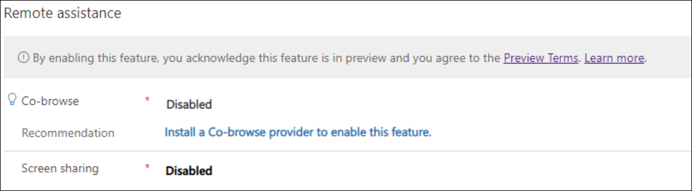
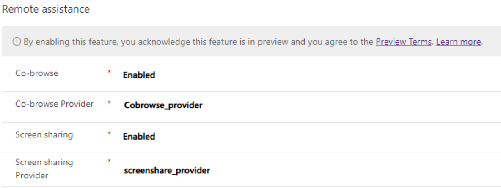

# Enable third-party co-browse and screen sharing

[!INCLUDE[cc-use-with-omnichannel](../includes/cc-use-with-omnichannel.md)]

Co-browse and screen sharing are escalation channels in the Chat channel of Microsoft Dynamics 365. A co-browse or screen-sharing escalation channel allows your organization’s agents to start a co-browse or screen-sharing session with customers. Using co-browse, agents can see and interact with a customer’s web browser. Using screen sharing, agents can see and interact with the customer’s current screen. This provides customers with an extra option to connect to an agent who can efficiently troubleshoot issues in real time.

Co-browse and screen sharing are enabled within Omnichannel Add-in for Dynamics 365 Customer Service chat channel by integration with third-party solutions.  Extensibility is provided to enable any providers to onboard their co-browse and screen-sharing solution to Omnichannel for Customer Service.

> [!NOTE]
> Third-party co-browse and screen sharing features are not available in Unified Service Desk.

## Prerequisites

- An active digital messaging or chat subscription. 
- Updated Omnichannel base and Omnichannel chat solution with third-party co-browse externalities enabled.

## Third-party co-browse and screen-sharing extensibility framework

To enable third-party co-browse and screen sharing, the Omnichannel for Customer Service application has added an extensibility system to support this feature. In this system, a few entities have been added to the Omnichannel for Customer Service solution, and third-party co-browse and screen-sharing providers should use these entities to enable their co-browse and screen-sharing feature in the Omnichannel for Customer Service framework. The following graph explains the basic entity relationships that support the third-party co-browse and screen-sharing feature.

> [!div class="mx-imgBorder"]
> 

Not all the above fields are required to be filled in for third-party co-browse and screen-sharing providers.  For version 1.0, ISVs are supported to bring their co-browse and screen-sharing feature into Omnichannel for Customer Service by enabling a button in the agent’s chat widget.  When a user selects this button, it opens an app tab within Omnichannel for Customer Service with the ISV's application website. To enable this button, ISVs need to bring the required data with their co-browse and screen-sharing solutions.

The following section lists the required entity data needed to support this feature. 

- **Conversation Actions entity (msdyn_conversationaction)** 

  The action that can be performed in the conversation.  
  
  **Fields**:  
  - Name (This is an identifier name for your button.) 
  - Event Name (Option set: Open App Tab Template, Send message, Customer Defined function. For third-party co-browse/screen-sharing feature, input **Open App Tab Template**.) 
  - Event Parameter (For the third-party co-browse/screen-sharing button, put the App Tab Template name here.) 
  - Order (Used to determine the positions for conversation actions. Admin can edit. Smallest number comes first.) 
  - Icon (A web resource URL that links to the button icon.) 

  **Fields classification and usage**:
  - This is the entity to store the action button metadata that is visible on the conversation control.  
  - Localized fields from relationships to Locale entity (label, tooltip, slash command) will be a subgrid in this conversation action form.  
  - Label, Order, Tooltip, Icon are used for rendering the button in the UI. Slash commands are used by agents to trigger conversation actions by typing the slash command in the chat box.   
  - Event Name, Web Resource, Event Parameter, and Function Name are used for handling the onButtonClick action.  

- **Conversation Action Locale entity (msdyn_conversationactionlocale)**  

  Localization information associated with the conversation action.  
  

  **Fields**:  
  - Label (The label of the button showing to users in conversation control.) 
  - Tooltip (Tooltip for that button.) 
  - Locale (Language key for that button.) 
  - Conversation Action (FK to conversation action entity.)  

- **Provider entity (msdyn_provider)** 

  A list of third-party providers that bring capabilities into the application.  
  
  **Fields**:  
  
  Name (ISV name)

- **Channel Capability entity (msdyn_channelcapability)** 
  
  The capability that a channel can enable, such as co-browse and screen sharing.  

  **Fields**:  
  - Name (provider_channelcapability relationship name)  
  - Escalation Channel Mode (Co-browse, Screen Sharing, Audio, Video, or None. For third-party co-browse and screen-sharing providers, use “Co-browse” or “Screen Sharing”.)  
  - Provider (FK to Provider entity)  
  - Conversation Actions (A lookup field for conversation actions. If there is no button created for a certain capability, then it can be empty. For the third-party co-browse and screen-sharing feature, link the channel capability to a conversation action record.  

 **Fields classification and usage**
 
 The Escalation Channel Mode attribute will tell what this button can do. For example, co-browse, audio, video. When users select a certain Escalation Channel Mode for a conversation action—for example, “co-browse”—Omnichannel for Customer Service will handle this co-browse event and trigger a list of internal events like “create new session for secondary channel,” “send system messages,” and “update presence,” which should be implemented in the Omnichannel for Customer Service code base.   

One provider can bring several channel capabilities, but for one Conversation Action and one Provider, the capability should be unique.  This is handled by using the Channel Capability entity, as shown in the following schema.

| Channel Capability | Provider | Escalation Channel Mode | Conversation Action |
|--------|--------|--------|--------| 
|ISV_screensharing  |ISV |Screen sharing | CA1 | 
| ISV_cobrowse | ISV | Co-browse | CA2 |

  
## UI rendering for the third-party co-browse and screen-sharing button 

Label, Order, Tooltip, and Icon are used for rendering a button in the UI. Users also can provide a slash command key for their button, but the slash command needs to be unique in the system.  Users need to input this data when bringing in their button.   

| Name | Label | Order |  Tooltip |  Slash command | Icon |
|----|----|----|----|----|----|
|ISVCobrowse  |ISV Co-browse | 0  | Start a Co-browse session provided by ISV | /cb | /webresource/…/…svg  |

## Event handlers for third-party co-browse and screen sharing

For third-party co-browse, ISVs need to input the conversation action data for triggering the Open App Tab Template event.  The Event Names are option sets. It can be a predefined omnichannel event that can be used for most cases, like Open App Tab Template or Send message.  In a third-party co-browse case, it will use the Open App Tab Template as Event Name and the Event Parameter can be the App Tab Template name. There will be no Web Resources data for this event because the App Tab Template framework will handle the web resource.  

| Name | Event Name | Event Parameter | Capability |   
| -----| -----| -----| ----- |
| ISVCobrowse | Open App Tab Template  | ISVAppTabTemplate  | Co-browse  |

## App Tab Template for third-party co-browse and screen sharing 

We encourage our integrated third-party co-browse providers to make their co-browse and screen-sharing applications inside of an Omnichannel for Customer Service tab. When the agent selects the **Co-browse** button in the chat widget, it will open this tab.  Inside of this tab, the agent can start and end the co-browse sessions and share the session invitations with customers.  You can include the data in this form inside of your solution.  Here are the manual steps for creating the App Tab Template:

1. Sign in to Dynamics 365 Customer Service and go to **Channel Integration Framework**. 
2. Go to **Templates** and then select **Application Tabs**. 
3. Select **New** to create a channel application tab.
4. In the Application type field, select **webresource**. 

In the Parameters section, add the web resource URL and query parameters that are required for ISVs to open their web resources. 

webresourcename: <URL path to the web resource>

> [!div class="mx-imgBorder"]
> 

There will be a single URL parameter called `data` that will contain a JSON object. This object when decoded and parsed will contain the `conversationId` field. This ID can be used to attach any data back to a conversation.

## Create the third-party co-browse and screen-sharing solution with the required data 

ISVs should bring in all the required data as specified in the [Third-party co-browse extensibility framework]() section and the [App Tab Template for third-party co-browse]() section to make this framework work. 

Here are the data input requirements for third-party providers:  

1. App Tab Template record.  
2. Conversation Action record. (If you have both co-browse and screen-sharing options, you can create two records, one for each.)  
3. Conversation Action Locale record. (For each conversation action you created, you should have at least one Conversation Action Locale record. The basic language we support is English.) 
4. Provider record.  
5. Channel Capability record. (If you have both co-browse and screen-sharing options, you can create two records, one for each.) 

These records (Conversation Action records, Conversation Action Locale records, Channel Capability records, Provider record, and Application Tab Template records) should be included as part of the solution you create as a third-party provider so that the end user doesn't need to create them manually.   

## Omnichannel administration experience for third-party co-browse and screen sharing  

We have created a new tab in Chat Widget called **Conversation Options**. Inside of this option is a section called **Remote assistance**.  The Omnichannel administrator will have the right to choose whether to enable or disable the third-party co-browse and screen-sharing options per chat widget. If there are no co-browse and screen-sharing providers installed in this organization, these two options are disabled as shown here.


> [!div class="mx-imgBorder"]
> 

> [!div class="mx-imgBorder"]
> 

> [!NOTE]
> The co-browse provider and screen-sharing provider are controlled separately.  You can install a co-browse provider by creating a co-browse channel capability record with required provider and conversation action data, the same as the screen-sharing provider.

When the organization has been provisioned with both options—that is, when it has two different channel capabilities installed—the admin can choose which third-party co-browse provider to use.  Also, it’s the admin’s choice whether to disable or enable these options. Here is the screenshot for admin enabled both options and selected the both providers. 

> [!div class="mx-imgBorder"]
> 


## Co-browse and screen-sharing button rendering in the agent chat widget 

When a co-browse and screen-sharing button is defined, it will be rendered at the top of the conversation control as shown here.


> [!div class="mx-imgBorder"]
> 

## Omnichannel session services and data flow for third-party co-browse and screen sharing


When an agent selects the button for co-browse or screen sharing, it triggers the application tab inside of the Omnichannel service. Omnichannel will handle the events as escalation channels event type. Omnichannel internal services will update the status for current session events.  

After the third-party applications take over, all data will be handled by a third-party application server. See the following graph for the integration data flow.


> [!div class="mx-imgBorder"]
> 

Some important events, such as starting or ending session events, should be reported to the Omnichannel service, so the overall service knows the status of the current agent. We provide third-party providers with this framework. It is the third-party providers’ responsibility to implement it in their codebase. The next section provides details on how to implement it. 

## Events expected from the third-party application 

The third-party application is expected to send events notifying Omnichannel for Customer Service of different milestones in the co-browse and screen-sharing session. Currently, these events are as follows: 

- CobrowseConnectedEvent (on connection of the co-browse session) 
- CobrowseEndedEvent (on end of the co-browse session) 
- ScreenShareConnectedEvent (on connection of the screen-sharing session) 
- ScreenShareEndedEvent (on end of the screen-sharing session) 

The events need to be dispatched within the third-party web resource to the `window.top` element.

 ```javascript
  function triggerCobrowseStart() {
    if(document.createEvent) {
      let params = {};

      let evt = new CustomEvent('CobrowseConnectedEvent', {detail: params});
      window.top.dispatchEvent(evt);
    }
  }

 ```

 The `CobrowseEndedEvent` and `ScreenShareEndedEvent` should be added to the `onbeforeunload` property of the web resource so that the session will be ended if the agent closes out of the tab within Omnichannel for Customer Service.

```html
<script>
function triggerCobrowseStop() {
  if(document.createEvent){

    let params = {};

    let evt= new CustomEvent('CobrowseEndedEvent', {detail:params});
    window.top.dispatchEvent(evt);
  }
}

</script>
</head>
<body onbeforeunload="return triggerCobrowseStop()">
</body>
```

## Provisioning and deprovisioning requirements 

To provision the third-party co-browse and screen-sharing solution for our customers, ISVs should provide a solution with the required data. When customers install the solution, minimal or no manual steps are required of them to enable the co-browse and screen-sharing feature. We require ISVs to be responsible for the data they created and to follow our guidance as required.  

To deprovision the third-party co-browse and screen-sharing solution for our customers, ISVs should remove the solution along with the data created with this framework. There shouldn’t be any existing legacy data or code remaining in that org after deprovisioning.   

## Publishing strategy

The following are links for publishing the application to AppSource: 

[AppSource onboarding](https://appsource.microsoft.com)

[Onboarding guide](https://docs.microsoft.com/azure/marketplace/cloud-partner-portal/business-applications-isv-program) 

[ISV Studio](https://aka.ms/isvstudio)

[Overview Guide PDF](https://aka.ms/bizappsisvprogram) 

[Agreement PDF](https://aka.ms/bizappsisvaddendum) 

[Policies PDF (Includes benefit table)](https://aka.ms/bizappsisvpolicies)

[Program page on partner.microsoft.com site with links to certificate info](https://aka.ms/bizappsisvweb)

[Customer/partner support](https://aka.ms/marketplacepublishersupport)
 
## Third-party providers responsibility and data disclaimer 

Be sure to publish the privacy policy link to AppSource for security and privacy protection of the personal information that would be processed, and provide a compliant approach to data protection. 
