# Troubleshoot issues in Omnichannel for Customer Service

[!INCLUDE[cc-use-with-omnichannel](../includes/cc-use-with-omnichannel.md)]

[!INCLUDE[cc-omnichannel-administration-deprecation-note.md](../includes/cc-omnichannel-administration-deprecation-note.md)]

Use the following list of troubleshooting sections to quickly find information to solve your issue.

## The instance isn't available to select on the provisioning application 

### Issue

For security, reliability, and performance reasons, Omnichannel for Customer Service is separated by geographical locations known as "regions". The provisioning webpage only displays instances in the same region, so you might experience issues where you don’t see all the instances from the Organization selector if you have instances in more than one region, and you provision Omnichannel for Customer Service without selecting the correct region.

### Resolution

Go to the Power Platform admin center (https://admin.powerplatform.microsoft.com/). Expand Resources, and select Dynamics 365. Select the region in the upper-right corner and select a new region from the dropdown list.

   > [!div class=mx-imgBorder]
   > 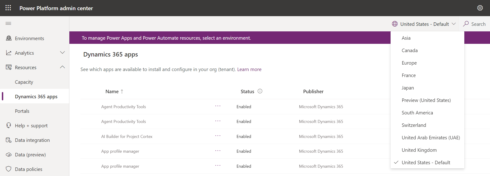

The portal will reload when you change the region. After it has finished reloading, go to **Applications** > **Omnichannel for Customer Service**, and then do the provisioning steps.

The provisioning application you're directed to is associated with the region you chose, and all instances located in that region are displayed as options for provisioning.

   > [!div class=mx-imgBorder]
   > 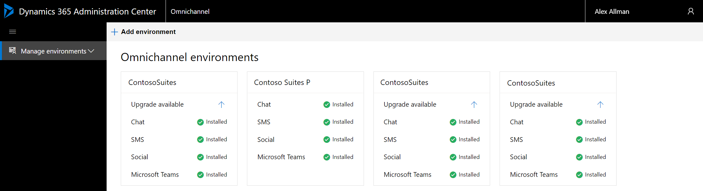

## Omnichannel provisioning fails due to expired Teams service principal

### Issue

 When you're provisioning Omnichannel for Customer Service, the following errors are displayed:

-  **Unable to perform the requested operation due to lack of permissions**, if the user is logged in as a System Administrator on a child business unit instead of the root business unit.
- **Request validation failed. Failed to execute action in CRM for selected environment**, if the user doesn't have read privileges for System roles.

### Resolution

- Check the permissions for the user and change the business unit of the system user to root business unit.
- Ensure that the user is assigned at least one security role, preferably Omnichannel Administrator, other than the System Administrator role.
### Issue

If your tenant has an expired Microsoft 365 license, then the provisioning of Omnichannel for Customer Service will fail in your organization.

### Resolution

To avoid the provisioning failure, you must remove the Microsoft Teams service principal and Skype Teams Calling API Service in Azure Active Directory (Azure AD), and add it back. Follow these steps to remove the services:

1. Identify the services in Azure AD.
2. Use PowerShell to remove Microsoft Teams and Skype Teams Calling API Service.
3. Add the service principal back.

#### Identify the services in Azure AD

1. Sign in to the [Azure portal](https://portal.azure.com/).
2. Select **Azure Active Directory** in the left pane.
3. Select **Enterprise Applications**.
4. In the search criteria, select **All Applications** and **Disabled** in **Application Type** and **Application Status**.
5. In the search box, enter the application ID `cc15fd57-2c6c-4117-a88c-83b1d56b4bbe` for Microsoft Teams.

   > [!div class=mx-imgBorder]
   > 

6. In the result that appears, copy the **Object ID**, and save it. Ensure that the application ID is  `cc15fd57-2c6c-4117-a88c-83b1d56b4bbe` as this ID is same for every tenant.

7. Now, search for Skype Teams Calling API Service by entering its application ID `26a18ebc-cdf7-4a6a-91cb-beb352805e81` in the search box.

   > [!div class=mx-imgBorder]
   > 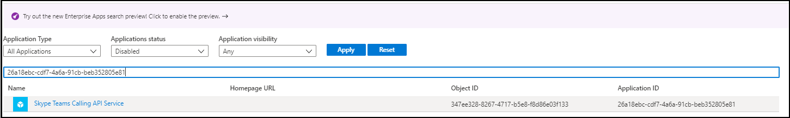

8. In the result that appears, copy the **Object ID**. Make sure that the application ID is `26a18ebc-cdf7-4a6a-91cb-beb352805e81`.

#### Use PowerShell to remove Microsoft Teams and Skype Teams Calling API Service

1. Select **Start**, type **PowerShell**, and right-click **Windows PowerShell** and select **Run as administrator**.   
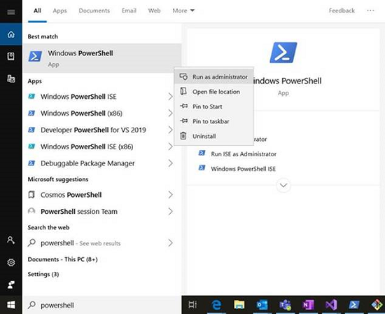

2. Select **Yes** on the **User Control** dialog to allow the application to make changes.
3. Type the `Install-Module AzureAD` command in the PowerShell window, and press **Enter**. This command installs the PowerShell commands for interacting with Azure Active Directory.  

4. PowerShell prompts whether to trust the repository. Type **Y** for yes and press **Enter**.   
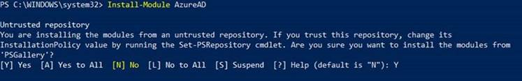

5. Type the `Connect-AzureAD` command in the PowerShell window, and press **Enter**.
This establishes a connection with the tenant's Azure Active Directory, so you can manage it using PowerShell.
6. Sign in to your organization as a tenant admin.
7. Run the `Remove-AzureADServicePrincipal -ObjectID <ObjectID>` command in the PowerShell window twice, one each for Microsoft Teams and Skype Teams Calling API Service. Replace **`<ObjectID>`** with the object ID you had stored earlier. This command deletes the expired Teams service and Skype Teams Calling API Service from Azure Active Directory.

   > [!Note]
   > Right-click in the PowerShell window to paste the Object ID.

The Microsoft Teams Service and Skype Teams Calling API Service are removed from your organization. You can try to provision Omnichannel for Customer Service again.

#### Add the service principal for the Permission service app

After removing the expired Microsoft Teams license from the tenant, you can add the chat to the tenant again by doing the following steps:

1. Run the following commands in the PowerShell window:

   `Login-AzureRmAccount`

   `$appId="6d32b7f8-782e-43e0-ac47-aaad9f4eb839"`

   `$sp=Get-AzureRmADServicePrincipal -ServicePrincipalName $appId`
   
   `if ($sp -eq $null) { New-AzureRmADServicePrincipal -ApplicationId $appId }`

   `Start-Process "https://login.microsoftonline.com/common/adminconsent?client_id=$appId"`

2. In the browser window that appears, sign in to your organization as a tenant admin to grant the admin consent.

   > [!NOTE]
   > Ignore the error page that appears with the message "no reply URLs configured".

3. Sign in to the [Azure portal](https://portal.azure.com/) as a tenant admin to enable Azure AD for user sign-in.

4. Go to **Azure Active Directory** > **Enterprise Applications**.

5. In the search box, enter **6d32b7f8-782e-43e0-ac47-aaad9f4eb839** for the application ID. The Permission Service O365 is listed.

6. Select the app, go to the **Properties** tab, and turn on the **Enabled for users to sign-in** toggle.

The chat is added to the tenant again.

## Errors occur when I try to open Omnichannel for Customer Service or Customer Service workspace with Omnichannel enabled  

### Issue

As an agent, when you log in to the Omnichannel for Customer Service application or when you log in on Customer Service Workspace with Omnichannel enabled, you see error messages.

### Resolution

When you open the Omnichannel for Customer Service application or Customer Service workspace with Omnichannel enabled, the system performs various tasks, including signing in to Omnichannel, preparing for notifications, and setting your presence. If the system encounters any errors while performing these operations, they're displayed on the user interface.

If you get any of the errors listed below, check if Security Defaults is turned on. If it is turned on, the agent should have the right authentication set up. Alternatively, Security Defaults can be switched off if it is not required.

To learn more about Security Defaults, see [What are security defaults?](/azure/active-directory/fundamentals/concept-fundamentals-security-defaults).

If your tenant is configured with Azure Security Defaults, make sure your users have multi-factor authentication set up on their accounts. Otherwise, they might run into a single sign-on error. To learn more about Azure Security defaults, see [What are security defaults ?](/azure/active-directory/fundamentals/concept-fundamentals-security-defaults)

### Error messages 

  - There was a problem with your single sign-on account. Please sign out of all Microsoft Dynamics 365 apps and sign in again. If this continues, have your administrator contact Microsoft Support with client session ID.

  - Something went wrong while authenticating—please try again. If this continues, have your administrator contact Microsoft Support with the client session ID.

  - We couldn't get your authentication token—please try again. If this continues, have your administrator contact Microsoft Support with the client session ID.

  - We couldn't set up notifications—please try again. If this continues, have your administrator contact Microsoft Support with the client session ID.

  - We couldn't set up presences—please try again. If this continues, have your administrator contact Microsoft Support with the client session ID.

  - Something went wrong while setting up your workspace—please try again. If this continues, have your administrator contact Microsoft Support with the client session ID.

  - We couldn't set up presences due to missing roles. Ask your administrator to grant you Omnichannel roles. If the situation continues, have your administrator contact Microsoft Support with the client session ID. To learn more about security roles, see [Assign roles and enable users for Omnichannel for Customer Service](add-users-assign-roles.md). 

  - We couldn't get your authentication token. Your Teams subscription has expired, please contact your admin to renew it. If this continues, have your admin contact Microsoft Support with the Client Session ID:{0}. To resolve the issue, follow the steps in [Omnichannel provisioning fails due to expired Teams Service Principal](#omnichannel-provisioning-fails-due-to-expired-teams-service-principal).

## Social data doesn't sync and prevents record identification for return users

### Issue

The data flush for the **Social Profile** entity is blocked. Customer information, including social profiles and contact details, aren't syncing properly in the environment. Data for returning customers isn't available. 

### Resolution
Ensure that the toggle for preventing social data in Dynamics is turned off. More information: [Manage feature settings](/power-platform/admin/settings-features)

1. Open Power Platform admin center, and then navigate to **Environments** > [select an environment] > **Settings** > **Product** > **Features**.

1. Ensure that in the Power BI **Embedded chat** settings, the toggle for the **Prevent social data in Dynamics** setting is set to **Off**.

    > [!div class="mx-imgBorder"]
    > 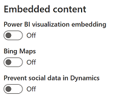
 

## Error occurs when I try to create a chat widget or social channel 

### Issue

Omnichannel solutions are installed in your environment when you receive a new trial organization. However, when you try to create a chat widget, Facebook page, or social channel in the Omnichannel Administration app, error messages similar to the following messsages might be displayed:

- An error occurred in the PreLiveChatConfigCreatePlugin plug-in.
- An error occurred in the PostOperationFacebookCreatePlugin plug-in.

### Resolution

These errors occur because though the solutions are already installed in your environment, they need to be activated before you can start using them. To provision the solutions, perform the steps outlined in [Provision Omnichannel for Customer Service](omnichannel-provision-license.md).

## Unable to deploy custom solution containing Agentscript solution

### Issue

When you try to deploy a custom solution, it fails on account of a dependency on the Agentscript solution, which is part of Omnichannel for Customer Service.

### Cause

The Agentscript solution has been deprecated and was not present in the target environment. It has been replaced by the msdyn_Agentscripts solution.

### Resolution

 We recommend that you remove all references of the Agentscript solution from the custom solution, and then reimport the solution.

## Power Virtual Agents bot conversations appear as active on dashboard even after customer has ended chat

### Issue

Conversations for Power Virtual Agents bot cannot be ended in Omnichannel for Customer Service and therefore will be seen as active on the supervisor dashboard even after they have been closed.

### Resolution 

You can configure a context variable that will explicitly end the bot conversation in Omnichannel for Customer Service after customers close the chat window. In Power Virtual Agents, create a standalone topic for CloseOmnichannelConversation context variable with the variable property set to global. Invoke the topic in another topic that you've configured for the bot.

Though the conversation will be closed in Omnichannel for Customer Service, it will not be closed in Power Virtual Agents and appear in the **Escalation rate drivers** KPI in **Power Virtual Agents Analytics** dashboard.

> [!IMPORTANT]
> Make sure that you have access to Power Automate to configure a flow so that the bot conversation in Omnichannel for Customer Service can be ended.

To configure ending a bot conversation, perform the following steps:

1. In Power Virtual Agents, for the selected bot, configure a new topic.
2. Select **Go to authoring canvas**, and in **Add node**, select **Call an action**, and then select **Create a flow**.
3. On the Power Automate window that opens on a new tab, do the following steps:
   1. In the **Return value(s) to Power Virtual Agents** box, select **Add an input**, and then select **Yes/No**.
   2. In the **Enter title** box, enter CloseOmnichannelConversation, which is the Omnichannel for Customer Service context variable name.
   3. In the **Enter a value to respond** box, select the **Expression** tab, and then enter **bool(true)** to build the expression, and select **OK**.
   4. Save the changes, and then exit Power Automate.
4. In the topic that you were editing, select **Call an action** again, and then in the list, select the flow that you created. 
5.  In **Add node**, select **End the conversation**, and then select **Transfer to agent**.
        > 
6. Go to the topic in which you need to invoke the topic for ending the bot conversation in Omnichannel for Customer Service, and use the **Go to another topic** option in **Add a node**.
7. Select the topic that you created for ending the bot conversation.
8. Save and publish the changes.

Additionally, you can configure automated messages in Omnichannel for Customer Service that will be displayed to the customer after the conversation ends.

## Agent transfers from Power Virtual Agents bots display a banner that required variables and actions are missing.

### Issue

An error message  similar to the following message is displayed on the Power Virtual Agents dashboard when you're configuring the handoff between Power Virtual Agents bot and the Omnichannel voice workstream:

"Your bot doesn't have access to all the required variables and actions. Ask your admin about installing the Omnichannel package or follow this step-by-step walkthrough".

### Resolution

If the following extensions aren't installed, you'll see a message that your bot doesn't have access to the variables or actions it needs. These extensions provide out-of-the-box actions or variables in the Power Virtual Agents authoring canvas that make the authoring experience easier for the bot author.

   - [Power Virtual Agents telephony extension](https://appsource.microsoft.com/product/dynamics-365/mscrm.mspva_telephony_extension)
   - [Omnichannel Power Virtual Agent extension](https://appsource.microsoft.com/product/dynamics-365/mscrm.omnichannelpvaextension)
   - [Omnichannel Voice Power Virtual Agent extension](https://appsource.microsoft.com/product/dynamics-365/mscrm.omnichannelvoicepvaextension)

## Chat widget icon does not load on the portal

### Issue

Chat icon doesn't load on the portal. The chat icon URL that was configured as default doesn't load.

### Resolution

You can use an icon of your choice by specifying the link of the icon in the **Chat widget** configuration page. Perform the steps outlined in [Configure a chat widget](add-chat-widget.md#configure-a-chat-widget).

## Chat not getting initiated on starting a new chat from portal

### Issue

A message stating **Sorry, we're not able to serve you at the moment** is shown to the customers when they start a chart on the portal. The possible issues might be one of the following scenarios:

- Agents not configured in the queue.
- Allowed Presence isn't updated in the work stream: The default work streams that are shipped out-of-the-box, doesn't have **Allowed Presence** values in the work stream.

   > [!div class=mx-imgBorder]
   > 

### Resolution

As an administrator, make sure of the following details:

- Check that agents have been added to the queues. For information on adding agents to queues, see [Create queues in Omnichannel admin center](queues-omnichannel.md#create-a-queue-for-unified-routing)

- For the associated workstream, check that the **Allowed Presence** option has values in the **Work distribution** area. More information: [Configure work distribution](create-workstreams.md#configure-work-distribution)

## Chat widget does not load on the portal

### Issue

Chat widget does not load on the portal. There are multiple reasons this may happen. This section includes five possible resolutions.

> [!div class="mx-imgBorder"]
> 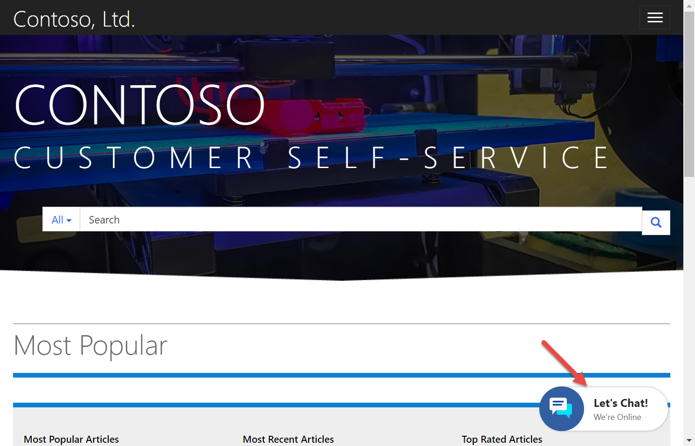

### Resolution 1: Location option

The Location option for the chat widget might be configured incorrectly.

Delete the location in **Widget location**, and then recreate it.

To delete and add **Widget location** for the chat widget, do the following steps:

1. Sign in to the **Omnichannel Administration** app.
2. Go to **Administration** > **Chat**.
3. Select a chat widget from the list.
4. Select the **Location** tab.
5. Select a record in the **Widget Location** section, and then select **Delete**.
6. Select **Save**.
7. Select **Add** in the **Widget Location** section to add a record. The quick create pane of the chat widget location appears.
8. Specify the following details.

   | Field | Value |
   |---------------------------|-----------------------------------------|
   | Title | Type the title of record. |
   | Value | The website domain where the chat widget must be displayed. The domain format should not include the protocol (http or https). For example, the website is  `https://contoso.microsoftcrmportals.com. Now, the value is  `contoso.microsoftcrmportals.com. | 
10. Select **Save** to save the record.
11. Go to the website and check whether the chat widget loads.

> [!Note]
> The chat widget requires session storage and local storage to be functional in your browser. Make sure you have cookies enabled in your browser so these services can work properly.

### Resolution 2: Remove location

Alternatively, try removing the chat widget location.

> [!div class="mx-imgBorder"]
> 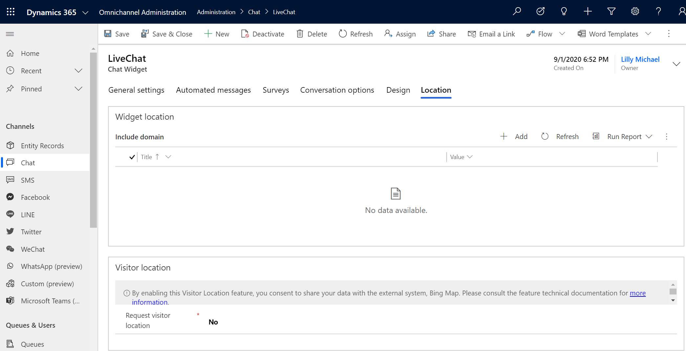

### Resolution 3: Clear portal cache

Clear the portal cache by doing the following steps:

1. Go to your portal and sign in as a portal administrator.

    > [!div class="mx-imgBorder"]
    > 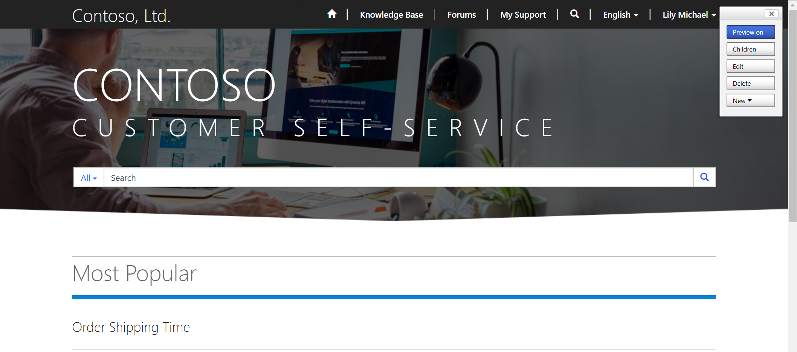

2. Add the following text to the end of your portal URL:

      /_services/about

    For example: 

      https://contoso.powerappsportals.com/_services/about

3. Select **Clear cache**.

    > [!div class="mx-imgBorder"]
    > 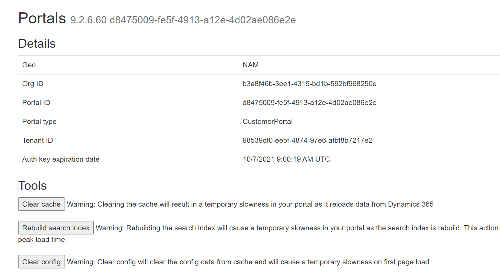

4. Reload the portal.

   Also, make sure that your web browser allows third-party cookies. 

### Resolution 4: Sync portal configurations

To sync portal configurations, do the following steps: 

1. Go to [https://make.powerapps.com](https://make.powerapps.com).

2. Find and select your portal, and then choose **Edit**.

    > [!div class="mx-imgBorder"]
    > 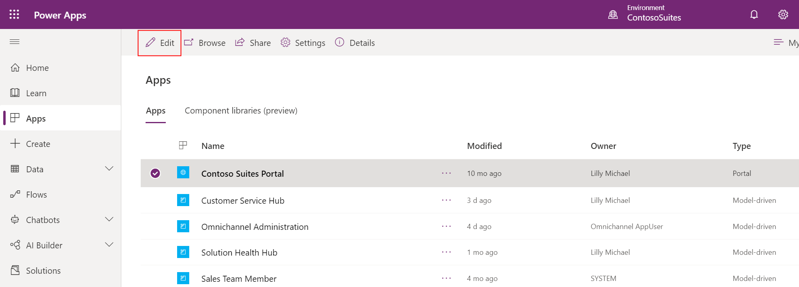

3. Select **Sync Configuration**.

    > [!div class="mx-imgBorder"]
    > 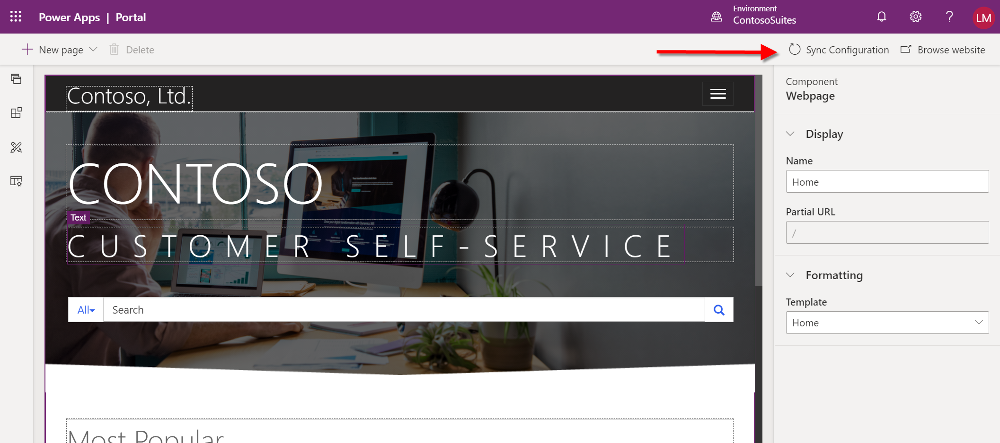

### Resolution 5: Restart portal

Restart the portal by doing the following steps:

1. Go to [https://make.powerapps.com](https://make.powerapps.com).

2. Select your portal, and then under **Advanced options**, choose **Settings > Administration**. 

    > [!div class="mx-imgBorder"]
    > 

3. Select **Restart**.

    > [!div class="mx-imgBorder"]
    > 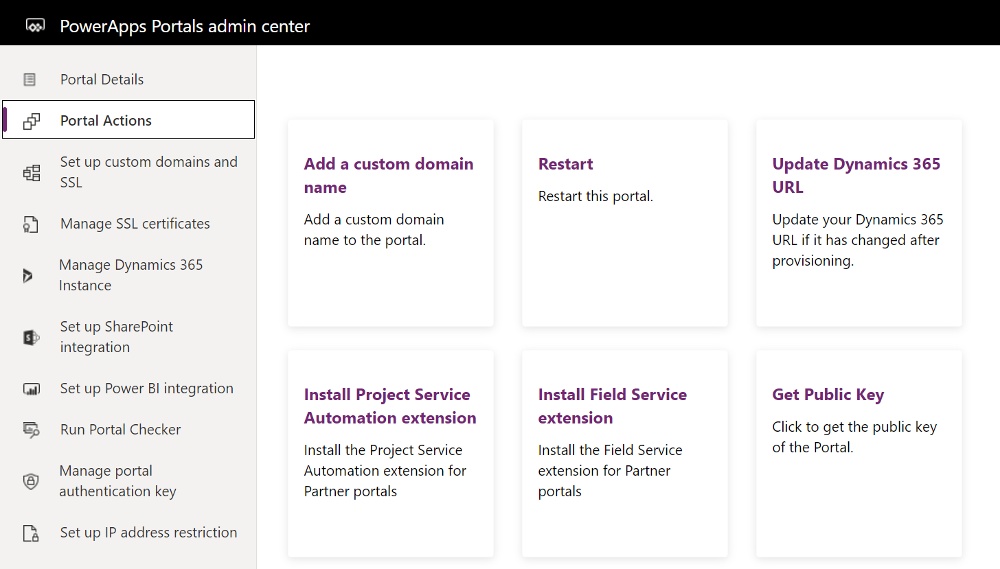

## Agents not receiving chat in Omnichannel for Customer Service

### Issue

As an agent, you aren't receiving chat in the Omnichannel for Customer Service app. The issue is caused when you receive the chats in Customer Service Hub app.

### Resolution

You must remove the Customer Service Hub app from the channel provider configuration in the Channel Integration Framework app.

1. Sign in to **Channel Integration Framework**.
2. Select the record that is related to omnichannel.
3. Remove **Customer Service Hub** from the **Select Unified Interface Apps for the Channel** section.
4. Select **Save** to save the record.

## Conversation is stuck in wrap-up state

### Issue

As an agent or a supervisor, you see that some conversations are stuck in the wrap-up state in your Omnichannel Agent Dashboard or Omnichannel Ongoing Conversations Dashboard. 

### Resolution

When conversations are ended by the agent or customer, they transition to the wrap-up state. In order to close the conversation, the primary agent assigned to the conversation needs to close the conversation in the session panel. To learn more about closing sessions, see [Manage sessions in Omnichannel for Customer Service](./oc-manage-sessions.md#close-a-session). To learn more about the wrap-up conversation state, see [Understand conversation states in Omnichannel for Customer Service](./oc-conversation-state.md#wrap-up).

## Dashboards do not appear in Omnichannel for Customer Service active dashboards view

### Issue

When you use the Omnichannel for Customer Service app on Unified Service Desk or on web, the **Active Omnichannel Agent Dashboard** view doesn't show certain dashboards like Tier 1 Dashboard, Tier 2 Dashboard, Knowledge Manager, and My Knowledge Dashboard.

### Resolution

As a system customizer or administrator, you must manually add these dashboards using app designer.

To add the dashboards using app designer, follow these steps:

1. Go to `https://<orgURL>.dynamics.com/apps`.
2. Select the ellipsis (**...**) button in the **Omnichannel for Customer Service** app tile.  
    
3. Select **OPEN IN APP DESIGNER**. The App Designer opens in a new tab.
4. Select **Dashboards** in the canvas area. The **Components** pane in the right side shows the list of **Classic Dashboards** and **Interactive Dashboards**.
5. Select the following dashboards under **Interactive Dashboards**. 
    - Knowledge Manager
    - My Knowledge Dashboard
    - Tier 1 Dashboard
    - Tier 2 Dashboard  
    
6. Select **Save** and then select **Publish**.

## Agent dashboard isn’t loading or is giving an authorization error

### Issue

The issue might happen due to the following reasons:

- Azure Active Directory consent is not available for Omnichannel for Customer Service app.
- Agent doesn't the Omnichannel agent role privileges.
- Agent is not assigned to any queue.

### Resolution

Perform the following steps:

- Contact your administrator to verify that Azure Active Directory consent is given to the Omnichannel for Customer Service application on your tenant. Go to [Authorize access](https://go.microsoft.com/fwlink/p/?linkid=2070932) to get access. To learn more, see [Provide data access consent](omnichannel-provision-license.md#provide-data-access-consent).
- Ensure the agent account has the role **Omnichannel Agent**. For more information about the relevant roles, see [Understand roles and their privileges](add-users-assign-roles.md#understand-roles-and-their-privileges). 
- Ensure the agent account is assigned to at least one queue in the Omnichannel Administration app. To learn more, see [Manage users in Omnichannel for Customer Service](users-user-profiles.md).

## An error occurred in the communication panel

### Issue

After you sign in to the Unified Service Desk client application, you see the following error message.

**An error occurred in the Communication panel. Restart Unified Service Desk and try again. (Error Code - AAD_ID_MISMATCH - Azure ADID mismatched with logged-in user id)**

   > [!div class=mx-imgBorder]
   > 

While signing in to Unified Service Desk, you must enter the Customer Service app credentials to sign in, and then again, you're shown a dialog to enter credentials to connect to Dataverse server.
When you enter different credentials, this issue occurs. 

### Resolution

If you use **Chrome process** to host applications, go to `C:\Users\<USER_NAME>\AppData\Roaming\Microsoft\USD` and delete the **CEF** folder. Now, sign in to Unified Service Desk client application and try again.

## Communication panel doesn't load in Omnichannel for Customer Service app

### Issue

Communication panel doesn't load in Omnichannel for Customer Service app:

- When a record doesn't exist in the Channel Integration Framework app.
- When configurations don't sync.

### Resolution

- Create a Channel Integration Framework record with the following values. 

   | Field | value |
   |-------------------------------------------|--------------------------------------------------|
   | Name | Omnichannel |
   | Label | Omnichannel |
   | Channel URL | \<Chat control cdn url>?uci=true&env=`<env>`&ocBaseUrl=\<oc endpoint\>&ucilib=\<crm org url\>/webresources/Widget/msdyn_ciLibrary.js |
   | Enable Outbound Communication | No |
   | Channel Order | 0 |
   | API Version | 1.0 |
   | Select Unified Interface Apps for the Channel | Omnichannel for Customer Service |
   | Select the Roles for the Channel | <li>Omnichannel administrator</li>  <li>Omnichannel agent</li> <li>Omnichannel supervisor</li> |

   To learn how to create a record, see [Configure a channel provider for your Dynamics 365 organization](/dynamics365/customer-engagement/developer/channel-integration-framework/configure-channel-provider-channel-integration-framework).

- To sync the configurations, remove the channel and roles, add them again and save the record.

   1. Sign in to the Dynamics 365 apps.
   2. Select the dropdown button on Dynamics 365 and select **Channel Integration Framework**.
   3. Select the **Omnichannel** record from the list.
   4. Remove **Omnichannel for Customer Service** from the **Select Unified Interface Apps for the Channel** section.
   5. Add **Omnichannel for Customer Service** again in the **Select Unified Interface Apps for the Channel** section.
   6. Remove **Omnichannel agent**, **Omnichannel supervisor**, and **Omnichannel administrator** from the **Select the Roles for the Channel** section.
   7. Add **Omnichannel agent**, **Omnichannel supervisor**, and **Omnichannel administrator** again in the **Select the Roles for the Channel** section.
   8. Select **Save** to save the record.
   9. Sign in to Omnichannel for Customer Service app and check if the communication panel loads.

## User presence isn’t loading or user is shown as unknown

### Issue

The issue might happen due to the following reasons:

- Cookies are blocked in the browser.
- Azure Active Directory consent isn't available for Omnichannel for Customer Service app.
- Agent doesn't have the Omnichannel agent role privileges.
- Capacity and default presence are not set.
- When you deploy or update the Customer Service workspace app profile, the Channel URL field in the Dynamics 365 Channel Integration Framework 2.0 settings for omnichannel gets overwritten. After a deployment, the Channel Integration Framework product might point to a different URL. So, check and ensure that the Channel URL field in Dynamics 365 Channel Integration Framework 2.0 always points to the correct URL.
- Channels are not activated in the agent experience profile. 

### Resolution

Perform the following steps:

- Ensure that cookies are not blocked in the browser in any mode so that agent and supervisor presence can work properly.
- Contact your administrator to verify Azure Active Directory consent has been given to the Omnichannel for Customer Service application on your tenant. More information: [Provision Omnichannel for Customer Service](omnichannel-provision-license.md)
- Ensure that the agent account has the **Omnichannel Agent** role assigned. More information: [Assign roles and enable users in Omnichannel for Customer Service](add-users-assign-roles.md)
- Ensure that the agent account has values set for **Capacity** and **Default presence**. More information: [Create and manage users and user profiles](users-user-profiles.md)
- Ensure that the Channel URL field in Dynamics 365 Channel Integration Framework 2.0 points to the correct URL. More information: [Configure a third-party channel provider](channel-integration-framework/v2/configure-channel-provider-app-profile-manager.md#configure-a-third-party-channel-provider)
- Ensure that you turn on all active channels in the agent experience profile. More information: [Assign users, templates, configure productivity pane, channels](../app-profile-manager/create-agent-experience-profile.md#assign-users-templates-configure-productivity-pane-channels)

## Pre-imported Unified Service Desk configurations in Customer Service organization

### Issue

Dynamics 365 Customer Service organization that you create from **demos.microsoft.com** have pre-imported sample Unified Service Desk configuration.

If you import the Unified Service Desk - Omnichannel for Customer Service package without deleting the existing configuration in the new demo org, you see an error after signing in to Unified Service Desk client application. The reason for the issue is multiple sample Unified Service Desk configurations can't exist in a Customer Service instance.

   > [!div class=mx-imgBorder]
   > 

### Resolution

You must delete the existing sample solutions before importing the Omnichannel for Customer Service - Unified Service Desk package. The pre-imported sample solutions are as follows:

- USDISHCustomization or USDWebClientCustomization (one of these solutions would be present depending on the org template)
- USDUnifiedInterfaceCustomization
- DynamicsUnifiedServiceDesk
- UiiForMicrosoftDynamicsCRM

After you delete the solutions, import the Unified Service Desk - Omnichannel for Customer Service package.

To delete the solutions, follow these steps:

1. Sign in to the Dynamics 365 instance.
2. Choose **Settings** > **Solutions** on the nav bar.
3. Select one of the solutions on the **Solutions** page by selecting the check box, and then choose **Delete**. You're prompted to confirm uninstalling a managed solution. Choose **OK** to proceed.  
   - USDISHCustomization or USDWebClientCustomization (one of these solutions would be present depending on the org template)
   - USDUnifiedInterfaceCustomization
   - DynamicsUnifiedServiceDesk
   - UiiForMicrosoftDynamicsCRM
      > [!NOTE]
      > You must delete the solutions in the following order:
      > 1. USDISHCustomization or USDWebClientCustomization
      > 2. USDUnifiedInterfaceCustomization
      > 3. DynamicsUnifiedServiceDesk
      > 4. UiiForMicrosoftDynamicsCRM2011
      > 
      >  You must follow the order to remove the solutions because some of the components in the solution depend on the components in the other solution.
4. After the solution is removed, repeat the steps to delete the other solutions.

## Unable to launch Unified Service Desk client application

### Issue

When you sign in to Unified Service Desk, you see the following error. 

**APPLICATION_HOST_ERR_NO_CONFIGURED_APPS: applications are configured for your use.**

   > [!div class=mx-imgBorder]
   > 

The issue is due to the package deployment failure.

### Resolution

You must deploy the Unified Service Desk - Omnichannel for Customer Service package again. To learn more, see [Deploy Unified Service Desk – Omnichannel for Customer Service package](../unified-service-desk/oc-usd/omnichannel-customer-service-package.md#deploy-unified-service-desk---omnichannel-for-customer-service-package).

## Conversation control becomes blank

### Issue

Conversation widget becomes blank while swapping between browser tabs in Google Chrome or Chromium-based Microsoft Edge.

### Resolution

Upgrade your browser version as per the system requirements of Dynamics 365 Channel Integration Framework version 2.0. To learn more, see [System requirements](channel-integration-framework/v2/system-requirements-channel-integration-framework-v2.md).

## After Omnichannel for Customer Service is provisioned, I get an authentication error on the agent dashboard. 

### Issue

The following error message is displayed on the agent dashboard after I provision Omnichannel for Customer Service.

**Something went wrong while authenticating—please try again. If this continues, have your administrator contact Microsoft Support with the client session ID.**

### Resolution

The issue occurs when you rename the org URL but don’t update the channel URL after you've provisioned Omnichannel for Customer Service. 

1. Go to [https://make.powerapps.com](https://make.powerapps.com).

2. On the left pane, select **Apps**, and then from the applications list, select **Omnichannel for Customer Service**. 
3. Select the ellipsis (...) button, scroll down the list, and select **App profile manager**.

4. Select the admin app like Customer Service admin center, and then select **Channel provider**.
   The Active Channel Providers list is displayed.

5. Do the following steps:
    - Make sure that the omnichannel channel provider record is listed and is in the active state. 
     If the omnichannel record isn't active, select the record, and then select **Activate** on the menu bar.
    - On the **General** tab of the omnichannel record, make sure that the **Channel URL** field includes the org information as shown in the following example:  
   `https://oc-cdn-ocprod.azureedge.net/convcontrol/ChatControl.htm?uci=true&clientName=zfp&cloudType=Public&env=prod&ocBaseUrl=https://org749544d7-crm.omnichannelengagementhub.com&ucilib=https:// <org>.crm.dynamics.com/webresources/Widget/msdyn_ciLibrary.js`

 
[!INCLUDE[footer-include](../includes/footer-banner.md)]
