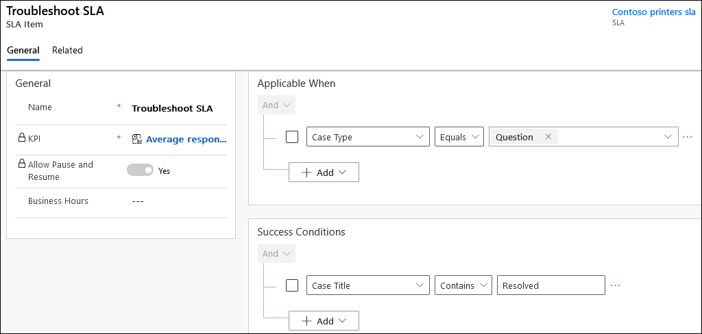

# Troubleshoot issues in service-Level agreements in Customer Service

## Warn and fail duration times are incorrect for the SLA

Why do I see that some service-level agreements (SLAs) don't take into account daylight saving time for warn and fail duration?

### Reason

If your SLA was created in the web client that is now deprecated, the business schedule calendar does not support daylight saving time.

### Resolution

To use the daylight saving time functionality and many other new features, migrate your SLAs created in the web client to Unified Interface. More information: [Migrate automatic record creation rules and service-level agreements](migrate-automatic-record-creation-and-sla-agreements.md).

## SLA timer does not pause when its state is changed from InProgress to OnHold on a holiday

Once triggered, the SLA timer continues to run even when its state is changed from *InProgress* to *OnHold*.

### Reason

If a holiday is configured, the status of the case is updated to *OnHold* to pause the case SLA. However, the pause functionality associated with the *OnHold* status doesn't appear to function correctly. Therefore, the timer continues to run even on a holiday when it should be paused.

So, it includes the holiday hours, non-working hours, and pause time (only business hours) while projecting the SLA warning time or failure time.

### Resolution

The functionality is intended. Your organization defines business hours while scheduling working days and holidays. SLA warning time and failure time adhere to those settings and are calculated based on the defined hours.

See the following scenarios to understand how the SLA *Warn* and *Failure* time is calculated:

- Create a case during non-working hours. Pause and resume the case before working hours start. Hold time between *Pause* and *Resume* will not be considered.
- Create a case during non-working hours. Pause and resume the case during working hours. Hold time will be considered and *Warn* and *Failure* time will be extended based on hold time.
- Create a case during working hours. Pause the case during working hours. Resume the case during non-working hours. Hold time will not be considered for *Warn* and *Failure* time.
- Create a case during working hours. Pause the case during non-working hours and resume it during working hours. *Warn* time and *Fail* time will be recalculated.

## SLA KPI instance status shows as canceled

When you update the target record such that “Applicable when” condition is no more applicable, the SLA KPI status moves from one of the existing states of "in progress", "succeeded", "nearing non compliance", or "expired" to the "canceled" state. The SLA KPI instance is canceled on the second evaluation because the “Applicable when” condition is no longer met. Consider the following scenario in which you create an SLA with the following conditions and set it as the default SLA.

- **Applicable when:** Case status equals active
- **Success condition:** Case status equals resolved

1. Create a case. The case status is set to active by default, the SLA is applied, and the SLA timer starts.

2. Resolve the case. The case status is set to resolved, and the SLA is reevaluated for the "Applicable when" condition. The SLA KPI instance status will be set to "canceled."

### Reason

When you define the Applicable When" and "Success Conditions" on the same attribute, such as "case status", one of the criteria might not be met, and the SLA KPI instance status will be canceled.

### Workaround

In such scenarios, we recommend that you don't define the "Applicable When" and "Success Conditions" on the same attribute.

## Success, warning, and failure actions are being run multiple times in web client

When updates are made to the target record, the attributes present in the "Applicable When" conditions of the SLA item are modified in the applied SLA.

Consider a scenario in which you've created an SLA in the web client with an SLA item that has the following "Applicable When" and "Success Conditions", and is set as the default.
> 

1. Create a case with case type set as question. The SLA timer starts.

2. Add "resolved" to case title. The success condition is met and the following events occur:

   - SLA KPI instance status is updated to succeeded.
   - A success action, such as send mail, is run, if configured.

3. Update the case type to request.

  - The SLA KPI instance that is in the succeeded status is reevaluated because the "applicable when" attribute is changed.
  - The SLA KPI instance moves from succeeded to "in progress".
  - Because the case title contains resolved and the success condition is true, the SLA KPI instance status changes from "in progress" to "succeeded", again, and runs the success action again.

Based on the SLA KPI instance status, if any actions are configured, those actions will be run multiple times.

### Reason

When the "Applicable when" attribute is  updated, the SLA is reevaluated that results in multiple iterations of the actions.

### Resolution

This is expected behavior for SLAs in the web client. We recommend that you define the "Applicable when" condition on only those attributes whose values don't change frequently.

### See also

[Track SLA details with Timer Control](customer-service-hub-user-guide-case-sla.md#track-sla-details-with-timer-control)  
[Define service-level agreements](define-service-level-agreements.md)  

[!INCLUDE[footer-include](../includes/footer-banner.md)]