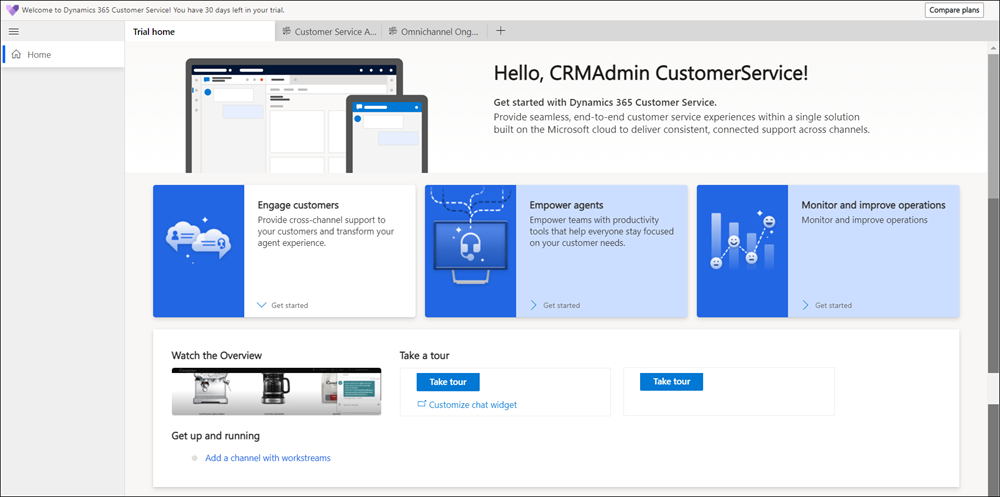

---  
title: "Sign up for a free trial–Customer Service | MicrosoftDocs"
description: "Learn how to quickly sign up for and start a free Dynamics 365 Customer Service trial. Explore the app with tours and videos, and find additional learning resources."
author: neeranelli
ms.author: nenellim
ms.date: 06/30/2021
ms.topic: get-started
ms.custom: template-trial-setup
ms.reviewer: shujoshi
---

# Sign up for a free trial

Dynamics 365 Customer Service offers a 30-day free trial. After a quick sign up, you will have access to many of the app's key features. The trial allows you to test the app, load sample data, and even try out your own customer data. [Learn more about what Customer Service has to offer](/dynamics365/customer-service/overview)

**To sign up for the trial**:

- Go to the [Try Dynamics 365 Customer Service](https://dynamics.microsoft.com/get-started/free-trial/?appname=customerservice) and select the **Get started** button.
- Then, follow the onscreen guidance to enter the [email associated with your Microsoft account](https://support.microsoft.com/windows/what-is-a-microsoft-account-4a7c48e9-ff5a-e9c6-5a5c-1a57d66c3bfa) and your contact information.

The trial will take a few moments to load, then you will be ready to start using Customer Service.

Your free trial home page.

**What can you do on the home page?**

Voila! Start your journey here. Use the guided tour to get familiar with how the cases flow.

Try out the chat as an agent to know how agents close the loop faster.

Check out the video to see how supervisors monitor the conversations to improve operations.

## Experience for a trial user

Customer Service uses a Microsoft Dataverse environment to store and manage data. Provisioning an environment typically takes 15 to 60 minutes to complete. While an environment is getting provisioned, some functionalities aren't available, but you can perform minimal operations and explore the product. After the environment is provisioned, all functionalities become available. More information: [What is Dataverse](/powerapps/maker/common-data-service/data-platform-intro) and [Environments overview](/power-platform/admin/environments-overview)

This section lists all the functionality that will be restricted until an environment is provisioned. These restrictions apply to only for:

- The default environment.
- The trial users and the users who purchase Customer Service through Microsoft 365 admin center.

### What you can do while an environment is being provisioned?

- Try the demo chat experience as an agent and customer that is available on the home page.
- [Understand how agents manage their cases and work on them](csw-overview.md).

### What you can't do while an environment is being provisioned?

Configure and use social, SMS, or the Microsoft Teams channels in Omnichannel for Customer Service.

## What to try

The trial environment includes many of the same features as the paid version. The following links will guide you through using some of the key features.

- [Understand how agents manage their cases and work on them](csw-overview.md).
- [View AI-suggested cases and knowledge articles for a case](csw-view-ai-suggested-cases-knowledge-articles.md).
- [Explore the agent dashboard](oc-agent-dashboard.md).
- [Understand the agent communication pane for conversations](oc-conversation-control.md).
- [Know more about chat notifications](oc-notifications.md).
- [View AI-suggested cases and knowledge articles for a conversation](oc-view-ai-suggested-cases-articles.md).
- [View how supervisors monitor agent conversations](ongoing-conversations-dashboard.md).

## Additional resources

[Explore training on Microsoft Learn](/learn/browse/?filter-products=dynamics-customer-service)  
[Watch videos on the product playlist](https://www.microsoft.com/en-us/videoplayer/embed/RE41po2?maskLevel=0)  
[Trial FAQ](trial-faq.md)  