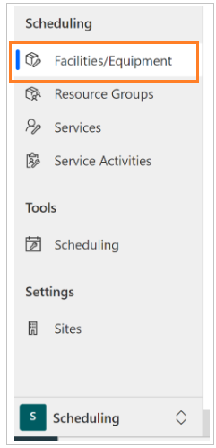
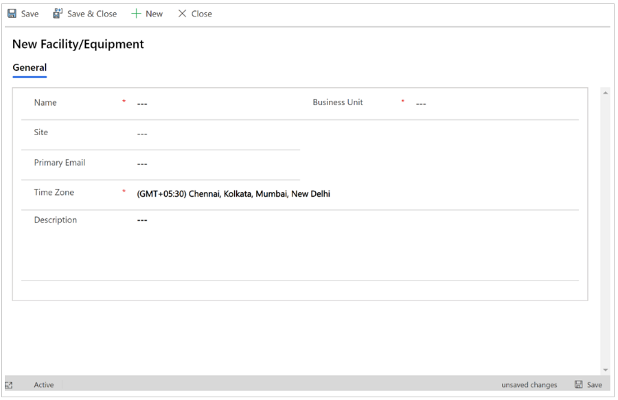
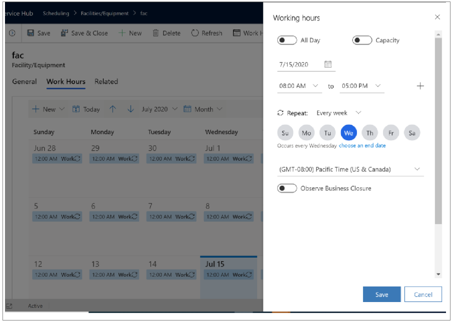

# Add facilities and equipment resources

Facilities and equipment are resources you use to perform services for your customers. Facilities can be physical spaces like service bays or conference rooms, and equipment could be tools or other assets. Add these resources to Dynamics 365 Customer Service to ensure optimal services to your customers.

## Add facilities or resources

Before you begin, make sure you have the **System Administrator** security role or equivalent permissions in Microsoft Dynamics 365. 

1. Navigate to **Customer Service Hub** > **Scheduling** tab.

2. Select **Facility/Equipment**.

   

3. Select **New**.

3. Fill in the information as required:
  
  - **Name**: Enter the name of the facility or equipment you want to add for service scheduling.
  
  - **Business Unit**: Dynamics 365 Customer Service enters the business unit automatically. To select a different business unit, select the **Lookup** button, and then select the business unit from the list.

  - **Site**. Select the location where the facility or equipment is located.
  
  > [!Note]
  > Make sure the site and customer are in the same location. Resources for a given service activity should also be located at the same site. 

  - **Primary Email**: Enter the email address of the site manager or equipment manager. If there are any updates or cancellations related to the schedule, facilities, or equipment, notifications are sent to this email address. 

  - **Time Zone**: Select the appropriate time zone to determine availability for the facility or equipment. By default, this is set to the time zone you’ve selected in the **General** tab of the **Set Personal Options** page. More information: [Set personal options](https://docs.microsoft.com/dynamics365/customerengagement/on-premises/basics/set-personal-options) 

  - **Description**: Add details about the facility or equipment, such as the numbers, size, make, or model.
  
4. When you are finished entering details, select **Save** or **Save & Close**.

   

5. Set up the workhour calendar.

   
   

### See also  

[Unified Interface-based service scheduling overview](uci-scheduling-overview.md)

[Create or edit a service](uci-create-edit-service.md)

[Schedule a service activity](uci-schedule-service-activity.md)

[Create resource groups](uci-create-resource-groups.md)

[Use sites to manage your service locations](uci-create-sites.md)

[Navigate the service calendar](uci-navigate-service-calendar.md)

[!INCLUDE[footer-include](../includes/footer-banner.md)]