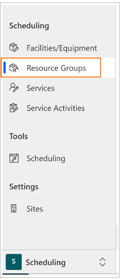
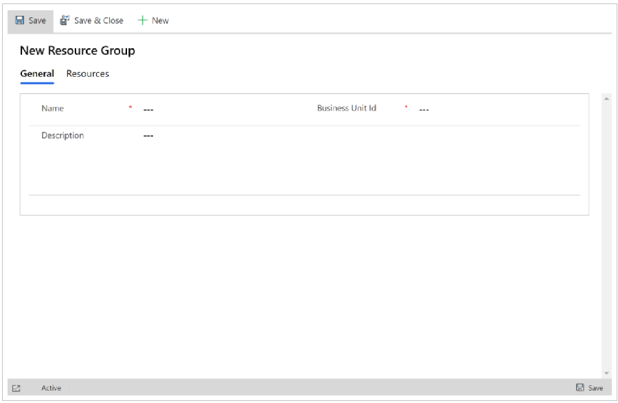
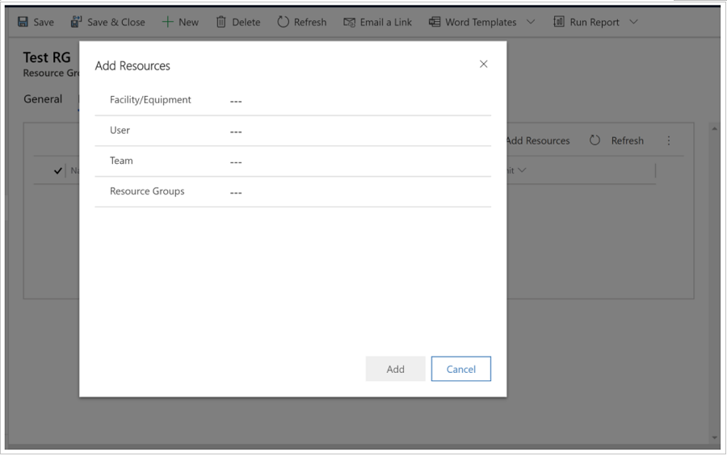
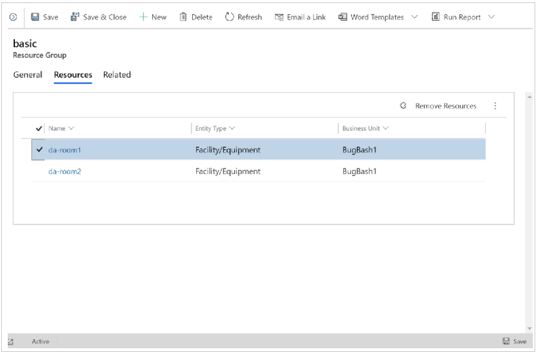

# Create resource groups

Use resource groups to group users, facilities, and equipment as part of the selection rules for a service.

## Create a resource group

Before you begin, make sure you have the Scheduler Manager role or equivalent permissions. 

1. Navigate to **Customer Service Hub** > **Scheduling** tab.

2. Select **Resource Group**.

   

3. Select **New**. 

4. In the Resource Groups form, enter information in the following fields: 

    - **Name**: You must enter a name for the resource group. The application does not check that the name is unique.

    - **Business Unit**: To locate and select a business unit, select the Lookup button.
  
    - **Description**: You can add a detailed description of this resource group, including the criteria that you used to determine which resources to add to the resource group. 

   
  
5. Select **Save**.
    After you save the record, **Resources** appears under **Common**. 

6. Select **Resources**, and then on the **Actions** toolbar, select **Add Resources**. 

7. In the **Look Up** dialog box, select the users, facilities/equipment, teams, or other resource groups to add to this resource group.

    Adding other resource groups to a resource group is a good way to manage large numbers of resources. For example, you could add the resource groups of "senior technicians" and "junior technicians" to a resource group of "technicians."

   
    
8. Select **OK** to add the selected resources to the resource group.

9. Select **Save** or **Save and Close**.

## Edit a resource group

1. Navigate to **Customer Service Hub** > **Scheduling** tab.

2. Select **Resource Group**.

3. Open the resource group you want to change, and then in the **Resource Groups** form, change the information. 

4. Select **Save** or **Save and Close**. 

   
   
### See also  

[Unified Interface-based service scheduling overview](uci-scheduling-overview.md)

[Create or edit a service](uci-create-edit-service.md)

[Add facilities and equipment](uci-add-facilities-equipment.md)

[Schedule a service activity](uci-schedule-service-activity.md)

[Use sites to manage your service locations](uci-create-sites.md)

[Navigate the service calendar](uci-navigate-service-calendar.md)
