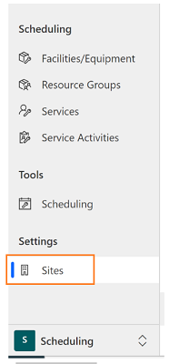
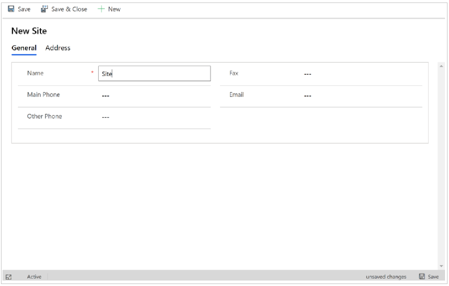

# Use sites to manage your service locations

Create sites to define the locations where you provide service to your customers. When you’re scheduling resources, you can define which resources will work on which site.

## Create a site

Before you begin, make sure you have the System Administrator or System Customizer security role or equivalent permissions.

1. Navigate to **Customer Service Hub** > **Scheduling** tab.

2. Select **Sites**

   

3. Select **New.**

   

4. Enter a name and any other details you want, and then click **Save**.

### See also  

[Unified Interface-based service scheduling overview](uci-scheduling-overview.md)

[Create or edit a service](uci-create-edit-service.md)

[Add facilities and equipment](uci-add-facilities-equipment.md)

[Schedule a service activity](uci-schedule-service-activity.md)

[Create resource groups](uci-create-resource-groups.md)

[Navigate the service calendar](uci-navigate-service-calendar.md)

[!INCLUDE[footer-include](../includes/footer-banner.md)]