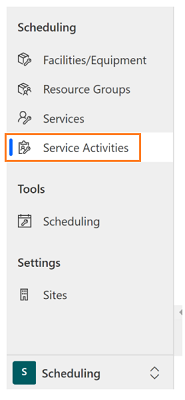
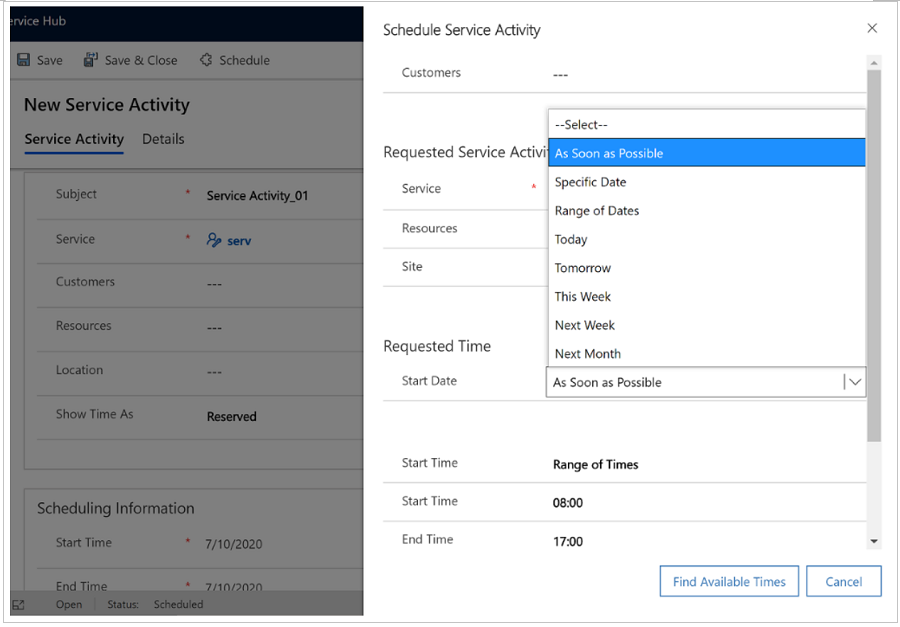

# Use the Service Schedule Activity form to schedule a service activity

Use this form to search for an available time for a service activity. You can either search for an open time using search criteria that, at a minimum, includes selecting a service, or you can define a more complex set of criteria. You can also create a service activity without checking for conflicts in the scheduled service. The service activity appears as a color block on the service calendar.

> [!Note]
> You can’t create a recurring service activity. Individual activities are recommended.

## Create a service activity
Avoid conflicts while scheduling services by finding the time the resources are available beforehand. 

Before beginning to create a service activity, make sure you have the Scheduler role or equivalent permissions. 

1. Navigate to **Customer Service Hub** > **Scheduling** tab.

2. Select **Service Activities**. 

   

3. On the **Schedule Service Activity** form, select **Schedule**.

   
   
4. Under **Requested Time**, select criteria for the times you want:
  - To search for a time on a specific date, in Start Date, select **Specific Date**, and then enter the date you want.
  
  - To search within a range of dates, select **Range of Dates**, and then enter the **On or After** and **On or Before** dates. You can also select specific days of the week. 

  - You can also search for times based on dates relative to the current date, such as **Today**, **Tomorrow**, **This Week**, **Next Week**, or **Next Month**. 

  - Similarly, to search within specific range of time, in **Start Time**, select **Specific Time**, **Range of Times**, or **Morning, Evening, Afternoon**. 

  - Do not clear the **Use Default Duration** check box or change the duration unless you want to schedule more time than the default duration of the service. The maximum duration of a service activity is 10 days. 

5. Select **Find Available Times**. The next available times are shown. 

6. Under **Available Times**, select the time for which you want to schedule the service activity, and then select **Schedule**. 

    The Schedule Service Activity form closes, and the application fills in the information from the selected time in the Service Activity form. 

7. Type or modify information in other text boxes, as required.

8. When you’re ready to save your data, select **Save**. 

   The service activity appears as a color block on the Service calendar. 

### See also  

[Unified Interface-based service scheduling overview](uci-scheduling-overview.md)  
[Create or edit a service](uci-create-edit-service.md)  
[Add facilities and equipment](uci-add-facilities-equipment.md)  
[Create resource groups](uci-create-resource-groups.md)  
[Use sites to manage your service locations](uci-create-sites.md)  
[Navigate the service calendar](uci-navigate-service-calendar.md)  

[!INCLUDE[footer-include](../includes/footer-banner.md)]