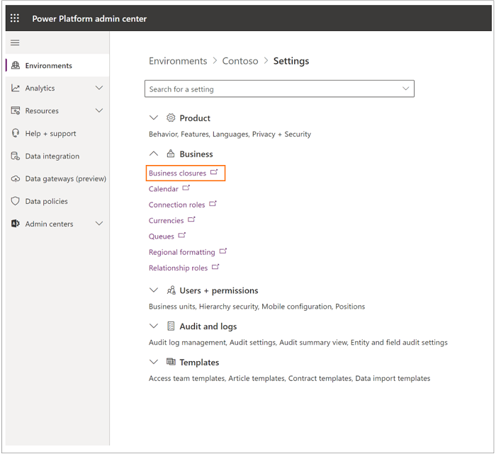

# UCIfied Scheduling Service overview

> [!Note]
> This topic is pre-release documentation and is subject to change.

UCified Service Scheduling will replace the Legacy Service Scheduling experience by 12/01/2020.   

The following topics contain information about legacy Service Scheduling features: 

- Create or change a service 

- Schedule a service activity 

- Add facilities and equipment  

- Create resource groups 

- Use sites to manage your service locations 

- Navigate to the Service Calendar  

- Set up a business closure 

> [!Note]
> To set up a business closure, navigate to the [Admin portal](https://admin.powerplatform.microsoft.com/), as shown in the following screen.

   

 
