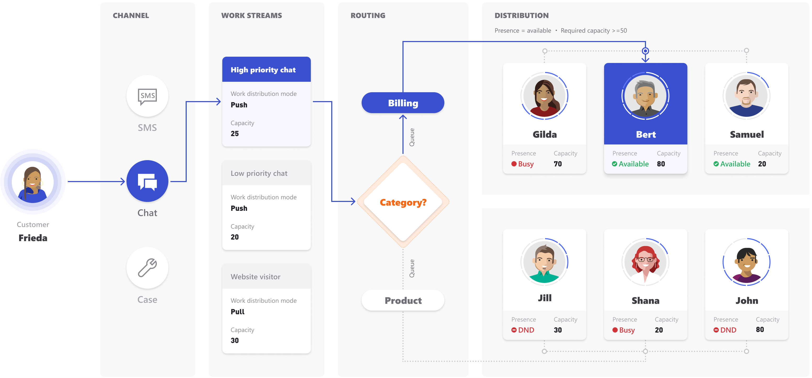

# Understand unified routing and work distribution

[!INCLUDE[cc-use-with-omnichannel](../includes/cc-use-with-omnichannel.md)]

Intelligent work item classification and omnichannel routing capabilities enable the flexibility and automation of AI-enabled workflows that increase routing efficiency and decrease human effort. 

Traditionally, organizations use queue-based routing, where incoming service requests are routed to a relevant queue, and agents work on those service requests by picking them from the queue. Organizations can miss service-level agreements if agents pick the easier service requests and leave the higher-priority requests in the queue. To address this scenario, organizations either create custom workflows to periodically distribute service requests among their agents or have dedicated personnel to distribute the service requests equitably among agents while adhering to organizational and customer preferences. Both methods are inefficient and error-prone, and necessitate continuous queue supervision.

The intelligent routing service in Dynamics 365 Customer Service uses a combination of AI models and rules to assign incoming service requests from all channels (cases, entities, chat, digital messages, and voice) to the best-suited agents. The assignment rules take into account customer-specified criteria, such as priority and autoskills matching. The new routing service eliminates the need for constant queue supervision and manual work distribution to offer operational efficiencies for organizations.

Advantages of unified routing and work distribution are as follows:

- Automate work assignments across channels.
- Set up work assignments for the best available agents based on their capacity and presence.
- Analyze and manage agent productivity across channels.

Unified routing and work distribution is a two-step process:

1. Routing dispatches conversations into the right queues.
2. Work distribution allocates the conversations in a queue to agents in real time, based on capacity and presence.

> [!div class=mx-imgBorder]
> 

## Overview of routing system

A customer initiates a conversation from the portal, and the conversation reaches the Omnichannel system. Now, based on the routing rules condition defined in the routing system, it starts routing the conversation to the appropriate queues.

The routing rules condition is based on the channel, CRM, and customer context that you, as an administrator, define in the Omnichannel Administration app.

When the conversation reaches to the queues, the work distribution system distributes the conversation based on certain triggers. To learn more, see [Overview of work distribution system](unified-routing-work-distribution.md#overview-of-work-distribution-system)

## Overview of work distribution system

The work distribution system distributes/assigns the conversation (work item) to an agent based on the following triggers:

- Work item available trigger
- Agent available trigger

### Work item available trigger

When a conversation is present in a queue, the work distribution system searches for the best available agent based on the capacity and presence if there are no other conversations present in the queue.

If there are other conversations present in the queues, then the conversation will be added to the end of the queue and will be assigned to the agents after other conversations are assigned.

If one or more agents are available, then the work distribution system takes a course of action based on the following scenarios.

  | Sl no | Scenario | Work distribution system action |
  |---------------|-----------------|---------------------------------------|
  | 1 | One or more agent is available | Assigns the conversation to an agent with the highest available capacity |
  | 2 | One or more agent is available with same capacity | Assigns the conversation to an agent who has a lesser number of active sessions for the current workstream |
  | 3 | One or more agent is available with same capacity and number of active sessions | Assigns the conversation to an agent who is waiting for a longer duration for a conversation |

   > [!Note]
   > - The work distribution system gives higher priority to the agents who have worked and got disconnected from a conversation in the past.
   > - The work distribution system gives lower priority to the agents who have rejected, transferred, or timed out the conversation.

### Agent available trigger

The work distribution system assigns one of the existing conversations that is in the queues when an agent is available.

An agent is available in the following scenarios:

 - When an agent signs in to the Omnichannel for Customer Service app.
 - When an agent presence status changes from one state to another, such as **Away** to **Available**, **Away** to **Busy**, and  **Away** to **DND**. An agent is also available depending on the allowed presence that is configured for the work stream.
 - When an agent capacity changes due to the closure of a conversation or assignment of a conversation.
 - The agent affinity is set to yes for a work stream.

Whenever agents are available, the work distribution system always retrieves the oldest conversations (longer duration) that is present in the highest priority queue and assigns the conversation to the agent who satisfies the capacity condition.

When more than one conversation satisfies the capacity, then the work distribution system takes a course of action based on the following scenarios.

  | Sl no | Scenario | Work distribution system action |
  |---------------|-----------------|---------------------------------------|
  | 1 | More than one conversation | Assigns the conversation from the high priority queue |
  | 2 | More than one conversation in the high priority queue | Assigns the conversation that is oldest (longer duration) in the high priority queue |

> [!Note]
> If an agent has rejected, transferred, timed out a conversation, then the work distribution system gives lower priority to these conversations over other existing conversations in the queue.

## Scenario walk-through of unified routing and work distribution 

The following section outlines a scenario to understand unified routing and work distribution and how conversations are assigned to agents.

A customer initiates a conversation (chat) regarding **Billing**. Now, unified routing and work distribution help route the conversation to the **Billing** queue, and assign the conversation to an agent who is a member of the queue with the required presence and capacity. This is shown in the following illustration.

> [!div class=mx-imgBorder]
> 

Let us see the steps involved in the scenario walk-through.

- When a chat conversation originates from the customer, the system identifies the channel, and the routing and work distribution configuration details are applied. These configuration details are defined in the workstreams. Learn more, see [Understand and create work streams](work-streams-introduction.md).

    In this walk-through, the system identifies the work stream as **Product & Billing live chat** and applies the configuration details of the  work stream to the incoming conversation. In this work-stream, the conversation requires a capacity of **50 units**. This implies that when the system assigns this conversation to an agent, the system blocks 50 units of agent’s capacity.

- Next, the routing and work distribution logic starts. With the help of context variables, **Routing rules** identify that the conversation belongs to the **Billing** queue, and the system routes to the **Billing** queue. 

- As the conversation reaches the Billing queue, the system  allocates the conversation to one of the agents of the Billing queue, who satisfy the following criteria:

    - Capacity is **50 units** or more.
    - Presence status is **Available**.

As **Bert** has the required capacity and presence, the system  assigns the conversation to **Bert**. After Bert starts working on the conversation,  the presence changes to **Busy** and the remaining capacity is updated to **30 units**.

### Adjusting an agent's capacity based on conversation allocation

Agent capacity is specified by the administrator in the User settings. See [Manage users](users-user-profiles.md) to learn how to set agent capacity.
An agent's capacity is adjusted by the system when a conversation is allocated, and the following actions occur:

- The conversation is added to the agent's **My Items** list.
- The agent's presence status changes to **Busy** or **Busy DND**.
- The agent's utilized capacity increases.
- The agent's available capacity decreases.

### Adjusting an agent's capacity based on closure of allocated conversation

When an agent has finished working on a conversation, the system adds the capacity back to the agent's availability, and the following actions occur:

- The conversation is removed from the agent's **My Items** list.
- The agent's presence status changes to **Available**.
- The agent's utilized capacity decreases.
- The agent's available capacity increases to the extent of free capacity.

If conversations are waiting to be assigned, they are allocated as soon as the agent becomes available.

To effectively route and distribute work to agents, admins can set up the following items in Omnichannel for Customer Service:

- [Assign roles and enable users for Omnichannel for Customer Service](add-users-assign-roles.md)
- [Manage users in Omnichannel for Customer Service](users-user-profiles.md)
- [Understand and create work streams](work-streams-introduction.md)
- [Configure a chat channel](set-up-chat-widget.md)
- [Configure an SMS channel](configure-sms-channel.md)
- [Work with queues in Omnichannel for Customer Service](queues-omnichannel.md)
- [Automatically identify customers using pre-chat responses](record-identification-rule.md)
- [Create and manage routing rules](routing-rules.md)
- [Configure and manage custom presence](presence-custom-presence.md)

### See also

[Omnichannel for Customer Service for administrators](omnichannel-administrator.md)  

[!INCLUDE[footer-include](../includes/footer-banner.md)]
