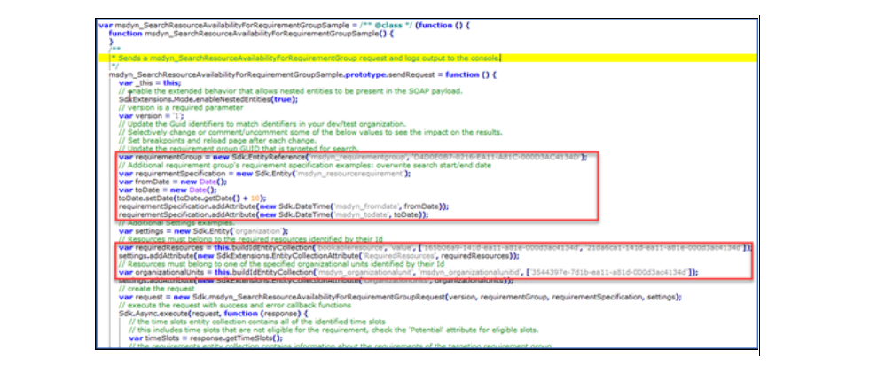
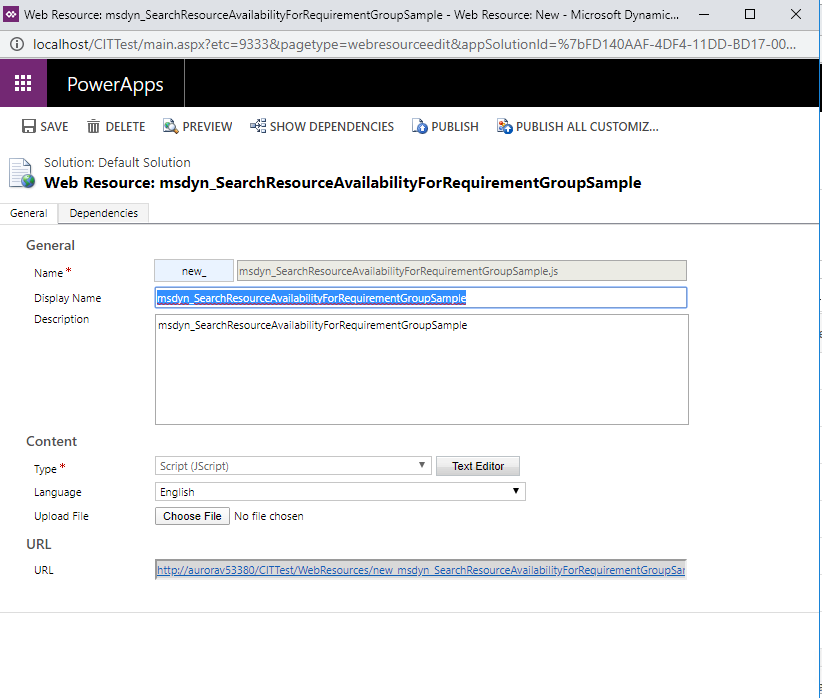
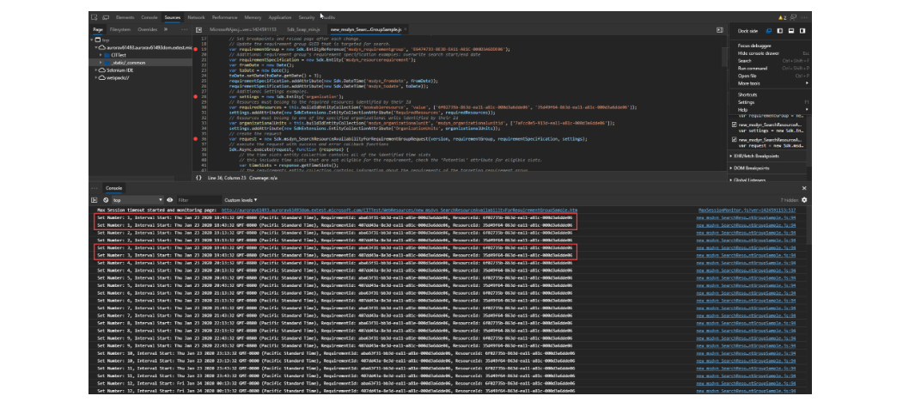
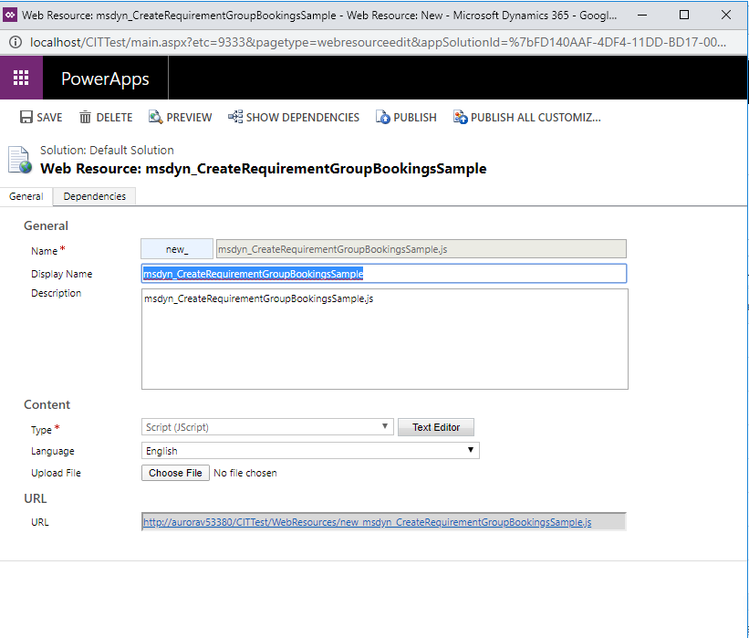
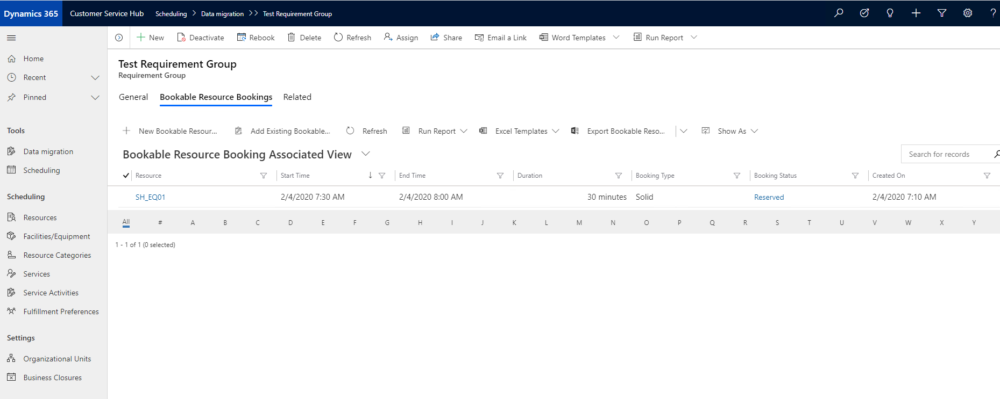
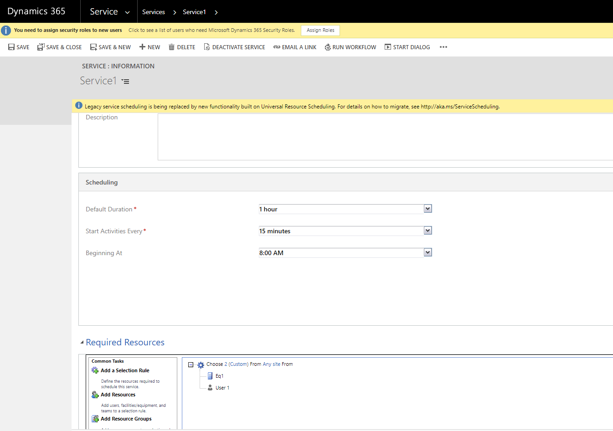
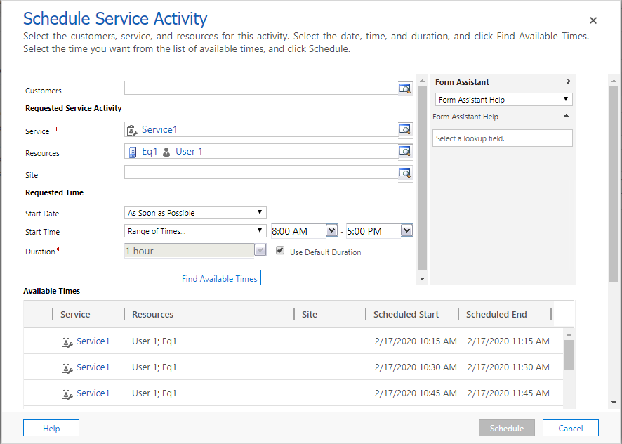
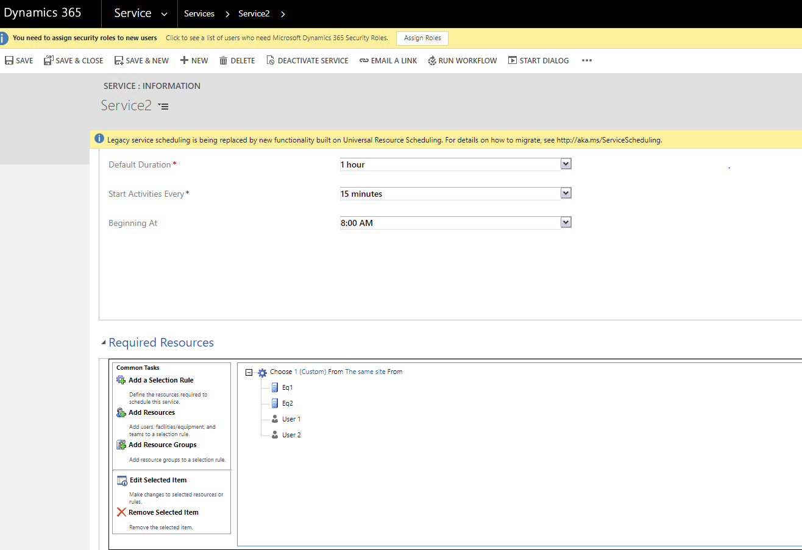
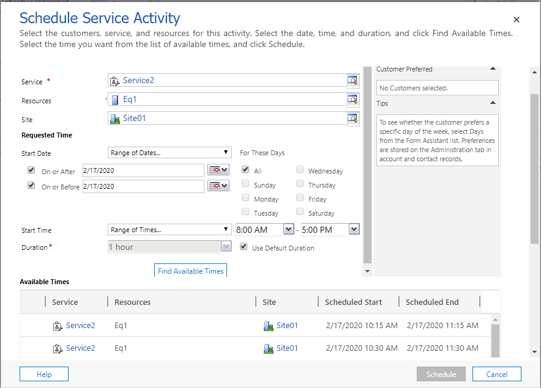
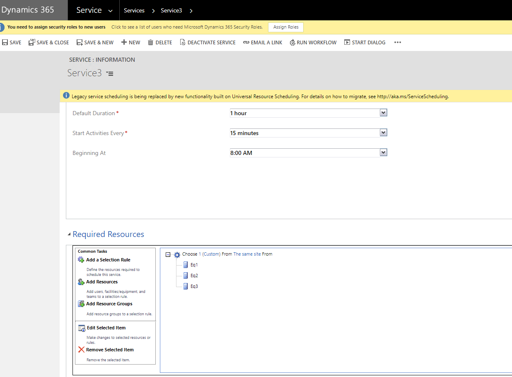

# Search resource availability and create bookings for requirement groups

Use the Search Resource Availability for Requirement Group API and the Create Requirement Group Bookings API to book the resources that meet the needs you identify in your requirement groups. 

- The [Search Resource Availability for Requirement Group](#bkmk_sra_rg) API returns available time slots for resources when you search by using requirement groups.
- The [Create Requirement Group Bookings](#bkmk_crgb) API uses the available time slots for resources to generate booking records for your requirement groups.

You pass the details of a requirement group in your API calls and retrieve a list of available resources and their open time slots. This is helpful for self-scheduling scenarios, where a user wants to view the availability of resources, or for portal scheduling scenarios where a customer wants to view resource availability from a website or app.

### Prerequisites

- Dynamics 365 version 9.0 or above with Universal Resource Scheduling version 3.12.x.x

<a name="bkmk_sra_rg"></a>

## Search Resource Availability for Requirement Group API

Use the following input and output parameters for the Search Resource Availability for Requirement Group (**msdyn_SearchResourceAvailabilityForRequirementGroup**) API.

### Parameters

| Name  | Type | Required  | Description  |
|-----------------|---|---|---|
|Version | String | Yes |The version number of the API. The version number identifies the version of the API that should be invoked. The version number is a semantic version number of the format major.minor.patch. The request does not have to contain the complete version number.|
|RequirementGroup | | Yes | An entity reference to the requirement group entity.|
|RequirementSpecification |Integer| No | If left null, respects the targeting requirement group duration by default.|
|Settings |`Entity<InputSettings>` |No | Sets the settings for the request.|

### Inputsettings

| Name  | Type | Required  | Description  |
|-------|---|---|---|
| ConsiderSlotsWithLessThanRequiredDuration | Boolean | No | Specifies if a time slot with less than the required remaining duration should be considered when computing potential time slots. It is false by default. |
| ConsiderSlotsWithOverlappingBooking | Boolean | No | Specifies if time slots with overlapping bookings should be considered when computing potential time slots. It is false by default. 
| ConsiderSlotsWithProposedBooking | Boolean | No | Specifies if time slots with proposed bookings should be considered when computing potential time slots. It is false by default. |
| MaxResourceTravelRadius | Distance | No | Specifies the maximum travel radius for resources when computing available time slots. |
| SortOrder | Integer | No | Specifies the requirement group order for the response. |
| PageSize |Integer | No | Numbers of item returned in a page. It is 20 by default. |
| PagingCookie | String | No | Paging cookie retrieved from previous searching result.|
| OrganizationUnits |List&#60;Guid&#62; | No | A collection of organization unit IDs. A qualified resource must be a member of one of the specified organization units. |
| MustChooseFromResources |List&#60;Guid&#62; | No | Evaluate and select results from resources in this list. |
| RequiredResources |List&#60;Guid&#62; | No | Evaluate all resources, filter the results based on this list. In general, use MustChooseFromResources instead for improved performance. |
| IgnoreTimeSlots | Boolean | No | Specifies if the returned time slots should be ignored. When true list of time slots returned will be empty. It is false by default. |
| ConsiderAppointments | Boolean | Set this to True for search resource availability API to respect existing Dataverse appointments as bookings on the resource, provided the organization and resource level settings have been set. Appointments with Busy or Completed statuses will be considered as unavailable for scheduling operations. |

### Output

|Returns | Name(Type)  | Description |
|---|---|---|
|TimeSlots (List&#60;OutputTimeSlot&#62;)   |StartTime (DateTime) | The start time.|
|         |EndTime (DateTime)                    |The end time.|
|         |ArrivalTime (DateTime)                |The arrival time.|
|         |Travel(OutputTimeSlotTravel)<br><br>OutputTimeSlotTravel<br><ul><li>Distance (Double)<br><li>TravelTime (Double)<br><li>DistanceFromStartLocation (Double)<br><li>TravelTimeToEndLocation (Double)<br></ul>    |The time slot travel information. Will only be present if the resource requirement contains values for latitude and longitude.|
|         |Effort (Double)                       |The effort/capacity.|
|         |IsDuplicate (Boolean)                 |A Boolean value indicating if the time slot is a duplicate.|
|         |Resource(OutputResource)<br><br>OutputResource<br><ul><li>Resource (BookableResource)<br><li>TotalAvailableTime (Double)<br></ul> |The Resource entity as explained below. |
|         |Location(OutputTimeSlotLocation)<br><br>OutputTimeSlotLocation:<br><ul><li>WorkLocation (Enum):<br><ul><li>Onsite (0)<br><li>Facility (1)<br><li>Location agnostic (2)</ul><br><li>LocationSourceSlot (Enum):<br><ul><li>Common (1)<br><li>Custom GPS entity (2)<br><li>Mobile audit (3)</ul> |The entity contains details about the location of a time slot. For more details, see TimeSlotLocation below. |
|         |TimeGroup(TimeSlotTimeGroup)<br><br>OutputTimeSlotTimeGroup:<br><ul><li>TimeGroupId (Guid)<br><li>TimeGroupDetail (EntityReference)<br><li>TimeGroupDetailStartTime (DateTime)<br><li>TimeGroupDetailEndTime (DateTime)</ul>  |The entity contains details about a time group. For more details, see TimeSlotTimeGroup below. |
|         |AvailableIntervals (`List<<Guide>OutputTimeSlot>`)|A collection of available intervals.|
|Resources (List&#60;OutputResource&#62;)  |Resource (EntityReference)|An entity reference to the bookable resource.|
|         |BusinessUnit (EntityReference) |An entity reference to the bookable resource group.|
|         |OrganizationalUnit (EntityReference) |An entity reference to the organizational unit.|
|         |ResourceType (Int)                 |The resource type. See the resourcetype attribute on the BookableResource entity for possible values.|
|         |PoolId (Guid)                      |The Id of the pool that the resource is a member of for the duration of the time slot.|
|         |CrewId (Guid)                      |The Id of the crew that the resource is a member of for the duration of the time slot.|
|         |Email (String)                     |The resource’s email address.|
|         |Phone (String)                     |The resource’s phone number.|
|         |ImagePath (String)                 |The path to the resource’s image.|
|Requirements (List&#60;OutputRequirements&#62;) |Requirement (EntityReference)   |An entity reference to the Resource Requirement record.|
|            |ConstraintBag (String)           |Requirement constraint in ufx bag(internal)|
|            |Resources (`List<<EntityReference>EntityReference>`)   |Entity reference list of resource that is available to the requirements.|
|ProposalResourceAssignmentSets (List&#60;OutputProposalResourceAssignmentSet&#62;) |IntervalStart (DateTime)|Start time for each proposal resource assignment set.|
|   |ProposalResourceAssignments (List&#60;OutputProposalResourceAssignments&#62;<br><br>OutputProposalResourceAssignments:<br><ul><li>RequirementId (Guid)<br><li>ResourceId (Guid)</ul> |List of Resources assigned to Requirement.|
|PagingInfos (OutputPagingInfo)  |MoreResults (Boolean)|If there are more results or not.|
|            |PagingCookie (String)|Paging cookie that can be used in the future search.|


### Example

```http
{
  "RequestName": "msdyn_SearchResourceAvailabilityForRequirementGroup",
  "Parameters": [
    {
      "Key": "Version",
      "Value": "1.0.0"
    },
    {
      "Key": "RequirementGroup",
      "Value": {
        "Id": "6927721a-0137-42be-8092-26995625a9d9",
        "LogicalName": "msdyn_requirementgroup",
        "Name": null,
        "KeyAttributes": [],
        "RowVersion": null
      }
    }
  ],
  "RequestId": null
}
```

**Response**

```json
{
  "ResponseName": "msdyn_SearchResourceAvailabilityForRequirementGroup",
  "Results": [
    {
      "Key": "TimeSlots",
      "Value": {....}
    },
    {
      "Key": "Requirements",
      "Value": {....}
    },
    {
      "Key": "ProposalResourceAssignmentSets",
      "Value": {....}
    },
    {
      "Key": "PagingInfos",
      "Value": {....}
    }]
}
```

<a name="bkmk_crgb"></a>

## Create Requirement Group Bookings API

Use the following input and output parameters for the Create Requirement Group Bookings (**msdyn_CreateRequirementGroupBookings**) API.

### Parameters

|  Name   | Type  | Required | Description   |
|-----------------|-----------------|---|---------|
|Version | String | Yes | The version number of the API. The version number identifies the version of the API that should be invoked. The version number is a semantic version number of the format major.minor.patch. The request does not have to contain the complete version number.|
|RequirementGroup | EntityReference  |Yes | An entity reference to the requirement group entity, usually is a GUID, as shown in the below sample.|
|Start |DateTime | Yes | Start time of the Timeslot. |
|Duration | Integer | Yes  | The Duration of the Booking to be created.|
|ResourceAssignments | EntityCollection | Yes| It is an entity collection of the Resource Assignments that are to be made for the Bookings to be created. Look at the Resource Assignment entity table for more details |

**Resource Assignments**

|  Name   | Type  | Required | Description   |
|---------------------|-------------|---|---------|
|RequirementId | 	Guid|	Yes|	The resource requirement Id of the Requirement for which the booking record is to be created. |
|ResourceId  | Guid    | Yes | The bookable resource Id of the Resource for which you want to create the booking. |
| BookingStatusId  | Guid  | Yes | The booking status Id of the booking to be created. |
| Effort | Integer  |  No| The capacity of the Bookable Resource that is consumed by this booking.|
| TravelTime | Integer  | No| The travel time in minutes.|

### Output 

Returns `HandlerExecuted` value which is of Boolean type.

## Using the Requirement Group API

In the following scenario, you schedule a requirement group via API. You'll need a service created with resources before you can schedule a booking. Follow these steps to create a service activity.

### Service configuration 


  1. In the site map, under **Scheduling**, select **Service**.
  2. Go to **Resource Requirements**.
  3. Create a service activity. For this example, we've created **Test Requirement Group**.

### Service Activity configuration  


  1. In the site map, under **Scheduling**, select **Service Activities**.
  5. Go to **Service Activities**.
  6. For **Subject**, select **Test Requirement Group**.
  7. For **Service**, select **Test Requirement Group**.

> [!NOTE]
> This automatically creates a resource requirement group that has the same name as the service activity. 

Now you have a requirement group automatically created that has one technician (resource) to be scheduled to perform service at your customer's location. 

### Resource Requirement Group grid 

The following image is an example configuration of the Resource Requirement Group page. 


> [!NOTE] 
> To access the **Requirement Group** page from the Customer Service Hub app, you need to navigate there via a URL. 

> [!IMPORTANT]
> Use the following URL to reach the **Resource Requirements Group** page: `<<YourOrgURL>YourOrgURL>?appid=guid&pagetype=entitylist&etn=msdyn_requirementgroupr`.


3. Go to **General**.
4. Name field **Test Requirement Group**.
5. Enter name in **Owner** field.
6. Template field.
7. Template Required, select **No**.

### Search against your organization

In this next scenario, we show how to pass values for a specific requirement group (Entity Reference - GUID), Required Resources<!--what is this?--> to complete work and match the resource to the organizational unit.      

> [!IMPORTANT] 
> - To run the Requirement Group API, you need GUIDs for:
>   - Requirement group
>   - Bookable resources
>   - Organizational unit (which can be retrieved by using the [Web API](/powerapps/developer/common-data-service/webapi/query-metadata-web-api))
> - If the API is called from a client (browser or canvas app) based on JavaScript, you need to have the extended SOAP SDK. The extended SOAP SDK is not an official Microsoft release, but you can is provided in the downloadable sample files for guidance. 
> - We recommend that you test this search in your development or test environments to validate your scenarios and results before running it in your production environment.
> - This API uses the complex object type in the input and output, so it only supports the SOAP endpoint. It does not support the OData endpoint. 


To execute this search against your organization, you need to download the [sample files](https://github.com/microsoft/Dynamics365-Apps-Samples/tree/master/customer-service/service-scheduling/search-resource-availability-create-bookings), and then follow the steps below:   

1. Modify the hard-coded input parameters in the msdyn_SearchResourceAvailabilityForRequirementGroupSample.js file to reflect the GUIDs of records in your org. (Example: requirement group, resources, organizational unit).    



[Sample Search Requirement Group](https://github.com/microsoft/Dynamics365-Apps-Samples/tree/master/customer-service/service-scheduling/search-resource-availability-create-bookings)

2. Add the files in the sample folder as web resources in your organization 




3. Navigate to the newly added new_msdyn_SearchResourceAvailabilityForRequirementGroupSample.htm page. Example: `<<YourOrgURL>>//WebResources/new_msdyn_SearchResourceAvailabilityForRequirementGroupSample.htm`   


4. Open the browser's developer tools by using the F12 function key. Set breakpoints as needed, and inspect the request/responses in the developer tool's console.  



  We can see there are multiple sets of time slots that are returned with each Set corresponding to a matching available Resource mapped to the underlying Requirement of the Requirement Group.   

  After the time slot Sets are returned by the API, you can display them on your custom web portal, app, or a Power App (model/canvas).    

5. After you choose a specific time slot set (Set number 1 in this example), update your new_msdyn_CreateRequirementGroupBookingsSample.js web resource in your org to pass the Resource Assignments (Requirement guid, Resource guid) and the Requirement Group as shown in the example below:    


> [!IMPORTANT]
> Find the complete sample code here: [Create Requirement Group](https://github.com/microsoft/Dynamics365-Apps-Samples/tree/master/customer-service/service-scheduling/search-resource-availability-create-bookings).



6. Navigate to the newly added new_ msdyn_CreateRequirementGroupBookingsSample.htm page. (Example: `<<YourOrgURL>>//WebResources/new_msdyn_CreateRequirementGroupBookingsSample.htm`) to invoke a call to the Booking API and create the booking.


7. Open the browser's developer tools by using the F12 function key. Here you'll see that the Handler executed value is set to True, indicating that the bookings were created successfully.    


  We can also verify this by going back into the organization and checking the associated bookings of the Service/Requirement group we created, as shown in the following illustrations.    




Other possible scenarios that might leverage these APIs are:   
- Build a custom web app or a Dynamics 365 portal to provide appointment scheduling for users. The app will show available time slots for the service or product being offered by using multiresource requirements (requirement groups).
- Build a Power Apps canvas app to support self-scheduling scenarios for line-of-business apps.    

See the [Additional resources](#bkmk_seealso) section for links to additional help resources.

### Sample code

The following sample code shows how to implement `msdyn_SearchResourceAvailabilityForRequirementGroup` message.

```static void Main(string[] args) 
        { 
            // Authentication  
            String machineName = "contoso?????"; 
            String orgName = "?????"; 
            String domain = $"{machineName}dom.extest.microsoft.com"; 
            String uri = $"http://{machineName}.{domain}/{orgName}/XRMServices/2011/Organization.svc"; 
            String username = "?????"; 
            String password = "?????"; 

            OrganizationServiceManager osm = new 
            OrganizationServiceManager(new Uri(@uri), username, password, domain); 
            _serviceProxy = osm.GetProxy(); 
            _service = (IOrganizationService)_serviceProxy; 
            searchResourceAvailabilityForRequirementGroup(); 
            createRequirementGroupBookings(); 
        } 

        static void searchResourceAvailabilityForRequirementGroup() 
        { 
            var req = new OrganizationRequest() 
            { 
                RequestName = "msdyn_SearchResourceAvailabilityForRequirementGroup" 
            }; 

            //Version  
            req["Version"] = "1.0.0"; 
            req["RequirementGroup"] = new EntityReference("msdyn_requirementgroup", Guid.Parse("e5e4f033-150d-eb11-a822-000d3aaf102a")); 

            Entity requirementSpecification = new Entity(); 
            requirementSpecification.Attributes.Add("msdyn_fromdate", DateTime.Today.AddDays(1)); 
            requirementSpecification.Attributes.Add("msdyn_todate", DateTime.Today.AddDays(3)); 
            req["RequirementSpecification"] = requirementSpecification; 

            try 
            { 
                var response = _service.Execute(req); 
                Console.WriteLine("Response from search: {0}", JsonConvert.SerializeObject(response)); 
            } 
            catch (Exception e) 
            { 

                Console.WriteLine("msdyn_SearchResourceAvailabilityForRequirementGroup failed with the following error: {0}", e.Message); 
            } 
        } 

        static void createRequirementGroupBookings() 
        { 
            var req = new OrganizationRequest() 
            { 
                RequestName = "msdyn_createRequirementGroupBookings" 
            }; 

            req["Version"] = "1.0.0"; 
            req["RequirementGroup"] = new EntityReference("msdyn_requirementgroup", 
            Guid.Parse("d74260ee-180d-eb11-a822-000d3aaf102a")); 
            req["Start"] = DateTime.Today.AddDays(1); 
            req["Duration"] = 60; 
            EntityCollection resourceAssignment = new EntityCollection(); 
            var entity = new Entity(); 
            entity["RequirementId"] = Guid.Parse("df4260ee-180d-eb11-a822-000d3aaf102a"); 
            entity["ResourceId"] = Guid.Parse("268e3d0d-5e0c-eb11-a822-000d3aaf102a"); 
            entity["BookingStatusId"] = Guid.Parse("10de5842-cf5e-4092-9006-d0aa9f9c1f74"); 
            resourceAssignment.Entities.Add(entity); 
            req["ResourceAssignments"] = resourceAssignment; 

            try 
            { 
                var response = _service.Execute(req); 
                Console.WriteLine("Response JSON : " + JsonConvert.SerializeObject(response)); 
            } 
            catch (Exception e) 
            { 
                Console.WriteLine("msdyn_createRequirementGroupBookings request failed with the following exception: {0}", e.Message); 
            } 
            Console.ReadKey(); 
        }  
```

## How to migrate from the legacy API to Universal Resource Scheduling 

To migrate from the legacy Search API and Book API to the Universal Resource Scheduling API, use the following required input and output fields to map the APIs. 

### Input mapping data for the Search API 

|Legacy input |Universal Resource Scheduling input |Description| 
|-------------|----------|-----------|
|ServiceId    |Requirement group  |Service/requirement group GUID|
|SearchWindowStart|Start date  |Start date for the appointment search |
|SearchWindowEnd   |End date |End date for the appointment search |
|Duration  |Duration  |Appointment duration |
|No of results  |Page size |Total number of proposals or number of appointments on a page |
|Sites  |OrganizationUnits  |Site/OU GUID |
|RequiredResource  |Preferred Resources|Resources the customer prefers to schedule |
|Constraints |Constraints |Customer entity(ufx)<!--what is "ufx"? --> |
|RecurrenceDuration     |                     |In a recurrence appointment search, the duration of the appointment |
|RecurrenceTimeZoneCode |                     |Time zone for a recurring request        |
|SearchDirection        |                     |Forward or backward search for slots, based on the dates given |
|AnchorOffSet           |                     |Offset in hours from midnight             |
|UserTimeZoneCode       |                     |Time zone that's been set for the user    | 
|SearchRecurrenceRule   |                     |Frequency, interval, count and so on      | 
|                       |Resource Types       |Type of resource                          |
|                       |Restricted Resources |Restricted for scheduling the appointment |

###  Output mapping for the Search API 

|Legacy output |Universal Resource Scheduling output |
|--------------|-----------|
|Appointment proposals |ProposalsResourceAssignmentSet |
|TraceInfo | |
|ExtensionDataObject | | 
|   |Time Slots|
|   |Requirements(constraintbag) |
|   |PagingInfos |

## Example scenarios for migrating from the legacy scheduling API to Universal Resource Scheduling

The scenario-based examples in this section add more details about mapping from the legacy API to the new Universal Resource Scheduling API.   

### Scenario 1: Get two resources for each schedule proposal  

*The following screenshot from the legacy API is provided for reference in this scenario.*



1. Create one site (**Site1**), one user (**User1**), and one equipment resource (**Facility/Equipment** tab), with the name **Eq1**, with the site set to **Site1**. 

2. Create the business closure and work hours for the user (8:00 AM to 6:00 PM) and the equipment (8:00 AM to 6:00 PM). 

3. Create a new service (**Service1**), and then add **required resources** as **Choose 2** from User1, Eq1. Save and close the service.



4. Go to the homepage and schedule a service activity and then, select **Service1**, and then select **Schedule** > **Find available slots**. 

5. Verify that two resources are returned for each proposal in accordance with the criteria you set.  

#### Universal Resource Scheduling API code for scenario 1 

```csharp
void searchRequirementgroup(Microsoft.Pfe.Xrm.OrganizationServiceManager osm)
{ 
var req = new Microsoft.Xrm.Sdk.OrganizationRequest() 
{ 
RequestName = "msdyn_SearchResourceAvailabilityForRequirementGroup"
};

  req["Version"] = "1.0.0"; 
  Entity requirementSpecification = new Entity();

  //Setting from date 

  requirementSpecification.Attributes.Add("msdyn_fromdate", DateTime.Parse("2019-12-  
  26T18:30:00.000Z"));

  //Setting to date 

  requirementSpecification.Attributes.Add("msdyn_todate", DateTime.Parse("2019-12- 
  27T18:29:00.000Z"));

  //Requirement group GUID 
  req["RequirementSpecification"] = requirementSpecification; 
  req["RequirementGroup"] = new   
  Microsoft.Xrm.Sdk.EntityReference("msdyn_requirementgroup", Guid.Parse("XXXXXXXX"));

  //Executing the request and getting response
  var response = osm.GetProxy().Execute(req); 
  response.ToString(); 
  response.Dump();
} 	 
```

### Scenario 2: Verify that search results are correct for scheduling 

*The following screenshot from the legacy API is provided for reference in this scenario.* 



1. Create the following: 
  - Two sites: Micr0s0ftSite1 and Site2
  - Two users: User1 and User2 (Site2)
  - Go to **Settings**> **Service management** tab and create a site(with the name `Site1`), two resources on the **Facility/Equipment** tab (namely, Eq1 and Eq2) and go to setting> Security and create a user(User1). Two equipment resources on the **Facility/Equipment** tab<!--Is this correct for the UI string? --> (Eq1, Eq2), where Eq1 belongs to Site1 and Eq2 belongs to Site2
 
2. Create the business closure and work hours for the user (8:00 AM to 6:00 PM) and the equipment (8:00 AM to 6:00 PM). 

3. Create a new service with status **Reserved** and required resources as **Choose 2** from **same site** from User1, User2, Eq1, Eq2. Save and close the service. 



4. Go to the homepage > **Service Activity** > **Schedule**, and then select the service you created in step 3. Select the site as **Site1**, and then click on **Find available time**. 

5. Verify that the search results that are returned are correct for the site selected in the search criteria.

#### Universal Resource Scheduling API code for scenario 2

```csharp
void searchRequirementgroup(Microsoft.Pfe.Xrm.OrganizationServiceManager osm)
{
  var req = new Microsoft.Xrm.Sdk.OrganizationRequest()
  {
  RequestName = "msdyn_SearchResourceAvailabilityForRequirementGroup"
  };
req["Version"] = "1.0.0"; 
Entity requirementSpecification = new Entity();

//Setting from date
requirementSpecification.Attributes.Add("msdyn_fromdate", DateTime.Parse("2019-12-26T18:30:00.000Z"));

//Setting to date
requirementSpecification.Attributes.Add("msdyn_todate", DateTime.Parse("2019-12-27T18:29:00.000Z")); 

req["RequirementSpecification"] = requirementSpecification;

//Requirement group GUID      
req["RequirementGroup"] = new EntityReference("msdyn_requirementgroup", Guid.Parse("XXXXXX"));

var response = osm.GetProxy().Execute(req);
response.ToString();
response.Dump();

}
```

### Scenario 3: Get proposed schedules that occur within the working hours for an equipment resource



1. Create two sites (Site1, Site2), and then create three equipment resources (Eq1, Eq2, Eq3). 

2. Create the business closure and work hours for all equipment (3:00 PM to 6:00 PM). 

3. Create a new service (**Service1**) Choose 1 from (Random) Eq1, Eq2, #q3.


4. In the **Schedule Service Activity** dialog box, search for proposals for Service1 by adding a required resource as **Eq1** for a specific date range. 

5. Verify that the proposed schedules that are returned occur within the working hours of the equipment for that date. 

#### Universal Resource Scheduling API code for scenario 3

```csharp
void searchRequirementgroup(Microsoft.Pfe.Xrm.OrganizationServiceManager osm)
{
var req = new Microsoft.Xrm.Sdk.OrganizationRequest() 
{
RequestName = "msdyn_SearchResourceAvailabilityForRequirementGroup"
};
req["Version"] = "1.0.0"; 
Entity requirementSpecification = new Entity();

//Setting start date          
requirementSpecification.Attributes.Add("msdyn_fromdate", DateTime.Parse("2019-12-26T18:30:00.000Z"));
//Setting end date
requirementSpecification.Attributes.Add("msdyn_todate", DateTime.Parse("2019-12-27T18:29:00.000Z"));

//Setting the eq1 as required resource	 	

requirementSpecification.Attributes.Add("msdyn_resourcerequirementid",Guid.Parse("XXXXXX")); 
req["RequirementSpecification"] = requirementSpecification; 

//Setting the requirement group GUID
req["RequirementGroup"] = new EntityReference("msdyn_requirementgroup", Guid.Parse("XXXXX"));

//Executing the request and getting response. 
var response = osm.GetProxy().Execute(req); 
response.ToString(); 
response.Dump(); 
} 
```

<a name="bkmk_seealso"></a>
### Additional resources

| Resource | Description |
|----|---|
|[Service Scheduling Guide](basics-service-service-scheduling.md)| Read how you can plan and schedule service activities for your customers.|
|[Service scheduling FAQ](service-scheduling-faq.md)| Frequently asked questions on service scheduling|
|[Multiresource scheduling with requirement groups](../common-scheduler/multi-resource-scheduling-requirement-groups.md)| Use requirement groups to mix and match different types of resources.|
|[Search Resource Availability API for single resource requirements](https://cloudblogs.microsoft.com/dynamics365/it/2019/07/15/how-to-use-resource-schedulings-search-resource-availability-api/)| Blog on how to use the Search resource availability API|
|[Overview of Dynamics 365 Field Service](../field-service/overview.md) | The Dynamics 365 Field Service business application helps organizations deliver onsite service to customer locations.|
|[Documentation for resource scheduling](/dynamics365/customer-engagement/common-scheduler/schedule-anything-with-universal-resource-scheduling)| Get started with using Universal Resource Scheduling.| 
|[Learning path for resource scheduling](/training/paths/universal-resource-scheduling/)| Learn how to use Universal Resource Scheduling in Microsoft Dynamics 365 for Field Service|
|[Field Service YouTube Channel](https://www.youtube.com/playlist?list=PLcakwueIHoT_AQBxkQQ7zePzd7fzZYP7X)| Video resources on Dynamics 365 Field Service|
|[Dynamics 365 application ideas](https://experience.dynamics.com/ideas/categories/list/?category=a2fa5aca-3f2d-e811-813c-e0071b6ad011&forum=bee3d862-df65-e811-a95d-000d3a1be7ad)| Use this portal to contribute product feedback and ideas for resource scheduling. |
|[Community forum](https://community.dynamics.com/365/fieldservice)| Use the community forum to ask questions, find answers, and see upcoming events. |
|[Dynamics 365 blog](https://cloudblogs.microsoft.com/dynamics365/?s=Resource+Scheduling)| Read the Dynamics 365 blog for release notes and posts from the product team.   |


[!INCLUDE[footer-include](../includes/footer-banner.md)]
