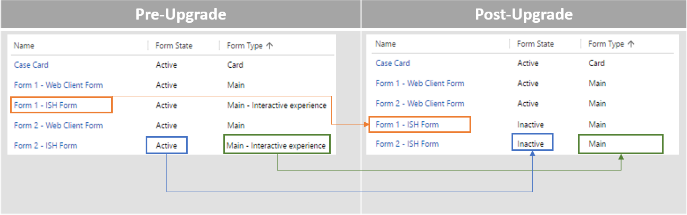
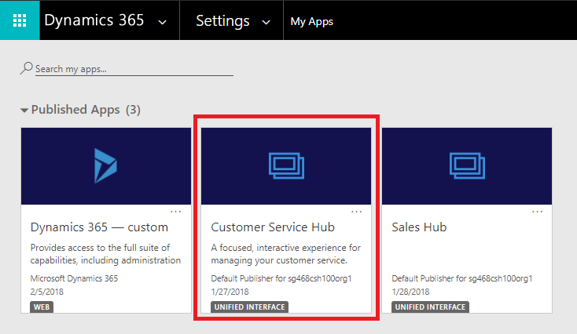
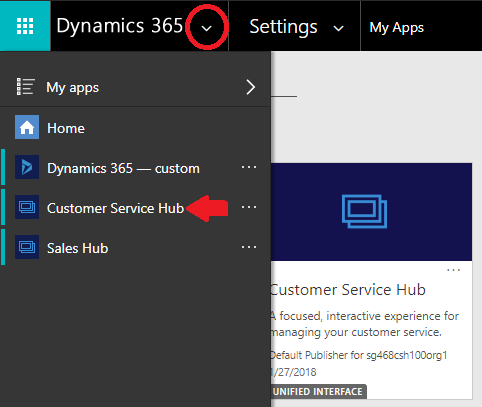
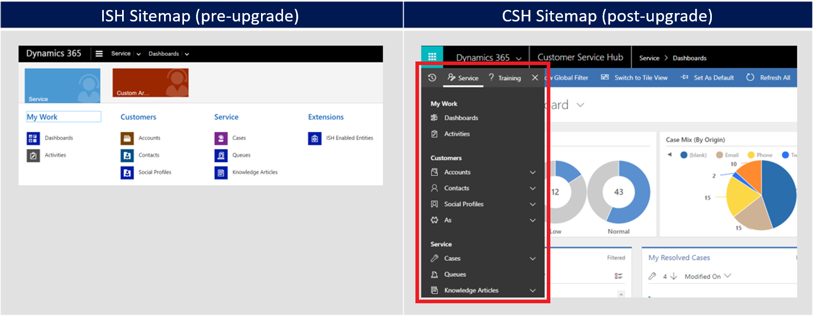
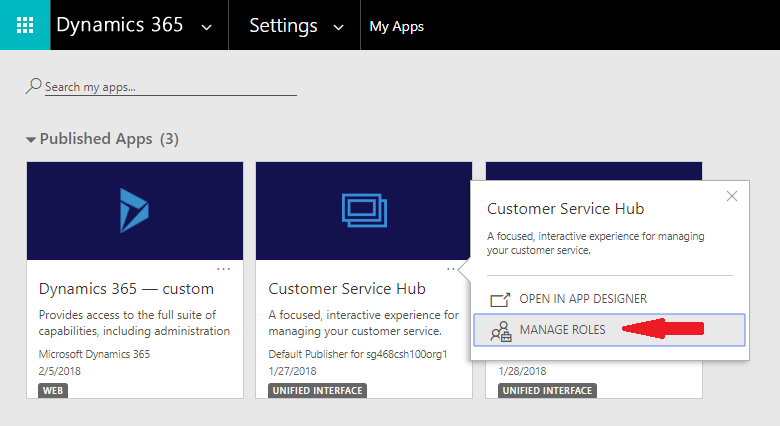
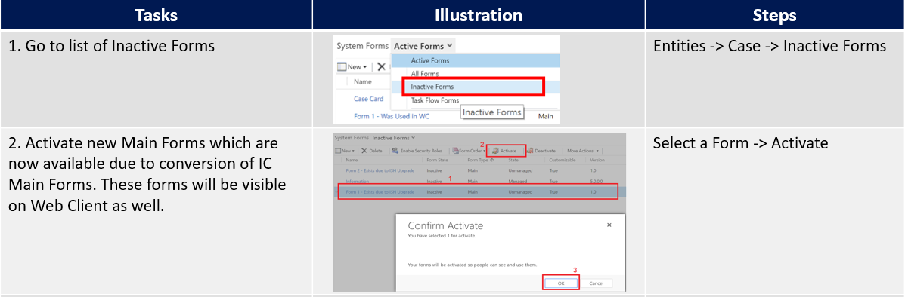
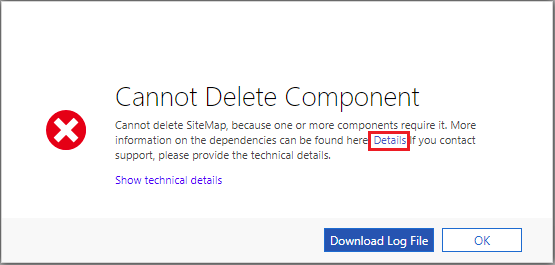

# Upgrade to Customer Service Hub

[!INCLUDE[cc-data-platform-banner](../includes/cc-data-platform-banner.md)]

The Interactive Service hub was introduced with [!INCLUDE] and Dynamics CRM 2016 as a reimagined customer service app. Interactive Service hub offered a web-based client designed to simplify daily tasks for customer service representatives and managers. It had new components and page-types, like interactive dashboards, interactive forms, and reference panel control. 

The Interactive Service hub's intuitive interface combined vital information in one place and allowed customer service representatives to prioritize work and be more productive, but there were certain limits to extending it. The new Customer Service Hub offers greater flexibility and improved controls and extensibility.

## Introduction to the Customer Service Hub app

With the latest version, Customer Service Hub offers a focused, interactive interface as an app module running on Unified Interface. Designed with a **build once, deploy everywhere** philosophy, Unified Interface features a new Custom Control Framework, responsive UI design, Right-to-Left support, and soon will be compliant with Web Content Accessibility Guidelines (WCAG) 2.0 .

Unified Interface eliminates the prolonged initial metadata download and brings greater parity with web client in terms of supported entities, controls, and extensibility. Also, because it is an app module, Customer Service Hub is completely role-based and metadata-driven, allowing greater customization flexibility. It makes it easy and intuitive for system administrators to filter forms, dashboards, and other metadata components shown to business users, so that they can deliver tailored apps.

## Versions eligible for upgrade

Organizations using Dynamics CRM 2016, [!INCLUDE], and Dynamics 365 Customer Service and Customer Engagement (on-premises) platform Update 2.1 are eligible to upgrade to latest version during the [customer-driven update](https://blogs.msdn.microsoft.com/crm/2018/01/12/scheduling-your-dynamics-365-organization-for-microsoft-dynamics-365-online-version-9-0-update/) schedule. Upgrading from a version earlier than CRM 2016 is not supported. Support for the Interactive Service hub client is limited to Dynamics 365 Customer Service Update 2.1.

## Prepare for upgrade

Before you upgrade, it is important to note that once you upgrade to Customer Service Hub, there is no support to roll back to Interactive Service hub. Follow these best practices before upgrading any production organization:

- Read about known issues with Customer Service Hub or Unified Interface at [Readme / Known Issues](../admin/readme-9.md).
- The upgrade is designed to deliver a nearly seamless experience. But, certain changes require manual intervention by a system administrator. Read the steps outlined later in this guidance, [Manual post-upgrade configuration for System Administrators](#post-upgrade-configurations-for-system-administrators).
- Upgrade a test or sandbox environment with your customizations and data.
- Back up your customizations and data.
- Read about the [customer-driven update](https://blogs.msdn.microsoft.com/crm/2018/01/12/scheduling-your-dynamics-365-organization-for-microsoft-dynamics-365-online-version-9-0-update/) process and schedule a suitable time for the upgrade.

The next sections describe notable upgrade-specific changes, general customization, and user experience changes in Dynamics 365 Customer Service app.

## Convert Interactive experience forms to Main forms

Like Dynamics 365 Customer Service web client, the Customer Service Hub app on Unified Interface uses Main forms. Any existing Interactive experience forms—both out-of-the-box and custom, will be modified and converted to Main forms when you upgrade to the latest version, and will import any solution into Dataverse. This change doesn't affect functionality, the form XML will largely remain the same except for a few changes in properties, shown below.

- The conversion process changes the form type. No new forms are created and the name of the form doesn't change
- The segment of form XML representing form behavior and customization is unaffected. This conversion will not have an adverse impact on functionality
- **Form Type** would be changed from **Main – Interactive experience** to **Main**
- If the managed properties of the form are set to be customizable, the **Form State** will be changed to Inactive; otherwise it will be unchanged. Because main forms are supported in Unified Interface as well as in Dataverse, deactivation is essential to avoid unintended access in Dataverse. This behavior is limited to customizable forms, so the upgrade does not force any form to an unrecoverable Inactive state
- After conversion to Main forms, Interactive experience forms will be ranked lower than other Main forms in the system, to avoid disruption to Dynamics 365 Customer Service web client users. System administrators can review the order and change it to suit the business needs. See [Assign form order](../customerengagement/on-premises/customize/assign-form-order.md) for more information

## Support for Interactive experience forms

Unified Interface does not use Interactive experience forms, so they will no longer be used or supported in Dynamics 365 Customer Service. The configuration settings specific to these forms, like the ability to create or re-order Interactive experience forms, would also be removed.

## Entity support and deprecation

With the latest release, Unified Interface supports all Interactive Service hub entities and many others. Interactive dashboards, Card forms, Main forms and any other components like Views, Charts, etc., can be created for any entity supported in Unified Interface and used in the Customer Service Hub app. The **EntityMetadata.IsInteractionCentricEnabled** property, which indicates whether an entity can be enabled for interactive experience, is removed. The corresponding property in the customization interface, **Enable for interactive experience**, has been removed, and the **EntityMetadata.IsInteractionCentricEnabled** property will be removed from the future version of the Dataverse SDK.

## User interface improvements

- Launch the Customer Service Hub app from **Navigation** or **My Apps** page

  From My Apps page:

  

  From the Navigation page:

  

- Interactive Dashboards deliver improved discoverability and reflow behavior. Read more about dashboards in the [ Customer Service Hub user guide](customer-service-hub-user-guide-dashboard.md).

- The sitemap in Unified Interface is oriented vertically, to make it easy to use on smaller devices. In addition to layout changes, Customer Service Hub has better support for Sitemap customization because its dedicated sitemap can be configured in any way without affecting other apps. You can read more about editing sitemaps in the [Site map Designer documentation](../customerengagement/on-premises/customize/create-site-map-app.md). (Note, that this change is not specific to this upgrade.)

   

## After the upgrade

Once you’ve upgraded to the latest version, Customer Service Hub will be provisioned for your org and will be updated with your customizations from Interactive Service hub.

> [!NOTE]
> System administrators and customizers must perform the [ Post-upgrade configurations](#post-upgrade-configurations-for-system-administrators) described later in this document. They should review the Customer Service Hub's runtime experience and compare it with Interactive Service hub before releasing the app to business users for consumption.

## What to expect after the upgrade

- Existing ways to launch the application will continue to work via the sitemap and bookmarked links. The sitemap link in **Settings > Application** will continue to be called *Interactive Service Hub*; however, it will redirect to Customer Service Hub
- Interactive Service hub URLs */nga/engagementhub.aspx* or */engagementhub.aspx* will redirect to the equivalent page in Customer Service Hub, and all query string parameters will be supported
- All customizations done on Interactive Service hub will be preserved by ensuring that the relevant components—both out-of-the-box and custom—are included in the Customer Service Hub app module. Forms and dashboards in the Interactive Service hub will be added to the app, so that the experience resembles for both the apps. Other components like views and entity dashboards will not be added, though all such components will be part of the runtime experience
- All entities that were enabled for Interactive Service hub will be added to the Customer Service Hub app definition, along with any business process flows that were part of Interactive Service hub
- Users with customer service representative, customer service representative manager, and knowledge manager roles will have access to Customer Service Hub by default. System administrators can manage access to other roles from the My Apps page, as shown here:

  

## Post-upgrade configurations for system administrators

As described earlier, most of the Main forms would be in *Inactive* state after the upgrade. If Customer Service Hub does not have an Active form for any entity, users will get *Fallback forms* when they access an entity record. A fallback form is the default form that is available to users whose security roles do not have any forms assigned to them (read more in [Control access to forms](../customerengagement/on-premises/customize/control-access-forms.md)). To ensure that users have a seamless experience after upgrading, system administrators must perform certain manual tasks, as listed in the table below.

 
As Main forms are supported in Unified Interface as well as in web client, activation would make them visible in web client too. System administrators are advised to assign appropriate security roles to avoid unintended access. See [Assign security roles to forms](../admin/assign-security-roles-form.md) for more information.

## Work with solutions

- Importing a solution with Interactive Service hub components from the versions Dynamics CRM 2016, [!INCLUDE], and Dynamics 365 Customer Service, and Customer Engagement (on-premises) platform Update 2.1 into the latest version would not reflect changes to Customer Service Hub, since it is an app module and doesn’t show every component in the system. The import would proceed in the usual manner, and the components added in the system would need to be added to Customer Service Hub. System administrators can edit the hub's app definition in App Designer and include the solution components. This gives System Administrators greater control over the hub's app definition. Read more about editing app definition in [App Designer](../customerengagement/on-premises/customize/create-edit-app.md) documentation.

- Uninstalling older solutions after upgrading to the latest version might require manual updates to the Customer Service Hub app in some cases. This typically occurs when the solution contains business process flows. While upgrading, all business process flows in the system (and their relevant entities) get added to Customer Service Hub, which creates dependencies on the solution. A solution framework dependency error will appear whenever such solutions are uninstalled.

  

  Opening the error details reveals the solution components that are referenced by other components in the system. Resolving these dependencies by editing the Customer Service Hub and removing the referenced components should let you to uninstall the solution. If this issue persists, it is possible that dependencies remain and repeating this process should help identifying them. Read more about editing app definitions in [App Designer](../customerengagement/on-premises/customize/create-edit-app.md) documentation.

### See also

[Overview of Customer Service and the Customer Service Hub](overview.md)

[User Guide (Customer Service Hub)](user-guide-customer-service-hub.md)

[Create or edit a model-driven app by using the app designer](../customerengagement/on-premises/customize/create-edit-app.md)

[!INCLUDE[footer-include](../includes/footer-banner.md)]