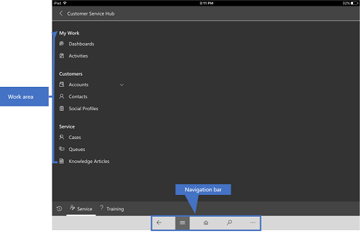
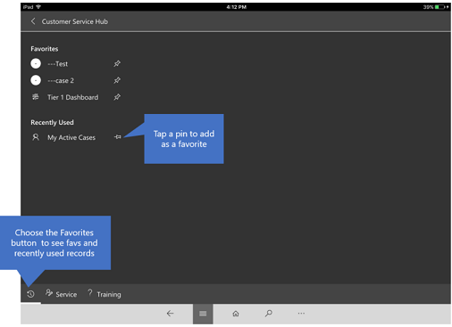

# Use Customer Service Hub on mobile devices

Access your Customer Service Hub data while you’re on the go using Dynamics 365 for phones or Dynamics 365 for tablets on your mobile device.

The Customer Service Hub app works the same whether you’re using it on your mobile device or using it on a web browser on your computer.

Before you can start using the app, you need to install the Dynamics 365 Customer Service mobile app on your device.

[!INCLUDE[proc_more_information](../includes/proc-more-information.md)] [Install Dynamics 365 for phones and tablets](../mobile-app/install-dynamics-365-for-phones-and-tablets.md).

## Basic Navigation

1.	When you sign in, you’ll see the MyApps page with all your apps listed. 
2.	Select **Customer Service Hub**.

**Navigation bar**

Use the navigation (nav) bar to get to your work area, create a new record, search, or do other tasks. To access more commands, tap .

**Favorites and recently used records**

The **Favorites and Recently Used** sections provide quick access to your records, views, and dashboards. 

- To access these sections, tap the **Menu**  button on the nav bar, and then choose the **Favorites and Recent**  button.

- To pin an item as a favorite, from the list of **Recently Used** items, tap the pin. This will pin and move the item to favorites.

  
  
## Guide to use the mobile app 

For more information on how to use the Dynamics 365 Customer Service mobile app, see [Basic navigation on Dynamics 365 for phones and tablets](../mobile-app/user-guide-mobile-app.md).

### See also  
 [Customer Service Hub user's guide](../customer-service/user-guide-customer-service-hub.md)

