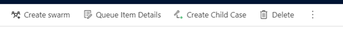
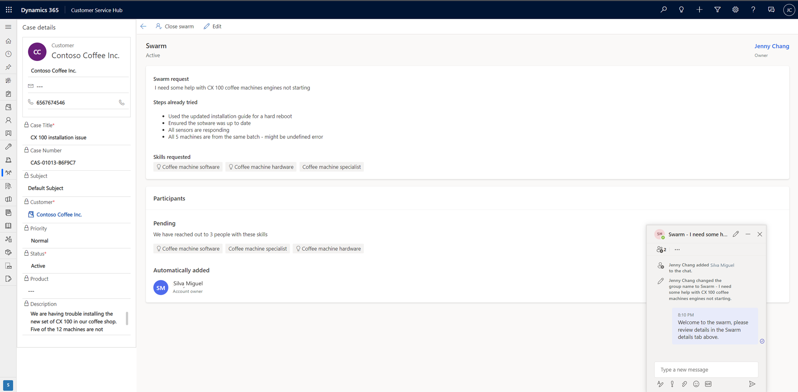
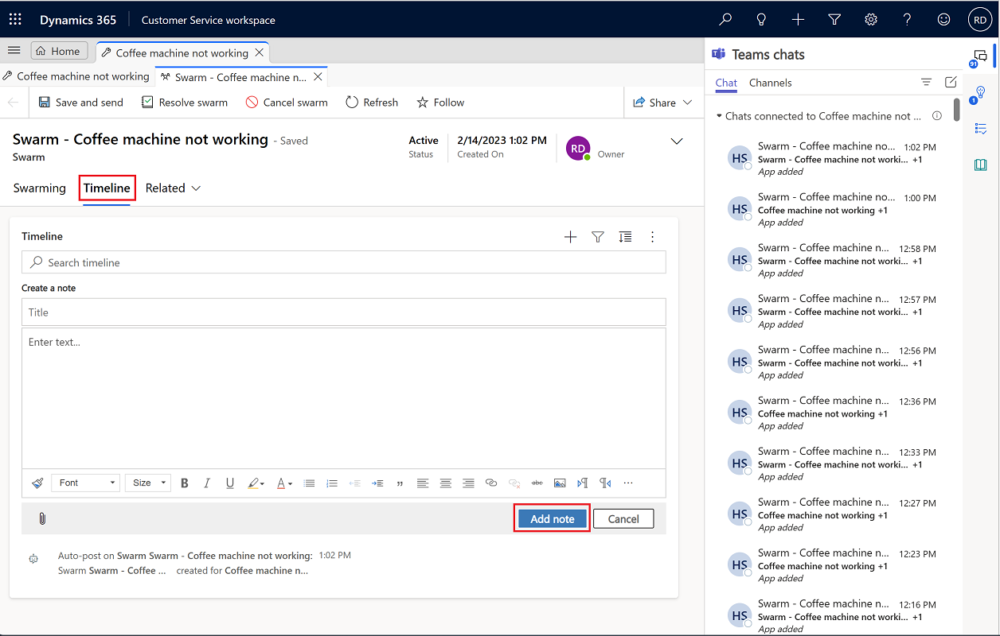
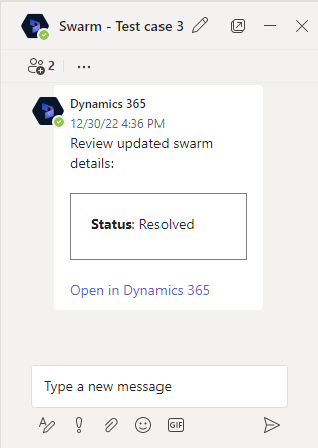

# Use customer support swarming (preview)

> [!IMPORTANT]
> [!INCLUDE[cc-preview-feature](../includes/cc-preview-feature.md)]
>
> [!INCLUDE[cc-preview-features-definition](../includes/cc-preview-features-definition.md)]
>
> [!INCLUDE[cc-preview-features-expect-changes](../includes/cc-preview-features-expect-changes.md)]
>
> [!INCLUDE[cc-preview-features-no-ms-support](../includes/cc-preview-features-no-ms-support.md)]

When you work on time-sensitive, complex customer issues, there are times when it's useful to apply the expertise of coworkers outside of your Dynamics 365 Customer Service team. 

Customer support swarming is particularly useful when you need to do the following:

- Collaborate with experts across your organization to get help on complex cases.
- Use an expert finder to quickly locate experts with the right skills to help.

Use customer support swarming to find the right set of experts to work with on your customer issues and collaborate with peers directly from your desktop.

## Prerequisites

To be able to create a swarm when working on a customer issue, you must have the following prerequisites in place.

- If you're an agent, you must have both a Dynamics 365 Customer Service Enterprise license and Microsoft Teams license.

- If you're an expert joining a swarm, you must have a Teams license.

- Embedded Microsoft Teams chat must be enabled for the agent desktop or on the Teams web app.

## Start a swarm

1. On the Customer Service command bar, select **Create swarm**. (You might need to select the ellipsis to see this option.)

   > [!div class="mx-imgBorder"] 
   > 

  The **Swarm** page opens with the **Case details** displayed on the left side pane. The case and account fields are read-only, and are designed to give other swarm participants the associated details about the case.
 
   > [!div class="mx-imgBorder"] 
   > 

   > [!Note]
   > If you don't see the **Create swarm** option, ask your administrator to assign access privileges for you.

1.  On the **Swarm** form, type information into the following fields:
    - **Swarm request**: The title of the swarm is displayed by default, but you can edit it if needed.
    - **Steps already tried** (optional, 2,000-character limit): Type the details about steps you've already taken to try to resolve the issue, and any results. These details help confirm that any required processes have been followed, and also provides immediate context for other swarm participants who are invited to collaborate on the issue.
    - **What skills do you need?** (optional): As part of the swarm request, the system takes the following actions: 
       - Attempts to match skills based on your swarm question
       - Suggests skills based on rules your administrator has defined. These rules find the key word(s) that are present in the swarm request and/or steps that have already been tried, and then populates the matched skills based on the configured rules.
     
     Suggested skills have the light bulb icon. You can also select up to 10 skills (both system-suggested and manually selected) that you think are relevant to the case. (Manually selected skills won't have the light bulb icon next to them.)
    
      > [!Note]
      > If neither the system nor you designate any skills, you can still create the swarm but no experts will be added. In this scenario, we recommend asking your supervisor for help with identifying the appropriate skills to get expert support.

1. Select **Save and send invitation**. A linked swarm chat is created, and the contacts configured by your administrator are automatically added to the chat. Once a swarm invitation has sent, you can still go back and edit the swarm details if needed.

   > [!Note]
   > By default, your supervisor is automatically added to create the swarm. If you don't have a supervisor, your administrator who configured the swarm is automatically added.

  > [!div class="mx-imgBorder"] 
  > 
   
   The following actions and views occur:
   - The system finds the minimum set of experts needed to cover as many of the skills suggested or that you added as possible.
   - A participants section opens, where you can see the number of experts invited to your swarm who match a particular skills.
   - You can view the names of skills not matched to an expert. If a skill is unmatched, you can work with your supervisor to find experts who match the skill.
   - You can view names of automatically added participants in the chat window.
   - When an invited expert accepts the swarm invitation, they're automatically added to the swarm chat.
   - If you select **Edit** on the command bar, existing saved skills remain. If you edit the swarm request, then the following actions occur:
     - The system will search for skills to account for the newest information, and will append skills found to the existing ones.
     - Invited experts and experts who are already in the swarm remain.
     - A group chat is created, where you can chat with people who are experts on the issue. You might be the only one who is in the chat at first but you can message others to ask them to join if needed.

### How the invitation to experts works

When you select an expert for your swarm, they're sent an automated invitation in Teams via an adaptive card. When they accept your invitation, they're attached to the swarm and their skills are indicated. If the expert declines the invitation, the system then looks for the next expert or experts who have the needed skill(s).

For the invited expert, the swarm invitation shows the following information:
   - Inviting agent: The agent who initiated the swarm and invited the expert.
   - Swarm request: The question the agent needs help with.
   - Steps the agent already tried: A brief description of what the agent has tried prior to creating the swarm.
   - Expert skills: The required skills the expert has for the swarm.
   - Accept and reject: Options for the expert to either join or decline the swarm. If an expert declines an invitation and then later decides they want to join, they can participate by asking you to add them manually. They won't be able to view the swarm form from the group chat.

When an expert joins a group chat, they'll see a read-only version of the **Swarm details** form added as a tab. The right-side pane displays the associated case details. The agent's swarm request and a summary of what the agent has tried to do to resolve the issue are displayed.

Experts who join a swarm can see all participants in the swarm and the skills they have that resulted in their invitation to the swarm.

Experts aren't required have access to Dynamics 365 to participate in swarms, but if they are able to access a swarm in Customer Service, they can go to the **Swarm activities** tab on the **Swarm** page, where they can view a timeline of all the key events that are related to the swarm.

Experts without a Dynamics 365 license can be invited to swarms in Teams. When they accept the invitation to join the swarm, a swarm chat appears in the **Chat** pane in Teams. The expert must select the chat to enter the swarm conversation. Both the agent and the expert can add others to the chat if needed. The agent can interact with the expert and add notes of their interaction to the swarm timeline.
 
### Create a task in the timeline

If there are details that you or your swarm experts want to document or update in the future, you can create a task with an optional due date that appears in the swarm timeline and also in the Teams chat.

To create a swarm-related task, complete the following steps:

1. On the swarm page in Customer Service workspace, select the **Swarm activities** page.
1. In **Timeline**, select the **Add** (+) icon, and then select **Task** on the dropdown menu. The **Quick Create: Task** pane opens on the right-hand side of the page.
1. (Optional) In the **Owner** field, as the creator of the task, you're listed by default. You can add others if desired by typing their names.
1. (Optional) Enter a **Description** of what you need to do.
1. (Optional) Enter a **Due** date.
1. Specify the **Duration** and **Priority** details.
1. When finished, select **Save and Close**.

A Dynamics 365 bot auto-posts a link to the task in the Teams chat.

### Create a note in the timeline

You can create notes that include specific details that appear in the swarm timeline and also in the Teams chat.

1. In **Timeline**, select the **Add** (+) icon, and then select **Note** on the dropdown menu. The **Quick Create: Note** pane opens on the right-hand side of the page.
2. Type a **Title** for the note.
3. In the rich text editor, add details.
4. When finished, select **Save and Close**.

  > [!div class="mx-imgBorder"] 
  > 

### Resolve a swarm session

When a swarm has completed, you can close it by completing the following steps:

1. On the **Swarm** page in Customer Service workspace, select **Resolve swarm**. 
1. (Optional): In the **Resolve this swarm?** dialog box, enter details that describe the solution.
1. Select **Resolve swarm**.

After the swarm is resolved, a Dynamics 365 bot posts to the Teams chat to indicate that the swarm has been resolved with a link to the swarm details in Dynamics 365.

  > [!div class="mx-imgBorder"] 
  > 
   

### Reactivate a swarm

You can reactivate a swarm by completing the following steps:

1. In Customer Service workspace, on the sitemap, select **Swarms** in **Service**.
1. On the **Swarm** page, from the dropdown list, select **All swarms**, and then select the swarm you want to reactivate.
1. On the **Case details** page, select **Reactivate swarm**.

After the swarm is reactivated, a Dynamics 365 bot posts to the Teams chat to indicate that the swarm has been reactivated with a link to the swarm details in Dynamics 365.

### Cancel a swarm

You can cancel a swarm that's in progress by completing the following steps:

1. In Customer Service workspace, on the sitemap, select **Swarms** in **Service**.
1. On the **Swarm** page, select **Active swarms** from the dropdown menu, and then select the swarm you want to cancel.
1. On the **Case details** page, select **Cancel swarm**.
1. On the **Cancel this swarm?** dialog, select the reason you want to cancel the swarm from the dropdown list, and then select **Cancel swarm**.

After the swarm is canceled, a Dynamics 365 bot posts to the Teams chat to indicate that the swarm has been canceled with a link to the swarm details in Dynamics 365.

### View associated swarms

You can see the swarms that are associated with a case from the record. To view the associated swarms, in Customer Service workspace, go to the **Details** tab, and then view the **Associated swarms** card.

### Swarm views

To view a list of swarms, go to **Swarms** on the site map. The following views are available:

- All swarms
- Canceled swarms
- My active swarms
- Resolved swarms
- Swarms being followed
- Swarms I follow

### See also

[Configure customer support swarming](configure-customer-support-swarming.md) 
[Configure Teams chat](configure-teams-chat.md) 
[Use Teams chat](use-teams-chat.md)
