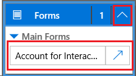
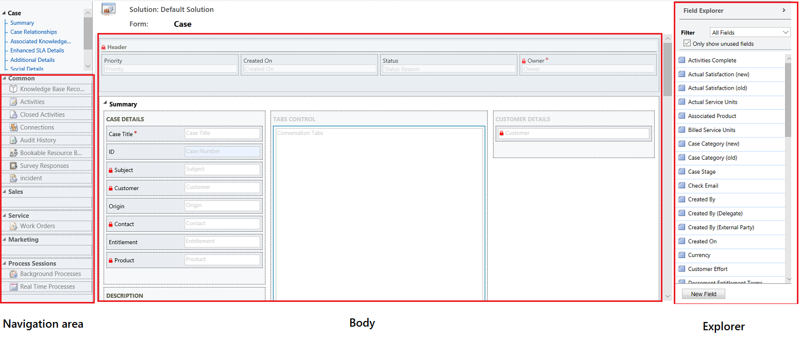
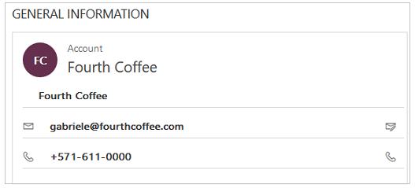

# Use the Main form and its components
 
Forms in the Customer Service Hub have a new experience that saves users some clicks and helps them maintain context while working on related records. You can see the forms enlisted in the solution explorer in the **Customization** area. The form type of the new forms is **Main**.

This topic explains how to edit a Main form, and add or change various elements of the form.

## Open the form editor

To edit a form or to add or change elements, use the form editor. The form editor lets you edit forms for all unified interface based apps, like the Customer Service Hub app. 

Follow the procedures given below to access the form editor: 

> [!NOTE]
> If you create any new solution components in the process of editing the form, the names of the components will use the solution publisher customization prefix for the default solution and these components will only be included in the default solution. If you want any new solution components to be included in a specific unmanaged solution, open the form editor through that unmanaged solution.

### Access the form editor through App designer

1. Go to **Settings > My Apps**.
2. Select **...** on an app and select **Open in App designer**.
3. Select the down arrow   to expand the tile and see a list of forms. 
4. Select the site map designer button corresponding to the form to edit the form in the Form designer.

   
 
5. Select **Save** to save the changes and **Save and close** to close the form designer. 
6. Select **Save** and then select **Publish** in the app designer to publish the changes for use in the Customer Service Hub app.

> [!NOTE]
> If you have made any changes to the app, publish them using the app level publish option. See [Publish an app using the app designer](../customize/publish-an-app.md) for more information.

> [!NOTE]
> The webclient Main form is also compatible with the Customer Service Hub and is available to be edited using the App designer.

### Access the form editor through the default solution

1. Go to **Settings > Customizations**.
2. Click **Customize the System** to open the default solution.
3. Under **Components**, expand **Entities**, expand the entity you want, and then select **Forms**.
4. In the list of forms, open the form of type **Main**.

### Access the form editor for an unmanaged solution

1. Go to **Settings > Customizations**.
2. Click **Solutions**.
3. Double-click the unmanaged solution you want to work with.
4. Locate the entity with the form you want to edit. If the entity isn’t there, you’ll need to add it.

#### Add an entity to an unmanaged solution

1. Select the **Entities** node and, in the toolbar above the list, click **Add Existing**.
2. In the **Select Solution Components** dialog box, with the **Component Type** selector set to **Entity**, select the entity you want to add and click **OK**.
3. If the **Missing Required Components** dialog box appears, you can click **No, do not include required components** if you don’t intend to export this unmanaged solution to another organization. If you don’t want to include missing required components at this time, you can add them later. You’ll receive notification again if you export this solution in the future.
5. In the solution explorer expand the entity with the form you want to edit and select **Forms**.
6. In the list of forms, open the form of type **Main**.

#### Publish the changes for use in the Customer Service Hub

Certain customizations that make changes to the user interface require that they be published before people can use them in the application. To publish your customization, in the solution explorer, click **Publish All Customizations**.

## Form editor user interface

The form editor displays commands in three tabs: **File**, **Home**, and **Insert**.[!INCLUDE[proc_more_information](../includes/proc-more-information.md)]
- [File tab](#file-tab)
- [Home tab](#home-tab) 
- [Insert tab](#insert-tab) 
 
The form editor is divided into three areas: **Navigation**, **Body**, and **Explorer**.

**Navigation**
Located on the left side, use the navigation area to control access to related entities or to add links to URLs to be displayed in the main pane of the form. To edit navigation, you must first select the **Navigation** command in the **Select** group of the **Home** tab.

Main forms provide navigation options through the navigation bar, but use the same data in the navigation area to control what navigation options are available. [!INCLUDE[proc_more_information](../includes/proc-more-information.md)] [Edit Navigation](../customize/use-the-form-editor-legacy.md)  

**Body**
Located in the center, use the body area to control the layout of the form. You can select and drag form elements to position them. Double-clicking on an element will open the properties for the element. 

By default, for the Case, Contact, and Account Main forms, the first section under the **Summary** tab shows the account or contact card form of type **Quick View**. For custom entities, this section is not available by default. You can insert a new section and a quick view form in it. The card form shows a maximum of five fields. Other than fields, it isn’t possible to show other controls in the Blue tile even if the quick view form contains it. 
 
>[!NOTE] 
> To preserve the card format (as shown in the following image), we recommend that you do not move the quick view form to any other section on the form.

	 
 [!INCLUDE[proc_more_information](../includes/proc-more-information.md)] [Create and edit quick view forms](../customize/create-edit-quick-view-forms.md)  
  
   - To add a field, select it from the **Field Explorer** and drag it into a section. 

    - To add an element that’s not a field, select where you want to place it and use the appropriate command from the **Insert** tab add it. 

    - To remove an element, select it and use the **Remove** command in the **Edit** group of the **Home** tab.

    - To edit the **Header** or **Footer** for the form you must first select the corresponding command in the **Select** group of the **Home** tab. The fields in the header and footer are shown below the customer card (the Blue tile) in the runtime.

**Explorer**
Located on the right side, the content of the explorer area depends on the context.

   - When you select **Body**, **Header**, or **Footer** in the **Select** group of the **Home** tab, you’ll see the **Field Explorer**. Use the **Field Explorer** to drag fields you want to display into a section in the form or within the header or footer. You can include the same field multiple times in a form. Use the **New Field** button as a shortcut to create a new field.

   - When you select **Navigation** in the **Select** group of the **Home** tab you’ll see the **Relationship Explorer**. Drag any of the relationships into one of the groups within the navigation area. You cannot add the same relationship twice. Relationships are available based on how they are configured. If you configure a relationship to not display, it won’t display in the **Relationship Explorer**. For information about how to configure default display options for relationships, see [Navigation Pane Item for Primary Entity](../customize/create-and-edit-1n-relationships.md#navigation-pane-item-for-primary-entity)

You can use the **New 1:N** and **New N:N** buttons as a shortcut to add new entity relationships.

### File tab

Select the **File** tab to add/view the following options:

- **New Activity** Add a new activity
- **New Record** Add a new record
- **Tools** Utilize options like Import data, Duplicate detection, and Bulk delete wizard
- **Options** Change the default display settings to personalize Microsoft Dynamics 365, and manage your email templates
    - General
    - Synchronization
    - Activities
    - Formats
    - Email Templates
    - Email Signatures
    - Email
    - Privacy
    - Languages
- Help
- Close

### Home tab
The **Home** tab displays the commands listed in the following table:

|Group|Command|Description|
|-----------|-------------|-----------------| 
|**Save**|**Save**  **(Ctrl+S)**|Save the form.|
||**Save As**|Create a copy of this form with a different name.|
||**Save and Close**|Save the form and close the form editor.|
||**Publish**|Publish the form. More information: Publishing customizations|
|**Edit**|**Change properties**|Change properties of the selected item in the body.   See the following sections depending on the selected item:   -   [Tab Properties](../customize/tab-properties-legacy.md) -   [Section properties](../customize/section-properties-legacy.md) -   [Common Field properties](../customize/common-field-properties-legacy.md) -   [Special field properties](../customize/special-field-properties-legacy.md) -  [Sub-grid properties](../customize/sub-grid-properties-legacy.md) -   [Quick view control properties](../customize/quick-view-control-properties-legacy.md)|
||**Remove**|Remove the selected item.|
||**Undo** **(Ctrl+Z)**|Undo the previous action.|
||**Redo** **(Ctrl+Y)**|Redo the previous action.|
|**Select**|**Body**|Edit the main body of the form.|
||**Header**|Edit the form header.|
||**Footer**|Edit the form footer.|
||**Navigation**|Edit the form navigation.   [!INCLUDE[proc_more_information](../includes/proc-more-information.md)] [Edit Navigation](../customize/use-the-form-editor-legacy.md)
|**Form**|**Business Rules**|View, edit, or create new business rules with the Business Rules explorer. **Note:**  For the interactive forms, only the “Entity” and “All Forms” scope is supported.   [!INCLUDE[proc_more_information](../includes/proc-more-information.md)] [Create and edit business rules](../customize/create-business-rules-recommendations-apply-logic-form.md)|
||**Form Properties**|[!INCLUDE[proc_more_information](../includes/proc-more-information.md)] [Form Properties](../customize/form-properties-legacy.md)|  
||**Preview**|Use this to see how form looks after it is published. You can also preview to test scripts associated with from events.|         
||**Enable Security Roles**|Use this to set which security roles will have access to the forms. [!INCLUDE[proc_more_information](../includes/proc-more-information.md)]  [Control access to forms](../customize/control-access-forms.md) **Important:**  If you create a new form, only the System Administrator and System Customizer security roles will have access to the form. You must assign access to other security roles before people in your organization can use it.|  
||**Show Dependencies**|See which solution components depend on this form and which solution components are required by this form. [!INCLUDE[proc_more_information](../includes/proc-more-information.md)] [Solution dependencies](../customize/overview.md)|  
||**Managed Properties**|Managed properties command has two properties **Customizable** and **Can be Deleted**. Setting these properties to false means the form won’t be customizable and cannot be deleted after you included it in a solution, export that solution as a managed solution, and import that managed solution into a different organization. [!INCLUDE[proc_more_information](../includes/proc-more-information.md)]  [Managed properties](../customize/managed-properties.md)| 
|**Upgrade**|**Merge forms**|If applicable, this option lets you merge this form with a form from a previous version of Dynamics 365 form|

### Insert tab

 
The Insert tab displays the commands in the following table:

|Group|Command|Description|
|-----------|-------------|-----------------| 
||**Section**|Add a section to a selected tab. You can include a section with one to four columns.   You can also insert a Reference panel in the interactive forms. Reference panel is also added as a section to the Main - Interactive experience form. By default the Reference panel section is added to the Case, Account, Contact and custom entity forms.   [!INCLUDE[proc_more_information](../includes/proc-more-information.md)] [Section properties](../customize/section-properties-legacy.md)|  
|**3 Tabs**|**Three Columns**|Insert a three-column tab with equal widths.   [!INCLUDE[proc_more_information](../includes/proc-more-information.md)] [Tab Properties](../customize/tab-properties-legacy.md)|  
||**Three Columns**|Insert a three-column tab with a wider middle column.|  
|**2 Tabs**|**Two Columns**|Insert a two-column tab with a wider right column.|  
||**Two Columns**|Insert a two-column tab with a wider left column.|  
||**Two Columns**|Insert a two-column tab with equal width columns.|  
|**1 Tab**|**One Column**|Insert a one-column tab.|  
|**Control**|**Sub-Grid**|Format a sub-grid and insert it into the form.   [!INCLUDE[proc_more_information](../includes/proc-more-information.md)] [Sub-grid properties](../customize/sub-grid-properties-legacy.md)|  
||**Spacer**|Insert an empty space.|  
||**Quick View Form**|Insert a Quick View Form.   [!INCLUDE[proc_more_information](../includes/proc-more-information.md)] [Quick view control properties](../customize/quick-view-control-properties-legacy.md)|  
||**Web Resource**|Insert a web resource to embed content from other locations in one page.   [!INCLUDE[proc_more_information](../includes/proc-more-information.md)] [Web Resource properties](../customize/web-resource-properties-legacy.md)|  
||**IFRAME**|You can add IFRAME to a form to integrate content from another website within a form.| 
||**Timeline**|Insert a timeline control in the form. This control shows the timeline of activities related to the entity on a form.|  
||**Navigation Link**|Using this option, you can insert a link into a form navigation.|  
||**Timer**|Insert a timer control to an entity form to track time against an SLA. [!INCLUDE[proc_more_information](../includes/proc-more-information.md)] [Add a timer control](../customer-service/add-timer-control-case-form-track-time-against-sla.md)|
||**Knowledge Base Search**|Insert a search control that users can use to search knowledge articles. [!INCLUDE[proc_more_information](../includes/proc-more-information.md)]  [Knowledge Article Search control](../customer-service/add-knowledge-base-search-control-forms.md)|  
||**Relationship Assistant**|Using this option, you can insert a relationship assistant control in the form.|

>[!Note] 
>The following components aren’t supported in the Main forms: 
• Yammer  
• Activity Feeds

## Form properties

To know in detail about the form properties, see [Form properties](../customize/form-properties-legacy.md).

## Visibility options  
 Several types of form elements have the option to be shown or hidden by default. Tabs, sections, and fields all provide this option. Using form scripts or business rules, the visibility of these elements can be controlled to create a dynamic form to provide a user interface that adapts to conditions in the form.  
  
> [!NOTE]
>  Hiding form elements is not a recommended way to enforce security. There are several ways people can view all the elements and data in the form when elements are hidden.  
  
 Rather than designing forms that depend on scripts to control visibility of options, consider whether a business process flow, a dialog, or switching to a different form may be better suited to meet your requirements. If you do use scripts, make sure that any element that might be hidden is hidden by default. Only show it with scripts when your logic calls for it. This way it isn’t displayed in presentations that don’t support scripts.  
  
## Tab properties  

To know in detail about the tab properties, see [Tab properties](../customize/tab-properties-legacy.md).

## Section properties  
 
To know in detail about the section properties, see [Section properties](../customize/section-properties-legacy.md).
  
## Timeline  
 The Timeline shows related activities for a specific entity.  
  
 The following types of activities are supported: Task, appointment, phone call, email, social activity, custom activity.  
  
 The Timeline also shows notes and, system and user posts. It shows those activities that have **Regarding** field set to the entity you’re viewing. For notes, the **Regarding** field isn’t shown to the user; It is implicit when created from the Timeline.  
  
 Each activity that’s shown in the Timeline, will have the same quick actions that are available on the activity’s command bar.  

## Common field properties  

To know in detail about the common field properties, see [Common field properties](../customize/common-field-properties-legacy.md). 
  
## Special field properties  
 All fields have the properties listed in [Common field properties](../customize/common-field-properties-legacy.md), but certain fields have additional properties.  

To know more, see [Special Field Properties](../customize/special-field-properties-legacy.md).

  
## Sub-grid properties  

To know in detail about the sub-grid properties, see [Sub-grid properties](../customize/sub-grid-properties-legacy.md).

## Quick view control properties  

To explore the Quick view control properties, see [Quick view control properties](../customize/quick-view-control-properties-legacy.md).
  
## Web resource properties  

Know in detail about the Web resource properties. Go to [Web resource properties](../customize/web-resource-properties-legacy.md). 
  
## IFRAME properties  

To know more about the IFRAME properties, see [IFRAME properties](../customize/iframe-properties-legacy.md). 
  
## Edit Navigation  
 Navigation within the form allows people to view lists of related records. Each entity relationship has properties to control whether it should be shown. [!INCLUDE[proc_more_information](../includes/proc-more-information.md)] [Navigation Pane Item for Primary Entity ](../customize/create-and-edit-1n-relationships.md#navigation-pane-item-for-primary-entity)
  
 Any entity relationships that are configured to be displayed can be overridden within the form editor.  
  
 For step-by-step instructions, see [Add form navigation for related entities](../customize/add-edit-form-navigation-related-entities.md).
  
 To enable editing navigation you must first select **Navigation** from the **Select** group on the **Home** tab.  
  
 In the **Relationship Explorer** you can filter by 1:N (one-to-many) or N:N (many-to-many) relationships, or view all available relationships. The **Only show unused relationships checkbox** is disabled and selected. So you can only add each relationship one time.  
  
 To add a relationship from the **Relationship Explorer** just double-click it and it will be added below the currently selected relationship in the navigation area. Double-click a relationship in the navigation area and you can change the label on the **Display** tab. On the **Name** tab, you can see information about the relationship. Use the **Edit** button to open the definition of the entity.  
  
 There are five groups in the navigation area. You can drag them to reposition them and double-click them to change the label, but you can’t remove them. These groups are displayed only when there is something in them. If you don’t want a group to appear, just don’t add anything to it.  
  
## Configure event handlers  

To know more about configuring event handlers, see [Configure event handlers](../customize/configure-event-handlers-legacy.md). 
  
## See Also  
 [Create and design forms](../customize/create-design-forms.md)   
 [Create and edit quick create forms](../customize/create-edit-quick-view-forms.md)   
 [Create and edit quick view forms](../customize/create-edit-quick-view-forms.md)
