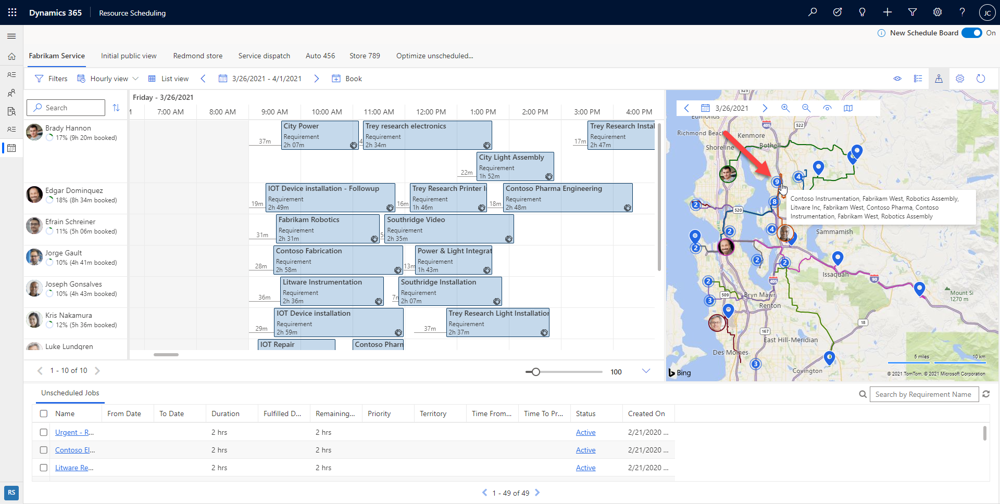
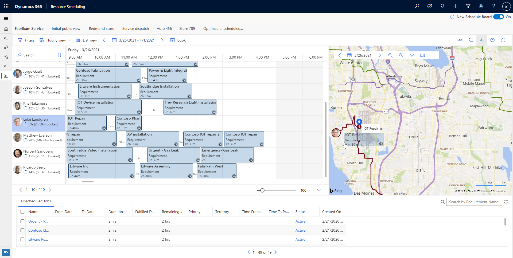
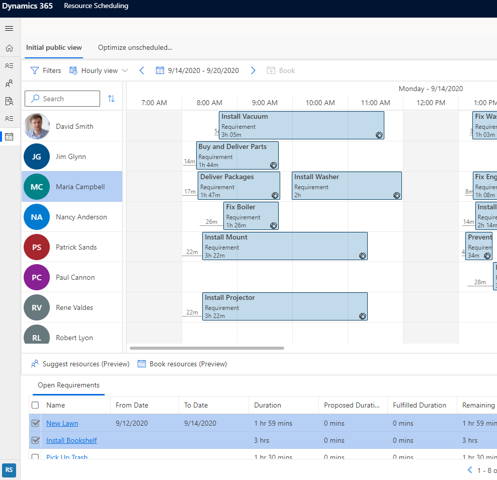
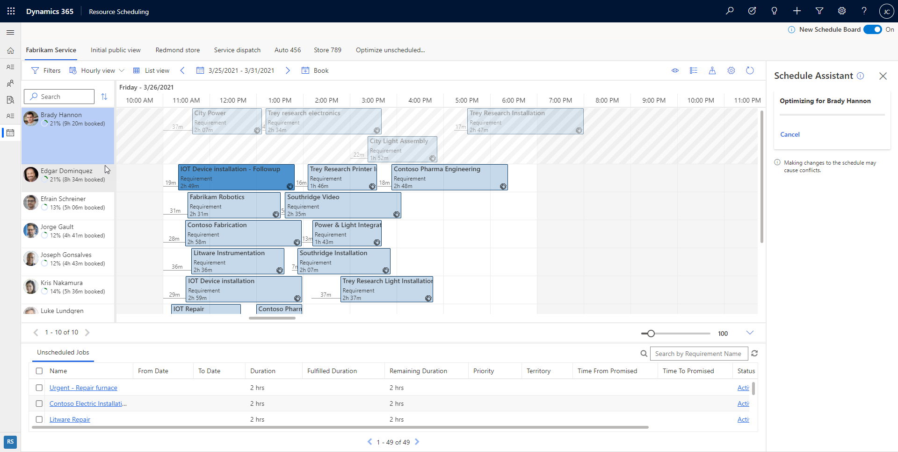

# Use the schedule board to configure service activities

In this article, we'll take a look at what's new and show you how to switch to the new schedule board in your environment. 

> [!div class="mx-imgBorder"]
> 


The new schedule board is faster, with better usability, and it lays the foundation for new capabilities for multi-day scheduling and intelligent interactions.

> [!div class="mx-imgBorder"]
> 


### Performance

The new schedule board is faster and more responsive when you do the following tasks: 

- Load the schedule board
- Select schedule board tabs
- Drag and drop service activities
- Reschedule bookings

> [!div class="mx-imgBorder"]
> 

### Usability and accessibility

The new schedule board is a Power Apps Component Framework (PCF) control that's built on the Unified Client Interface, making it more flexible, supportable, and accessible. The new schedule board works better on different screen sizes and across form factors. 

New color schemes and ways of depicting travel time make it easier for schedulers to see statuses and details.

> [!div class="mx-imgBorder"]
> 

For instance, the previous screenshot shows a new "ghost booking" feature that helps schedulers know if a booking will fit into a schedule before the booking is even scheduled.

### Foundation for new capabilities

The new schedule board provides the foundation for future releases that will help provide schedulers with insights and recommendations for how to improve schedules.

## Prerequisites

The next generation schedule board is generally available and requires that you have Dynamics 365 Customer Service.
 

## Enable new schedule board

Go to the schedule board and use the toggle button in the top-right side of the schedule board to switch between the current and new schedule boards. 

> [!div class="mx-imgBorder"]
> 

## Select and filter resources

Choose which resources should display on each schedule board tab.

1. Expand the filter pane, and then choose **Select Resources**.

> [!div class="mx-imgBorder"]
> 

2. From the list of available resources on the left, move the ones you want to display on the schedule board to the right, and then select **Apply**.

> [!div class="mx-imgBorder"]
> 

## Resource cards

Right-click a resource's name and then choose **View Resource Card** to see more, like the resource's skill set (characteristics) and roles. From here, you can also initiate a message, email, or phone call.

> [!div class="mx-imgBorder"]
> 

## Map view of requirements and resources

Select the map icon in the upper-right of the schedule board to display the resources and requirements on a map.

> [!div class="mx-imgBorder"]
> 

After expanding the map view, select a resource's name to see their route. The numbers indicate the order the resource is scheduled to arrive at each job (requirement) location.

> [!div class="mx-imgBorder"]
> 
 
On a zoomed-out view of the map, the requirements and resources are grouped together, and you can see a count of requirements and resources. This count helps you quickly identify a geographical area with more unscheduled jobs, and then start scheduling the jobs to nearest resources. 

> [!div class="mx-imgBorder"]
> 

You can drag an unscheduled requirement pin from the map to the resource timeline and schedule it to that resource. 

> [!div class="mx-imgBorder"]
> 

> [!div class="mx-imgBorder"]
> 

You can also drag the resource route to a nearby unscheduled requirement to schedule it and add it to the resource route. 

> [!div class="mx-imgBorder"]
> 

> [!div class="mx-imgBorder"]
> 

## Daily view

The new schedule board supports a daily view of scheduled jobs, and supports dragging-and-dropping to the schedule.

> [!div class="mx-imgBorder"]
> 

Scheduled requirements with a short duration will display across the entire day to make it easier to view details. Hover over the requirement or double-click it to see the actual duration. 

> [!div class="mx-imgBorder"]
> 

## Weekly and monthly views

Switch to the weekly or monthly views to see scheduled jobs at a higher level. Select a resource's time slot and a requirement below to trigger the booking panel.

> [!div class="mx-imgBorder"]
> 

The booking panel will help you schedule a service activity across multiple days and choose how the work should be divided each day.

## Schedule resources

Beyond manual drag-and-drop scheduling, organizations that use resource scheduling optimization can select one or more requirements from the new schedule board and either have the system **Suggest resources** or **Book resources**. This feature is currently in Preview for the organizations that are using Resource Scheduling Optimization.


> [!div class="mx-imgBorder"]
> 

Selecting **Suggest resources** will display recommended resources in the right panel for the scheduler to book.


> [!div class="mx-imgBorder"]
> 

Selecting **Book resources** will find the most optimal resources and book them without further actions from the scheduler.

> [!div class="mx-imgBorder"]
> 

**Suggest resources** and **Book resource** capabilities on the new schedule board are currently only available for organizations using resource scheduling optimization.

Sometimes you might need to optimize only a single resource's schedule, rather than a set of available resources. Single resource optimization provides a quick way to reoptimize a resource's schedule and travel route after schedule changes have occurred during the day. This functionality is available on the new schedule board. You can right-click a resource from any schedule board view, and then select **Optimize Schedule**.

> [!div class="mx-imgBorder"]
> 

> [!div class="mx-imgBorder"]
> 
> 
> [!div class="mx-imgBorder"]
> 

## Move bookings to a new resource, a new start date and time, or both

With Customer Service, the new schedule board provides an easy way to reassign and reschedule bookings in the same action. Bookings can be moved to resources on the current schedule board tab, or to resources on other schedule board tabs.

### Move a booking to a resource on the current schedule board tab, or change the start date/time, or both

1. Right-click a booking, and then select **Move to**. 
2. Reassign the booking to any resource on the current schedule board tab, or change the start date and the start time of the booking. 
3. Select **Update** to apply the changes.

> [!div class="mx-imgBorder"]
> 

### Move a booking to a resource on a different schedule board tab, or change the start date or time, or both

1. Right-click the booking, and then select **Move to**.
2. Select the filter icon in the resource field, and then change the filter from **Resources on this tab** to **All resources**.
   Now, you can reassign this booking to any resource on any tab, and change the start date and start time of the booking.
3. Select **Update** to apply the changes.

> [!div class="mx-imgBorder"]
> 

## Automatic scheduling with optimization goals

The schedule board supports optimization goals. After selecting suggested resources, schedulers can edit the optimization goal, which dictates how resources are recommended. 

> [!div class="mx-imgBorder"]
> 

There's a default optimization goal that applies to the entire system and serves as the default for optimization requests. Schedulers can also edit the default optimization goal for each schedule board. Finally, schedulers can edit the optimization goal for a single optimization request by selecting **Suggest Resources**. 

## Edit multi-day bookings

After you've created a multi-day booking across multiple days, weeks, or months, you can right-click the booking, select edit, and change how many hours are assigned for each day, week, or month via the booking panel on the right. 

> [!div class="mx-imgBorder"]
> 

## Use the appointments feature in resource scheduling

Organizations often use appointments in Dynamics 365. For example, an agent might create a service appointment to help a customer with an issue. Other examples include organizations creating appointments because of integrations with other systems.

Dynamics 365 Appointments (Microsoft Dataverse appointments) can be displayed on the Customer Service schedule board alongside bookings, and can be considered during scheduling to understand whether an agent or bookable resource is available.

For information on how to configure and use appointment scheduling, see [Include appointments in scheduling](/dynamics365/field-service/appointment-scheduling).

## Configuration considerations

- The new schedule board is currently supported on Microsoft Edge, Chrome, and Firefox browsers.

### When to use the new versus current schedule board

The new schedule board is recommended for manual scheduling scenarios and for organizations that want to get up and running with a scheduling solution for schedulers. The new schedule board is designed and built to deliver improved performance and usability. Users who perform drag-and-drop scheduling or users who only need to see the schedule board can use the new schedule board during preview. Also, organizations using resource scheduling optimization should consider using the new schedule board because the resource scheduling optimization capabilities are embedded.

The in-market schedule board is recommended for more complex scheduling scenarios like assisted scheduling, multi-resource scheduling, using requirement groups, and so on. 

Use the following feature comparison table to understand which version of the schedule board is right for your business.

| Feature   | Category   | New schedule board     | Old schedule board | Details   |
| --------- | ---------- | ------ | ------ | ---- |
| Manual scheduling     | Scheduler | Yes   | Yes   | Scheduler can manually select a resource and create a booking for an unscheduled requirement by interactions like dragging and dropping the requirements, selecting an open timeslot, and using booking panel.    |
| Assisted scheduling           | Scheduler | 2021 release wave 2 | Yes         | Scheduler can select an unscheduled requirement on the requirement panel and select "Find Availability," which opens up the schedule assistant view, and shows the available timeslots for the available resources. Scheduler can choose a timeslot and create a booking.       |
| Automated scheduling          | Scheduler | For existing resource scheduling optimization customers, public preview is available.  | No                 | The default capabilities of resource scheduling optimizer functionality are made available in the schedule board, enabling schedulers to manage schedules from a requirement's or resources point of view with the organization's business goals applied automatically by the optimizer.                    |
| Auto update travel time    | Scheduler | Yes                  | Yes                |  When a booking is manually scheduled or rescheduled via drag-and-drop, the travel time from the resource's previous location is automatically calculated and displayed in the front of the booking.
| View modes - Hourly, daily    | Scheduler | Yes                               | Yes                | Show the resources and their bookings on the hourly and daily views of the schedule board.          |
| View modes - Weekly, monthly  | Scheduler | Yes    | Yes        | Show the resources and their bookings on the weekly and monthly views of the schedule board.      |
| View types - List view        | Scheduler | Yes        | Yes                | List view is a simple view, in which bookings of the resources are shown as a simple list. This list view provides accessible view to the Users to browse and create Bookings                                               |
| View types - Map view         | Scheduler | Yes         | Yes                |        |
| View types - Details view     | Scheduler | 2021 release wave 2                        | Yes                | Details view is a configurable view, to show and add details of a resource, requirement, or a booking record.     |
| Multi-resource scheduling     | Scheduler | 2021 release wave 2         | Yes      | Requirement groups allow you to define groups of resources that would be appropriate for a job and to then schedule all those resources with a single search. With requirement groups, you can mix and match the different types of resources—such as individual field technicians, a whole crew, equipment, or facilities—needed for a job              |
| Multi-day assisted scheduling | Scheduler | 2021 release wave 2                   | Yes                | Service activities and scheduling requirements can be scheduled across multiple days and weeks. A common example is scheduling a 40-hour service activity across an entire work week where the field technician is expected to perform more detailed work at the same location each day.      |
| Multi-day manual scheduling   | Scheduler | Yes                    | Yes                | Service activities and scheduling requirements can be scheduled across multiple days and weeks. A common example is scheduling a 40-hour service activity across an entire work week where the field technician is expected to perform more detailed work at the same location each day.       |
| Pools and crews       | Scheduler | 2021 release wave 2         | Yes                | Resource pool scheduling allows you to assemble groups of similar resources to manage capacity and give schedulers the option to assign specific resources at a later time.<br>Resource crews allow schedulers to search and schedule multiple resources at once. Crews can include a group of employees, subcontractors, equipment, facilities, or any combination thereof who will perform the same work during a period of time. Crews speed up and simplify the scheduling process and allow team members to work together more consistently.                               |
| Configuration                 | Admin      | 2021 release wave 2       | Yes                | Admin can create new tabs on the schedule board and configure changes on the board, tab settings, and scheduler settings      |
| Extensibility       | Admin      | 2021 release wave 2            | Yes                | Admin can extend the schedule board and use extensibility on some of features like<br>Custom Booking template (Hours) - HTML<br>Custom Booking alerts - HTML<br>Custom Resource Cell Template - HTML<br>Custom Filter Layout - Universal FetchXML<br>SB/SA Retrieve Resources Query - Universal FetchXML<br>SB/SA Retrieve Constraints query - Universal FetchXML<br>Custom Web resource support<br>Client Extensions (support for JavaScript, style sheets, and Localizations files)<br>Booking Rules (Support for custom business logic via JavaScript on the booking creation) |
 
Continue to use the current schedule board for common functions like:
- Creating and deleting schedule board tabs. 
- Schedule board tab settings.
- Schedule board configurations like number of days in a view or applying filter territories.


### Add new schedule board to custom sitemap area

When using a custom sitemap or an app module, you'll need to update the sitemap to consume the new schedule board preview.

The following snippet is what it looks like before:

```<SubArea Id="msdyn_ScheduleBoardSubArea" ResourceId="SitemapDesigner.NewSubArea" VectorIcon="$webresource:msdyn_/Icons/SVG/Calendar.svg" Url="$webresource:msdyn_/fps/ScheduleBoard/ScheduleBoard.html" Client="All,Outlook,OutlookLaptopClient,OutlookWorkstationClient,Web" AvailableOffline="true" PassParams="false" Sku="All,OnPremise,Live,SPLA">```

> [!div class="mx-imgBorder"]
> 

The following snippet is what it looks like after:

```<SubArea Id="msdyn_ScheduleBoardSubArea" ResourceId="SitemapDesigner.NewSubArea" VectorIcon="$webresource:msdyn_/Icons/SVG/Calendar.svg" Url="/main.aspx?pagetype=entitylist&amp;etn=msdyn_scheduleboardsetting" Client="All,Outlook,OutlookLaptopClient,OutlookWorkstationClient,Web" AvailableOffline="true" PassParams="false" Sku="All,OnPremise,Live,SPLA">```
​

> [!div class="mx-imgBorder"]
> 

**URL:**

```/main.aspx?pagetype=entitylist&etn=msdyn_scheduleboardsetting```

**ID:**

```msdyn_scheduleboardtoggle```

## Additional notes

- The schedule board is only supported in Unified Interface web, and not on tablets or phones.
- The booking status colors that appear on the schedule board have lower opacity than the defined booking status colors. This behavior is similar to the Outlook calendar. When a booking is selected on the schedule board, the booking color will appear with normal opacity.

### Uninstall the schedule board

To uninstall the new schedule board solution ("Resource Scheduling Controls"), perform the following steps.

1. Go to the **Schedule Board Settings** entity customization form.
2. Remove the new schedule board preview control from the grid.
3. Save and publish the changes.
4. Go to the resource scheduling app, clear the browser's cache, and reload schedule board. The old schedule board will load without the toggle in the top-right side of the screen.
5. Once the solution is uninstalled, the new schedule board won't be available for the environment until you upgrade your Customer Service app to the latest available version.


### See also

[Schedule a service activity](schedule-service-activity-csh.md)


[!INCLUDE[footer-include](../includes/footer-banner.md)]
