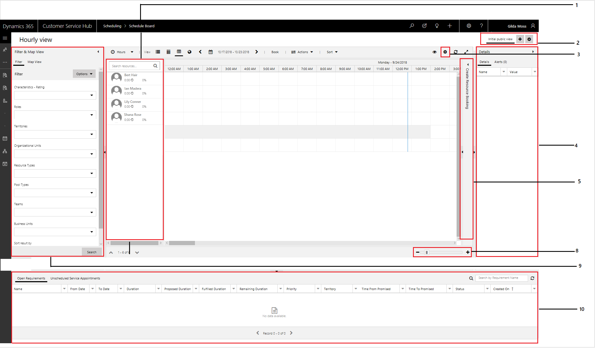
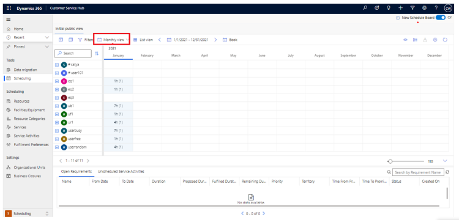
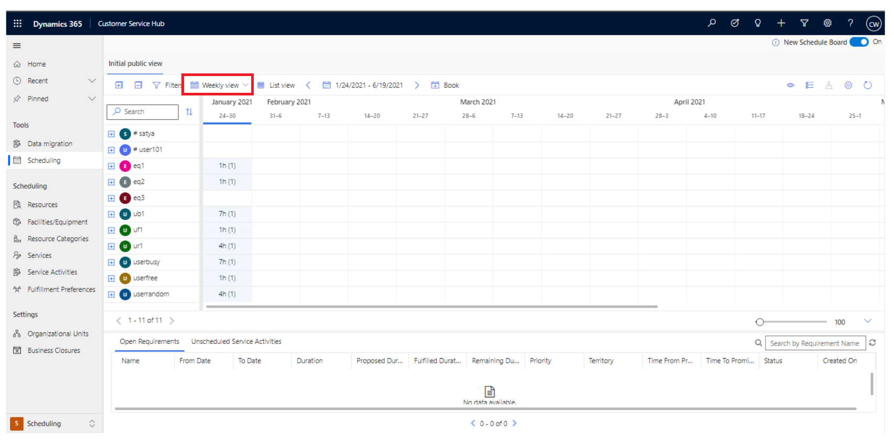
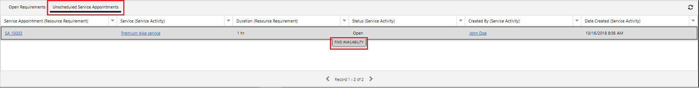
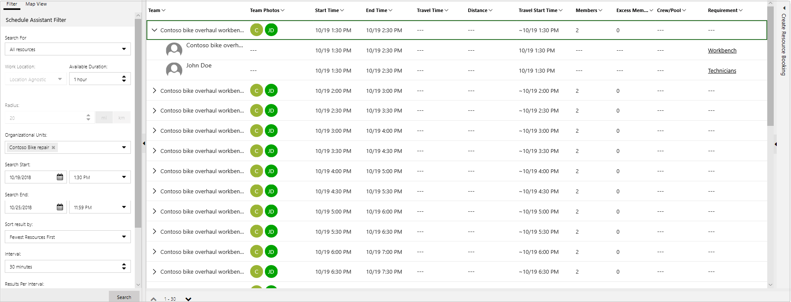
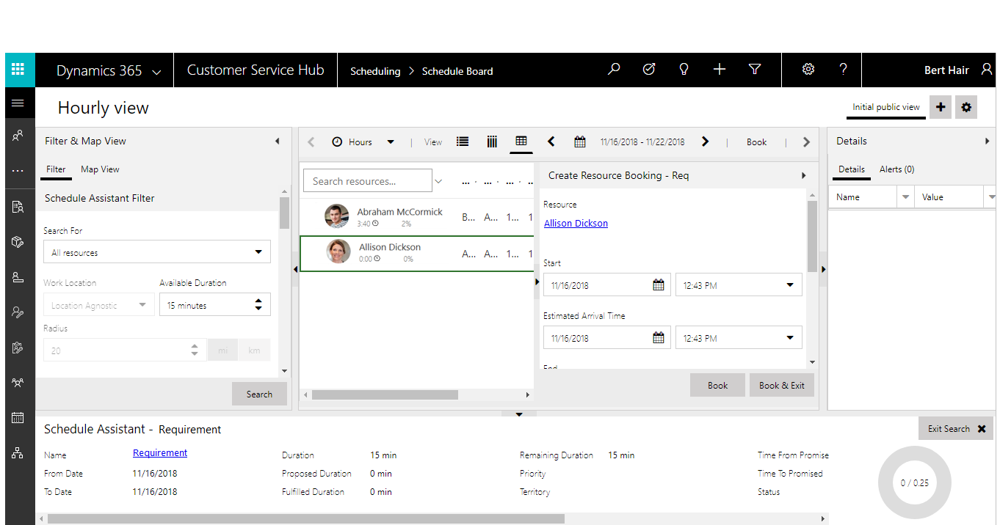

# Use the schedule board to configure service activities

The schedule board in service scheduling lets you view resource availability before you book them for service activities. Set up views and filters the way you prefer, and book service activities for each of your resources.

In the schedule board, you can do the following tasks and activities:  
  
- View your organization's daily, weekly, and monthly schedule of service activities.  
  
- View work schedules and service activity schedules for a variety of resources.  
  
- Schedule service activities.  
  
- Change the status of an existing service activity.  
  
- Search for conflicts in the schedule.  
  
> [!NOTE]
> You can’t customize the schedule board or change the default view with the application. However, you can ask your system administrator to change the colors of the time blocks.  
 
## Navigate the schedule board
In the Customer Service Hub sitemap, navigate to **Scheduling** > **Tools**, and select **Schedule Board**.

Here’s what you’ll see when you open the schedule board:

|Label  |Field  |Description  |
|---------|---------|---------|
|1    |    View list of resources     |  A list of resources is displayed on the left side of the calendar in alphabetical order. To view the resources, and service activities for anyone in your organization, in the **Type** list, select **Resource**, and then in the **View** list select the resource view.       To find a specific resource, enter the first few letters of the name in the **Search** box.       |
|2    |   Initial public view      |    Add more schedule board tabs in the Initial public view section.    To edit an existing schedule board view or to modify tab settings, double-click the view name or select the settings icon.       |
|3    |  Scheduler settings       |   **Scheduler settings** help you synchronize dates and content with a location.    |
|4  |     Details    |     View additional details of the booking in the **Details** tab.    |
|5     | Create Resource Booking     |   Select requirements and create a resource booking in the **Create Resource Booking** tab.     |
|6     |     Filter & Map view    |   Filter information by **Characteristics - Rating, Roles**, **Territories**, **Organizational Units**, **Resource Types**, **Teams**, and **Business Units** to narrow or expand the schedule board view, using the **Filter** tab.     Map view shows the location of resources, organizational units, bookings, and requirements.       |
|7     |   Service Activities view      |    To view the details of any resource, or service activity, select the record in the list to the left of the calendar, and then at the bottom of the calendar, under the **Zoom** scale, select the **Expand** button to expand the preview pane. You can also double-click a record to open it.  |
| |         |         |

### Preview: View schedules by week or month

[!include[cc-beta-prerelease-disclaimer](../includes/cc-beta-prerelease-disclaimer.md)]

> [!IMPORTANT]
>
> - A preview is a feature that is not complete, as it may employ reduced privacy, security, and/or compliance commitments, but is made available before it is officially released for general availability so customers can get early access and provide feedback. Previews are provided "as-is," "with all faults," "as available," and without warranty.
> - This preview feature does not come with technical support and Microsoft Dynamics 365 Technical Support won't be able to help you with issues or questions.  If Microsoft does elect to provide any type of support, such support is provided "as is," "with all faults," and without warranty, and may be discontinued at any time.
> - Previews are not meant for production use, especially to process Personal Data or other data that is subject to heightened compliance requirements, and any use of "live" or production data is at your sole risk. All previews are subject to separate [Terms and Conditions](../legal/supp-dynamics365-preview.md).

You can now view schedules by week or month on the schedule board for easier access to the schedule you want to look at.

**Monthly view**

**Weekly view**

[!INCLUDE[proc_more_information](../includes/proc-more-information.md)] [Configure the schedule board for resource availability](../field-service/configure-schedule-board.md)

## Schedule a booking for a service activity

You can select unscheduled service activities and schedule a booking using the **Create Resource Booking** tab:

1. In the **Booking Requirements** section, go to **Unscheduled Service Activities** tab and select the activity for which you want to schedule a booking.

   The **Find Availability** button is displayed. 

     
 
2. Select the **Find Availability** button to view the resources or resource groups that are available for booking.

   The **Schedule Assistant** filter lets you filter resources based on **Available Duration**, **Organizational Units**, and many other parameters.

   

3. Select a resource group from the **Teams** list.
4. In the **Create Resource Booking** tab: 

   - View the resources from the resource group that will be booked once the booking is created.
   - Select the start and end date and time using the calendars in **Start Date** and **End Date**.
   - Select **Booking Status** from the drop-down list.
   - Select **Book & Exit** to create a resource booking and exit the tab.
     

### See also

[Schedule a service activity](schedule-service-activity-csh.md)
