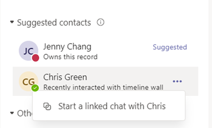
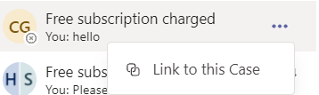

# (Preview) Use Teams chat in Customer Service

> [!IMPORTANT]
> [!INCLUDE[cc-preview-feature](../includes/cc-preview-feature.md)]
>
> [!INCLUDE[cc-preview-features-definition](../includes/cc-preview-features-definition.md)]
>
> [!INCLUDE[cc-preview-features-expect-changes](../includes/cc-preview-features-expect-changes.md)]
>
> [!INCLUDE[cc-preview-features-no-ms-support](../includes/cc-preview-features-no-ms-support.md)]

As an agent, you can chat in Microsoft Teams from within Dynamics 365 Customer Service Hub, Customer Service workspace, and any custom app. While working on customer records, you can start a new chat or link an existing chat to a record, and thus collaborate efficiently without switching context or leaving the application. Linking all the associated chats to a record can help you maintain all the conversations related to the record in one place. 

> [!NOTE]
> This feature must first be enabled by an administrator, and you must have certain permissions to access Teams data. More information: [Configure Teams chat in Customer Service](/configure-teams-chat)

## Agent overview of key features for Teams chat

The following image displays the key features of the agent Teams chat experience.

 > [!div class="mx-imgBorder"] 
 > 

The following legend describes the numbered callouts in the above image.

|Number |Feature | Description |
|-------|-----------|-----------|
| 1 | New chat | Create chats that aren't associated with any Dynamics 365 records.  |
| 2 | Filter |  Filter chats by name. |
| 3 | Chats linked to other records | Chats that are associated with other Dynamics 365 records that the current user is a part of. Users can prioritize responses to these chats over other chats. |
| 4 | New linked chat | Start a new chat that is linked with the record. These chats can only be viewed in Dynamics 365 by the chat participants. |
| 5 | Other chats | Chats that aren't linked to any records or started from Teams. |
| 6 | Chat control | Allows users to multi-task across chats. |
| 7 | Basic Teams functions | Format, use emojis, use gifs, set delivery options, attach files. |
| 8 | Add/remove participants | Select who participates in the chat and who doesn't. |

## Open Teams chats that are related to a record

You can open any Dynamics 365 Customer Service record and select the **Teams chats and channels integration** icon. The **Teams chats (preview)** panel opens with the following sections in the **Chat** tab:  
- Chats linked to the record: Lists Teams chats that either you’ve linked to the selected record or someone else has linked a chat with you as a participant. 
- Suggested contacts: Lists suggested contacts depending on the users who are working on the record. For more information, see [How suggested contacts work](#how-suggested-contacts-work).  
- Other chats/All recents: Lists your top 50 chat conversations on Teams. You can select any existing conversation and link it to a record. 

## Start a new linked chat

You can start a new linked chat or convert an existing Teams chat into a linked chat to associate the chat with a Dynamics 365 record. Standard record types, including case, conversation, account, contacts, knowledge article, and email, are available out of the box, or your administrator can add your desired record type.

Your administrator can configure an optional message that you can send using the chat to start a collaboration. this helps you to share succinct, read-only context to your collaborators on Teams.
 
If you're using Teams for the first time within Customer Service Hub or Customer Service workspace, you can select the blue bubble, and then follow the interface guidance.

1.	Open any Dynamics 365 Customer engagement record, and then select the **Teams chats and channels** integration icon.
    The Teams chats (preview) panel opens.
    - You can access the embedded chat from in Customer Service Hub and custom apps. When you select the :::image type="icon" source="media/teams-embedded-chat.png" border="false"::: icon, the chat pane opens as an app in the right side pane.
    
2.	Use one of the following methods: 
    a.	To start a new linked chat with a participant, select **New linked chat** in the **Linked to this record section**.  
    b.	To start a linked chat with a suggested contact directly on the chat list, select the contact with whom you want to chat, and then select **Start a linked chat**.  (Selecting the **Suggested** link allows you to load more suggested contacts.) 
    
     > [!div class="mx-imgBorder"] 
     > 
    
    > [!NOTE]
    > You can only link group chats to records. Direct, one-to-one chats can't be linked, and will instead display an option to start a new linked chat with that contact.
    
    The chat name uses the record name or the participants’ name, depending on the configuration that your administrator has set up. To set the chat name as the record name, you can ask your administrator to turn on the **Use record title as the default chat name for linked chats** setting. You can modify the chat name. Provide a meaningful name to the chat so that you can identify the chat even on Teams, and so that your collaborators on Teams can also easily identify chats that are associated with Dynamics 365 records.  
    c.	To convert an existing group chat into a linked chat, select a chat from the **All recents** section. Select the **More Commands** ellipsis (…), and then select **Link chats to record**.   
    
3.	Add more participants to the chat if you want to.
    If they have a Dynamics 365 license and access to the record, the participants in the linked chat will see the chat when they open the record in Dynamics 365.
    
## Link or unlink an existing chat from a record

You can link a chat to a single record or multiple records. For example, if you had a chat about a case that turned into a work order, you could also link the chat to the work order. If you decided later that you didn't want the chat linked to the case, you could unlink it. For this example, you'd follow these steps:

- To link the chat to the case, select the chat, and then select **Link to this case**.
     
    > [!div class="mx-imgBorder"] 
    > 

- To unlink the chat from the case, select the chat, and then select **Unlink from this case**.

    > [!div class="mx-imgBorder"] 
    > 

## How suggested contacts work
The suggested contacts list displays users who are connected or have interacted with the record. So, a suggested contact could be one or more of the following users, in the given order:
- If the record is assigned to a user, the owner of the record.
- If the record is assigned to a team, the team admin or team members who've logged an activity in the record timeline.
- Users who've linked chats with the record.
-	Other users who've logged an activity in the record timeline.

## Link a Teams channel to a record

The **Channels** tab lists the channels that either you’ve linked to the selected record or someone else has linked a channel where you’re a participant. If you've linked a record to a channel using basic or enhanced collaboration experience, that channel is also listed in this tab. 

You can link relevant Teams channels to a record so that all the members can easily access the linked channels from the record and follow the conversation. 

1.	Open any Dynamics 365 Customer Service record, and select :::image type="icon" source="media/teams-icon.png" border="false":::. 
   The **Teams chats (preview)** pane opens.
2. Select the **Channel** tab. The tab lists the channels that are already linked to a record.
3. Select the **Link channel** icon in the upper-right corner of the Teams chats (preview) pane. 
   The **Collaborate with Microsoft Teams** dialog opens.
4. To start a new linked channel, select **Create a new connection**.
5. To link an existing channel, select the channel from the list, and then select **Start collaboration**.

### See also

[Configure Teams chat in Customer Service](/configure-teams-chat) 

[!INCLUDE[footer-include](../includes/footer-banner.md)]
