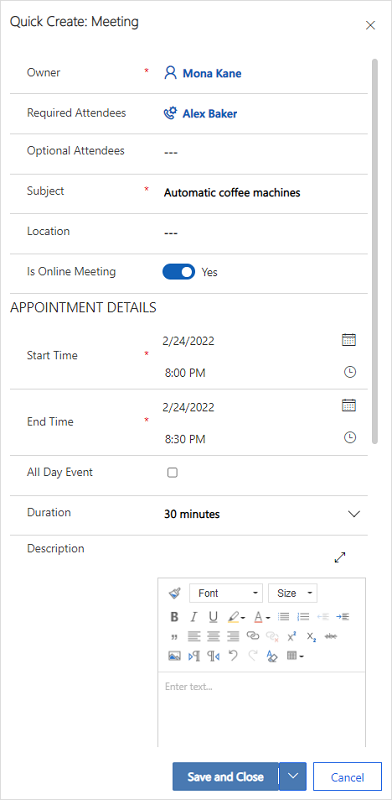

# Use Microsoft Teams meeting integration in Customer Service (preview)

> [!IMPORTANT]
> [!INCLUDE[cc-preview-feature](../includes/cc-preview-feature.md)]
>
> [!INCLUDE[cc-preview-features-definition](../includes/cc-preview-features-definition.md)]
>
> [!INCLUDE[cc-preview-features-expect-changes](../includes/cc-preview-features-expect-changes.md)]
>
> [!INCLUDE[cc-preview-features-no-ms-support](../includes/cc-preview-features-no-ms-support.md)]

The Teams meeting integration feature provides a unified meeting experience that helps you, as an agent, to reduce your administrative workload and increase productivity. The Dynamics 365 records are accessible while conducting a meeting over Teams, which you can refer to and have contextually relevant conversations with your customers. You can also take notes to help save time, be more productive, and leverage better data within your organization. 

As an agent, you can: 
-	Create and join Microsoft Teams meetings directly from Dynamics 365. 
-	Access and update Dynamics 365 records seamlessly within the context of a Microsoft Teams meeting. 
-	Capture notes and tasks seamlessly during a Microsoft Teams meeting, and have these notes and tasks automatically sync to records in Dynamics 365. 

## Meeting lifecycle 

The lifecycle of a meeting can be divided into the following stages, with each stage catering to specific tasks:

-	Pre-meeting: In this stage, you perform the following tasks:
    -	[Create a Teams meeting](#create-a-teams-meeting)
    -	[Join a Teams meeting](#join-a-teams-meeting)
    -	[Add Dynamics 365 app to a Teams meeting](#add-dynamics-365-app-to-a-teams-meeting)
    -	[Use the Dynamics 365 app to view and update record information](#work-with-the-dynamics-365-app)
-	In-meeting: In this stage, you perform the following tasks:
    -	Use the side-panel to view and update record information
    -	[Work with notes during a meeting](#work-with-notes-during-a-meeting)
    -	[Work with tasks during a meeting](#work-with-tasks-during-a-meeting)
    -	[Work with activities during a meeting](#work-with-activities-during-a-meeting) 
-	Post-meeting: In this stage, you perform the following tasks:
    -	[Use the Dynamics 365 app to view and update record information](#work-with-the-dynamics-365-app)

### Create a Teams meeting

You can create a Teams meeting either from Dynamics 365 or Microsoft Outlook. While creating a Teams meeting, ensure that a Dynamics 365 record is linked to the meeting. Linking a record to the meeting enables you to view record details before the meeting, in a side panel during the meeting, and after the meeting.

You can link a Dynamics 365 record by selecting a Regarding record. When a record is linked prior to the meeting, the Dynamics 365 app is added automatically to the meeting, and you can see the details of the linked record in the side panel. If a record is not linked to the meeting, you won't be able to see the details of the linked record. In such a case, you should add the Dynamics 365 app to the meeting before it has been started, for a better experience.

**Create Teams meetings in Dynamics 365**

You can create a Teams meeting while creating a meeting either from the timeline of a record or from the activities page.

**To create a Teams meeting from the Timeline control**

1. On the timeline control of a Dynamics 365 record, select **Create a timeline record** > **Meeting**.

1. In the **Quick Create: Meeting panel**, enter the meeting information such as attendees, location, time, and description.

1. Turn on the Teams meeting toggle.

    

1. Select **Save and Close**. The meeting coordinates won’t display until after you save and close the record.
> [!Note]
> When you create a meeting from the Timeline control of a record, the Regarding field is automatically populated with the record name from which the meeting is being created. This ensures that the Dynamics 365 app is added automatically to the Teams meeting and you can see the related record details during the meeting.

**To create a Teams meeting from the Activities page**

1.	Sign in to Customer Service Hub.

1.	On the sitemap, select **Activities**.

1.	On the command bar at the top, select **Meeting**.

1.	On the **New Meeting** page, enter the meeting information such as attendees, location, time, and description.

1.	Turn on the **Teams meeting** toggle.

1.	In the **Regarding** field, search and select a record that the meeting is related to. This ensures that the Dynamics 365 app is added automatically to the Teams meeting and you can see the related record details during the meeting.

1.	Select **Save & Close**.

**Create Teams meetings in Microsoft Outlook**

You can create a Teams meeting in Microsoft Outlook, but the meeting will not be linked to a Dynamics 365 record automatically. You must install the Dynamics 365 app for Outlook to link the meeting to a Dynamics 365 record. After installing the app, open it, and search for the record in the **Set Regarding** field.

For information on creating a Teams meeting in Microsoft Outlook, see [Schedule a Teams meeting from Outlook](https://support.microsoft.com/en-us/office/schedule-a-teams-meeting-from-outlook-883cc15c-580f-441a-92ea-0992c00a9b0f)

For information on using the Dynamics 365 App for Outlook, see [Basic navigation in App for Outlook (Dynamics 365 apps)](/dynamics365/outlook-app/user/basic-navigation).

## Add Dynamics 365 app to a Teams meeting

The Dynamics 365 app, when added to a Teams meeting, enables you to view record details before, during, and after a meeting. The Dynamics 365 app can be added either automatically or manually to a Teams meeting.

**Automatically add the app**

If you link a Dynamics 365 record to a meeting while creating it in Dynamics 365 or Microsoft Outlook, the Dynamics 365 app is added automatically to the meeting. This allows you to view record details before, during, and after a meeting.

**Manually add the app**

If you don’t link a Dynamics 365 record to a meeting while creating it in Dynamics 365 or Microsoft Outlook, it's recommended that you add the app to the meeting before joining the Teams meeting for a better experience.

To add an app before a meeting, first send the meeting invite, then open the meeting in Teams. Select **Add a tab**, search for the Dynamics 365 app, and add it.

To add an app during a meeting, after the meeting starts, select **Add an app** in the meeting controls at the upper-right area of the screen, search for the Dynamics 365 app, and add it. 

### Work with the Dynamics 365 app

The Dynamics 365 app enables you to view information of a record that is linked with a meeting. The record details can be viewed before the meeting, in the side panel during the meeting, and after the meeting. 

#### View record details before or after a meeting

Open the meeting in Teams, and then select the **Dynamics 365** tab. You can perform all actions on the linked record as you would in Dynamics 365 Customer Service.

**View record details during a meeting**

Select the Dynamics 365 app icon in the meeting toolbar at the upper-right area of the screen. The record details are displayed in a side panel. You can view and update information such as notes and tasks.

> [!NOTE] 
> The record side panel supports only Contact, Opportunity, Lead, Account, and Case tables. 
 
:::image type="content" source="./media/teams-meeting-side-panel.png" alt-text="Record side panel in a Teams meeting.":::

While in Teams, if you want to access a record directly in your Dynamics 365 app, you can open the record by selecting the popout icon on the side panel. 

### Join a Teams meeting 
You can join a Teams meeting from Dynamics 365, Microsoft Outlook, or Microsoft Teams. 

**Join a Teams meeting from Dynamics 365** 

1.	Open the meeting record from the **Timeline** or from the **Activities** page.

1.	Perform one of the following actions: 
    -	On the command bar at the top, select **Join Teams Meeting**. 
    - In the **Teams meeting** field, select **Join Teams Meeting**. 
    - Go to the **Description** area, hold the **Ctrl** key, and select **Click here to join the meeting**. 

**Join a Teams meeting from Microsoft Outlook** 

1.	Open the calendar event.

1.	Perform one of the following actions: 
    - On the **Meeting** tab in the ribbon, select **Join Teams Meeting**. 
    - In the message body, select **Click here to join the meeting**. 

**Join a Teams meeting from Microsoft Teams** 

You have several options. More information: [Join a meeting in Teams](https://support.microsoft.com/office/join-a-meeting-in-teams-1613bb53-f3fa-431e-85a9-d6a91e3468c9)

### Work with notes during a meeting

Prerequisites:
- A record must be linked to the meeting and the Dynamics 365 app must be added to the meeting. 
- The side panel must be launched by selecting the Dynamics 365 app icon  in the meeting controls at the upper-right area of the screen.
  
The latest note is displayed under the **Notes** section in the side panel. You can view all notes in a standalone panel by selecting **Show more notes**. If you add, edit, or delete notes from the side panel, the changes are synced with the linked Dynamics 365 record.

:::image type="content" source="./media/teams-meeting-notes.png" alt-text="Notes in the record side panel in a Teams meeting.":::

**Add a note** 

1.	In the **Notes** section, select :::image type="icon" source="./media/teams-meeting-add-icon.png" border="false":::.

1.	In the **Add note** form, enter a title and description of the note. 

1.	To attach a file, select **Attach file**. 

1.	Select **Save**. The note is added to the record and displayed in the side panel. 

**Edit a note**

1.	In the **Notes** section, hover over the note, and then select the **Edit** icon :::image type="icon" source="./media/teams-meeting-edit-icon.png" border="false":::.

1.	In the **Edit note** form, update the title and description of the note as desired. 

1.	Select **Save**.   

**Delete a note** 

1.	In the **Notes** section, hover over the note, and then select the **Delete** icon :::image type="icon" source="./media/teams-meeting-delete-icon.png" border="false":::. 

1.	In the confirmation message, select **Delete**. 

### Work with tasks during a meeting   

Prerequisites:  
- A record must be linked to the meeting and the Dynamics 365 app must be added to the meeting. 
- The side panel must be added to the meeting.

The open tasks are displayed under the **Tasks** section in the side panel. You can view all tasks in a standalone panel by selecting **Show more tasks**. If you add, edit, or delete tasks from the side panel, the changes are synced with the linked Dynamics 365 record. The tasks are sorted by their due date, prioritizing the tasks that are due soon or overdue.

:::image type="content" source="./media/teams-meeting-tasks.png" alt-text="Tasks in the record side panel in a Teams meeting":::

**Add a task** 

1.	In the **Tasks** section, select the **Add** icon :::image type="icon" source="./media/teams-meeting-add-icon.png" border="false":::. 

1.	Add the task details.

**Complete a task** 

In the **Tasks** section, select the option button for a task to mark it as complete. 

**Reopen a task**

1. In the **Tasks** section, select **Show more tasks**. 
 
1. In the **Completed tasks** section, select the task to reopen it.

   :::image type="content" source="./media/teams-meeting-tasks-panel.png" alt-text="Completed tasks in the record side panel in a Teams meeting.":::
 
**Edit a task** 

1.	In the **Tasks** section, hover over the task, and then select the **Edit** icon :::image type="icon" source="./media/teams-meeting-edit-icon.png" border="false":::. 

1.	Edit the task details as desired.
   
**Delete a task** 

1.	In the **Tasks** section, hover over the task, and then select the **Delete** icon :::image type="icon" source="./media/teams-meeting-delete-icon.png" border="false":::. 

1.	In the confirmation message, select **Delete**.

### Work with activities during a meeting

Prerequisites:
- A record must be linked to the meeting and the Dynamics 365 app must be added to the meeting.
- The side panel must be launched by selecting the Dynamics 365 app in the meeting controls at the upper-right area of the screen.

Recent activities are displayed under the **Activity** section in the side panel. To view all activities, select **Show more activities**.

:::image type="content" source="./media/teams-meeting-activities.png" alt-text="Activities in the record side panel in a Teams meeting":::

You can view only appointment, email, and phone call activities that are associated with the record. To view other associated activities, go to the customer engagement app. If you want to view details of an activity, in the **Activities** section, select an activity. The activity record opens in your web browser.

### See also
[Configure Microsoft Teams Meeting integration in Customer Service](configure-teams-meetings.md)
