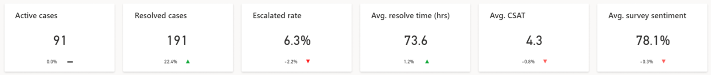
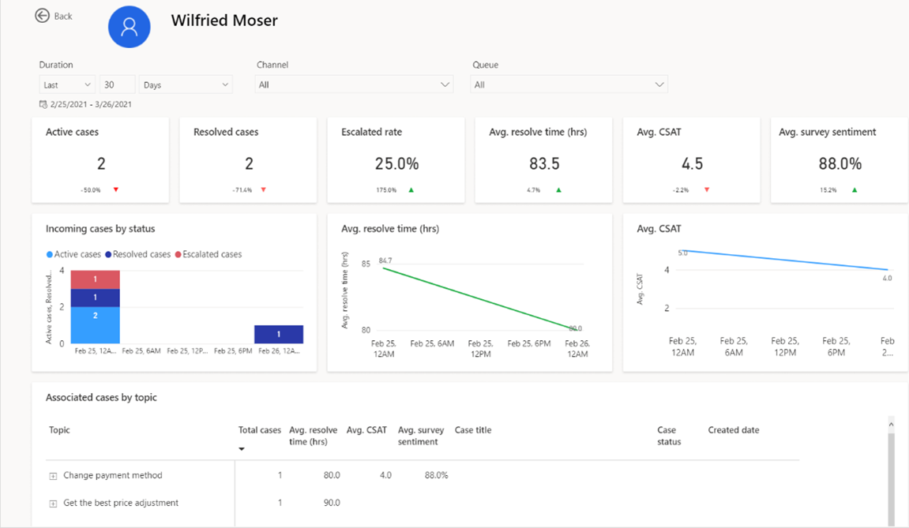

# Agent dashboard in historical analytics

> [!IMPORTANT]
> This feature is intended to help customer service managers or supervisors enhance their team's performance and improve customer satisfaction. This feature is not intended for use in making, and should not be used to make, decisions that affect the employment of an employee or group of employees, including compensation, rewards, seniority, or other rights or entitlements. Customers are solely responsible for using Dynamics 365 Customer Service, this feature, and any associated feature or service in compliance with all applicable laws, including laws relating to accessing individual employee analytics and monitoring, recording, and storing communications with end users. This also includes adequately notifying end users that their communications with customer service representatives (service representatives or representatives) may be monitored, recorded, or stored and, as required by applicable laws, obtaining consent from end users before using the feature with them. Customers are also encouraged to have a mechanism in place to inform their representatives that their communications with end users may be monitored, recorded, or stored. 

The Agent dashboard shows charts and KPIs that you can use to guide representatives and understand overall representative performance.

To view the Agent dashboard, go to Customer Service historical analytics and select **Agent** at the top of the workspace. The dashboard shows charts and KPIs for individual representatives and overall representative performance, and includes the following insights:

> [!div class="mx-imgBorder"]
> 

### Access the Agent dashboard

[!INCLUDE[cc-navigation-cs](../../includes/cc-navigation-cs.md)]

## Report details

The reports summarize the key performance indicators for the specified time period and the percent change over the period. You can filter these areas by duration, channel, queue, representative conversation, and timezone. The KPIs for the dashboard are displayed as seen in the following screenshot.

> [!div class="mx-imgBorder"]
> 

The following table displays the key performance indicators in the agent report. 

| KPI            | Description    |
|----------------|----------------|
| Active cases   |  The number of cases that are currently open.   |
| Resolved cases   | The number of cases closed by a representative.     |
| Escalated cases   | The percentage of cases that needed to be escalated.     |
| Average resolve time | The average time taken by a representative to resolve the case.   |
| Average CSAT   | The average customer satisfaction score, based on written feedback submitted by the customer in the Customer Voice survey.    |
| Average survey sentiment | The average sentiment score, based on written feedback submitted by the customer in the Customer Voice survey.  |

The agent dashboard has charts that have the following metrics.

| KPI            | Description    |
|----------------|----------------|
| Case volume over duration   |  Day-over-day trend of case volume.|
| Average resolve time  | Month-over-month trend of case resolution time in minutes.|
| CSAT and survey sentiment by agent   | Representatives-focused view comparing CSAT and sentiment from Customer Voice survey responses.|
| Agent metrics | Overview of core representative metrics in relation to other metrics and date.|
|||

## Agent drill down view

The Agent drill down view provides supervisors with a holistic look into individual representative performance on metrics and can be valuable in training scenarios for representatives.

To access the drill down report, select any metric value for the required representative, and then select **Details**.

> [!div class="mx-imgBorder"]
> 

> [!NOTE]
> Agent availability (start and end time) is only available in UTC, and isn't affected by the user's time zone.

### Related information

[Dashboard overview](customer-service-analytics-insights-csh.md)  
[Summary dashboard](summary-dashboard-cs.md)  
[Topics dashboard](case-topics-dashboard-cs.md)  
[Manage report bookmarks](manage-bookmarks.md)  

[!INCLUDE[footer-include](../../includes/footer-banner.md)]
