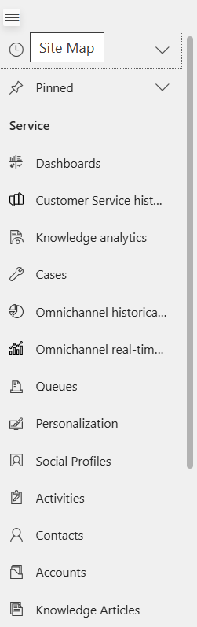
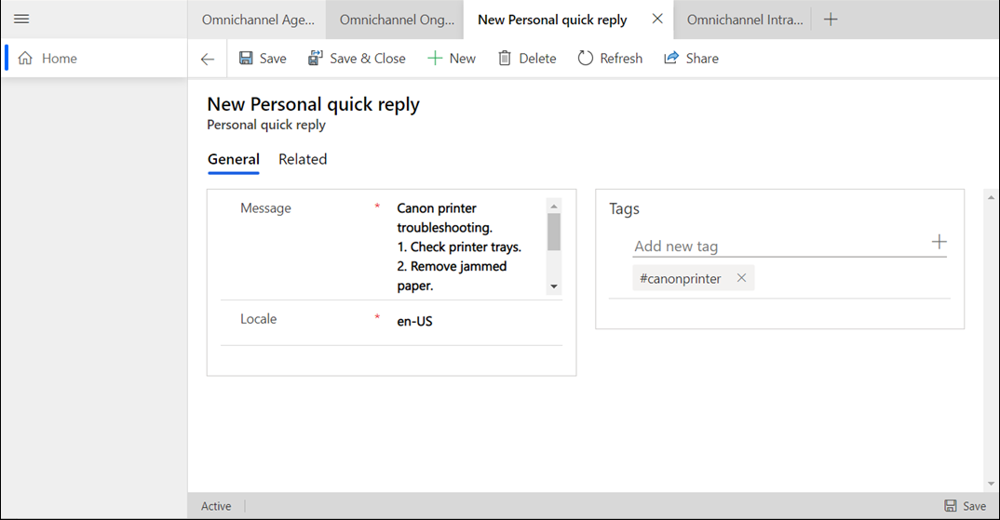

# Create personal quick replies

[!INCLUDE[cc-feature-availability-embedded-yes](../../includes/cc-feature-availability-embedded-yes.md)]

As an agent, you can use the personalization menu that's accessible through the application tab of the agent app to add *personal quick replies*, also called *predefined messages*. You can create quick replies for the common questions and scenarios that you need to address in your role. You can tag the replies with keywords that help you invoke the quick replies when you're interacting with customers.

## Create personal quick replies

You can create, edit, and delete the personal quick replies you own. The quick replies that you create are available on the **Personal** tab in the **Quick replies** panel of the conversation window.

1. Sign in to the Contact Center workspace or the Customer Service workspace apps, and on the home page, select the plus sign  on the application tab.
    

2. Select **Personalization**.

3. On the **Personal quick replies** tab, select **New Personal quick reply**, and do the following:
    - **Message:** Enter the text you want to use for your reply.
    - **Locale:** Select the language in which you want to create the quick reply.

        > [!NOTE]
        > - To avoid duplicating quick replies, check the predefined messages before creating a personal quick reply.
        > - Personal quick replies aren't localized in the agent app. To provide quick responses in multiple languages, create a separate quick response record for each language and select its corresponding locale.

    
4. In the **Tags** area, enter the keyword you want to associate with the quick reply, and then select . If you want to use the number sign (#), don't use it anywhere else in the keyword except at the beginning.
5. Select **Save**.

It can take up to 15 minutes for the quick replies to be available for your use.

For more information on personal quick replies, see [Send quick replies](oc-conversation-control.md#send-quick-replies).

### Related information

[Send quick replies](oc-conversation-control.md#send-quick-replies)  
[Manage applications](oc-manage-applications.md)  

[!INCLUDE[footer-include](../../includes/footer-banner.md)]
