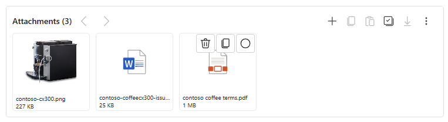

# Use enhanced experience to attach files to emails

When you're composing an email, you can drag files and add them as attachments and copy attachments from one email to another.

## Prerequisites

Your administrator has enabled the enhanced attachment control.

## Use the enhanced experience to attach files
 
Perform the following actions using the enhanced email attachment control:

- Add files.
- Select the dropdown to add existing attachments from previous emails. In the **Select attachment** window, you can perform the following actions: 
  - Select the required attachments.  
  - Select the attachment link to preview it in the Attachment preview popup. 
  - Search for attachments by attachment name.  
- Drag files to the attachment control, email body, or rich text editor to be added as attachments. When you drag image files to rich text editor, they're added as inline images.
- Select **Flows** to create and select your existing flows. 
- Export attachments that you uploaded. The .csv file contains the name and size of the attachments. 
- View the size of the uploaded attachment in the nearest unit of its size.
- Hover over the attachment to download, delete, or select an attachment.
- Select the file to launch the preview. Preview is available only for image and pdf attachments.
- Switch between the grid and list views.
- Select all the attachments.
- Copy multiple attachments from various emails and paste them into a single email. When you copy multiple attachments, the application displays a notification with the following: 
   - The total number of attachments that you copied across multiple emails and pasted to the target email. 
   - **Clear All** option to remove all the copied attachments. 
   - **Undo** option to remove the most recently copied attachment. 

 

## Delete attachments for completed emails

Perform the following steps within your Power Apps form to enable deleting an attachment for a completed email.

- In the [Power Apps home page](https://make.powerapps.com), select **Tables** from the left navigation pane.
- In the Tables page, select **Email**, select **Forms** in Data experiences in the Email page and then select **Email**.
- The Email Form page appears. In the Attachment panel on the right, select **Attachments control** in the **Components** dropdown in Properties.
- The default value of the **Static value** dropdown in **Make Delete visible to users** is selected to **False**. Change this value to **True** and select **Done**.

:::image type="Delete inline attachment." source="../media/delete-email-attachments.png" alt-text="Delete inline attachment for a completed email." lightbox="../media/delete-email-attachments.png":::

## Next steps

[Enable enhanced experience for email attachments](../administer/add-enhanced-attachment-control.md)
