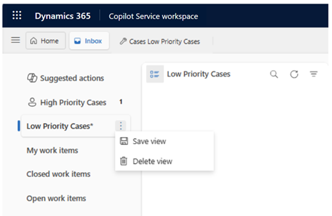

# Create a personalized view in the inbox

A personalized inbox view lets you view cases in your inbox in a way that works best for you. If your administrator enabled the inbox view, you can create and manage the case views you want to help you organize your work. Personal views that you create are available to you only unless you share them. 

A personalized case view consists of the following elements: 

- Default sorting options 
- Filters to show records that match specific criteria, if needed

## Add and save a personalized inbox view

1. Select **Cases** under **Service** in the Copilot Service workspace site map. The **Cases** page opens.
2. Select **Inbox view** on the ribbon. The personalized view appears in the left pane.

   > [!div class="mx-imgBorder"]
   > 
   
4. Optional: To save the view, select the ellipsis next to it, and then select **Save view**.
   > [!Note]
   > If you don’t save the view, the system removes it when the session ends.

   > [!div class="mx-imgBorder"]
   > 

## Delete a personalized inbox view

If you no longer want to save an inbox view, select the ellipsis next to it, and then select **Delete view**.

### Related information

[Use the inbox](use-inbox.md)  
