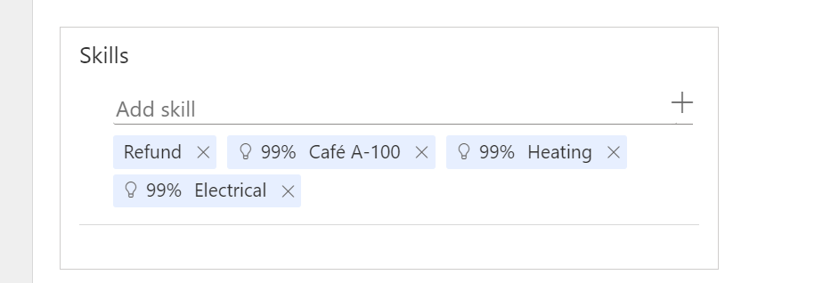

# Manage skills

[!INCLUDE[cc-feature-availability](../../includes/cc-feature-availability.md)]

Dynamics 365 comes with an out-of-the-box skill control for messaging channels. When your administrator adds the skill control to the case or conversation forms and enables it for you, you can view and update skills at runtime.

> [!NOTE]
> For the record type table, customize the case form to add the skill control. More information: [Add a skill control for routed records](../develop/add-skill-control.md)

When you receive a work item in your queue, you can view the skills required by the work in the **Skills** field of your case or conversation record. For each work item, you can view skills that have been attached by the manual skill classification rules and those that were identified by the machine-learning skill finder models.

In the following screenshot, **Refund** is a skill attached by the manual skill classification rules, whereas skills with percentage rating such as **99% Heating** and **99% Electrical** are identified by the machine-learning model.

> [!div class="mx-imgBorder"]
> 

> [!NOTE]
> If you aren't able to view the skill control on the case or conversation forms, try clearing your browser cache.

## Add and remove skills

If upon assessing the work item, you think that the relevant skills are missing or incorrect, you can choose to update the skills.

To add skills, select the **Add skill** field and enter a skill name. As you enter one or more letters, the application suggests a list of skill names in the dropdown list; select the relevant skill. Add as many skills as you think are appropriate for the work item.

To remove skills, select **X** next to each skill that you want to delete.

The skill updates you make for your assigned work items can then be used to retrain the machine learning-based skill finder models and help with accurate work assignments. More information: [Retrain skill finder model](../administer/set-up-isf-model.md#retrain-the-model-iteratively)

### Related information

[Allow agents to update skills](../administer/allow-agents-update-skills.md)  
[Set up record routing](../administer/set-up-record-routing.md)  
[Set up unified routing](../administer/set-up-routing-process.md)  

[!INCLUDE[footer-include](../../includes/footer-banner.md)]
