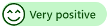
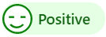
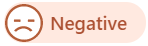
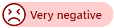

# Monitor real-time customer sentiment

[!INCLUDE[cc-feature-availability-embedded-yes](../../includes/cc-feature-availability-embedded-yes.md)]

[!INCLUDE[cc-rebrand-bot-agent](../../includes/cc-rebrand-bot-agent.md)]

As a customer service representative, you can monitor customer sentiment in real time during conversations. Real-time sentiment analysis helps you assess customer satisfaction, understand the urgency of an issue, and determine an appropriate response. In the application, you can see the customer's satisfaction levels instantly while you communicate with the customer.

## View real-time customer sentiment

A customer's real-time sentiment is displayed at the top of the communication panel. The sentiment icon changes dynamically based on the six most recent customer messages sent to you.

When you get an incoming conversation request, you accept the request and communicate with the customer. By default, you see the neutral sentiment icon, which indicates that at this moment the customer satisfaction level is neutral. As you continue to communicate with the customer, the sentiment icon changes dynamically according to the conversation.

When a conversation is escalated from an AI agent, the sentiment icon you see is based on the previous messages exchanged between the customer and the agent.

:::image type="content" source="../media/sentiment-very-positive-cc.png" alt-text="Conversation panel showing a very positive customer sentiment indicator.":::

## Understand real-time customer sentiment

Sentiment analysis automatically measures customer satisfaction levels in real time.

The following sentiment icons are displayed on the communication panel.

| Sentiment | Icon |
|--------------------------|---------------------------------------------------|
| Very positive |  |
| Positive |  |
| Slightly positive |  |
| Neutral |  |
| Slightly negative |  |
| Negative |  |
| Very negative |  |

> [!NOTE]
> The real-time sentiment is shown to you only if the supervisor or administrator has enabled sentiment analysis for a queue where you've been added as a member.

If profanity is detected in English, the sentiment is displayed as **Negative** or **Very negative**.

> [!div class="nextstepaction"]
> [Next topic: Manage presence status](oc-manage-presence-status.md)

## Monitor sentiment in multiple languages

Multi-language sentiment displays sentiment scores on some non-English conversations.

> [!NOTE]
>
> Multi-language sentiment is available only if the administrator enables it for you.

To learn more, see [multi-language sentiment](../administer/enable-sentiment-analysis.md).  

## Videos

[Real-time sentiment analysis in Omnichannel for Customer Service](https://go.microsoft.com/fwlink/p/?linkid=2114615)  
To view more videos on Omnichannel for Customer Service, see [Videos](videos.md).  

### Related information

[Introduction to the representative interface](oc-introduction-agent-interface.md)  
[Enable sentiment analysis](../administer/enable-sentiment-analysis.md)  
[Manage sessions](oc-manage-sessions.md)  
[Manage applications](oc-manage-applications.md)  
[View customer information on Active Conversation form](oc-customer-summary.md)  
[Search for and share knowledge articles](../oc-search-knowledge-articles.md)  
[Take notes specific to a conversation](oc-take-notes.md)  
[View active conversations for an incoming conversation request](oc-view-customer-summary-incoming-conversation-request.md)  

[!INCLUDE[footer-include](../../includes/footer-banner.md)]
