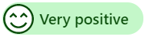
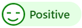
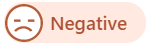
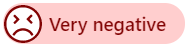
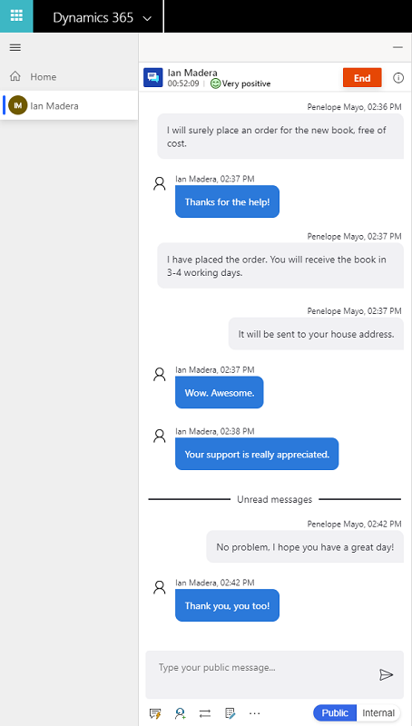
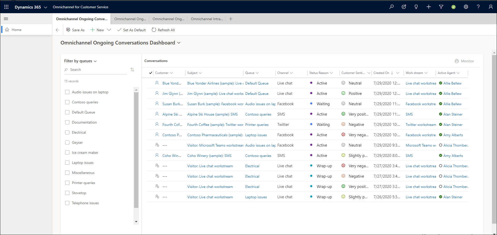
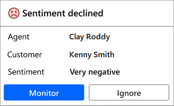

# Sentiment monitoring

[!INCLUDE[cc-feature-availability-embedded-yes](../../includes/cc-feature-availability-embedded-yes.md)]

> [!NOTE]
> Supervisor and customer service representatives (service representatives or representatives) sentiment notifications aren't available in Unified Service Desk.

Sentiment analysis enables service representatives and supervisors to understand real-time and historical customer sentiment across channels to improve customer service. The application uses natural language processing (NLP) and machine learning (ML) algorithms to understand customer sentiments.

For real-time conversational channels, such as chat and messaging, the application displays sentiment intensity indicators based on the previous six customer messages received in a conversation. The sentiment intensity is scored in one of seven gradients: three positive, three negative, and one neutral.

> [!NOTE]
> Email Sentiment uses a three-class scale (Positive, Neutral, Negative) and is evaluated per email message, not through the seven-gradient model. Learn more in [View email sentiment](/power-apps/user/view-compose-email#view-email-sentiment).
> Case sentiment aggregates email sentiment signals from all emails associated with a case to provide an overall sentiment indicator for the case. This rollup gives supervisors and service representatives a quick view of how a customer feels across the entire case, rather than just in an individual message. Learn more in [Configure sentiment analysis for case](../administer/configure-case-sentiment-analysis.md)

| Sentiment | Icon |
|--------------------------|---------------------------------------------------|
| Very positive |  |
| Positive |  |
| Slightly positive |  |
| Neutral |  |
| Slightly negative |  |
| Negative |  |
| Very negative |  |

Sentiment analysis supports multiple languages. The system uses Microsoft Azure Text Translator API to provide sentiment scores for conversations in more than 40 languages.

> [!NOTE]
> The following rules apply:
> - Non-English conversations are translated to English, then scored. 
> - Unsupported languages don't receive a sentiment score.
> - If profanity is detected in English, then the sentiment shows as Negative or Very negative.

Learn more in [Explore Text Translator API](/azure/cognitive-services/translator/translator-info-overview).

## Personas

The multi-language sentiment feature supports the following personas: administrator, supervisor (team lead), and service representatives.

- If you're an administrator:

   - You can configure sentiment for English-only and non-English languages.
       > [!NOTE]
       > Sentiment analysis is enabled by default.

- If you're a supervisor (team lead):

    - You can track service representative performance and engage in real time to continuously improve the support quality.
    
        Example: You can identify negative sentiment events, including English profanity, in conversations between service representatives and customers.

    - When you identify negative sentiment, you can provide timely feedback to the service representative to help them resolve an issue.

        Example: Monitor and join the conversation.

    - You can identify which chat and text sessions are going well, and which might require monitoring.

- If you're a service representative: 

    - You want to know customer's sentiments in real time and monitor customer satisfaction levels instantly as you communicate with them.

    - You can be responsible for handling multiple customer engagements at any given time.

    - You can engage directly with the customer to solve the customer's issue.

    - You can use the analysis of customer sentiment to understand the severity of the problem and take action. 

## Sentiment intensity indicators

Sentiment intensity indicators are an automatic and unbiased measurement of a customer's satisfaction level in real time. These indicators show service representatives and supervisors how a conversation is trending, and give supervisors a real-time gauge to help them decide when they need to step in and assist.

- For service representatives:

    Sentiment intensity indicators at the top of the communication panel help you understand the customer’s sentiment.

    > [!div class=mx-imgBorder]
    > 

- For supervisors:

    - Sentiment intensity indicators identify ongoing chat sessions that need your attention, so that you can better assess and apply your time where it's most valuable.

    - Using sentiment intensity indicators on the Omnichannel Ongoing Conversations dashboard allows you to easily identify ongoing customer support chat sessions that aren't going well.

    > [!div class=mx-imgBorder]
    > 

## Low sentiment notification alert

While a service representative is communicating with the customer, if the customer's sentiment decreases to or below a threshold level, you get a notification. The notification displays the following details:

- Service representative name
- Customer
- Sentiment
- Monitor button
- Ignore button

    > [!div class=mx-imgBorder]
    > 

Select the **Monitor** button to access the **Active Conversation** and the communication panel. If the service representative needs help, you can join the conversation.

For example:

An administrator sets the threshold value as **Very negative**. When the customer's sentiment reaches **Very negative** or any other sentiment value below the threshold value, a notification appears.

## Multi-language sentiment limitations

Sentiment analysis relies on the initial customer messages in any conversation to detect the language of the conversation.  

Expect the following system behaviors:

- If the system detects a customer's initial messages as English, it assumes that subsequent messages are in English as well. If your customer switches away from English after these initial messages, the system doesn't perform language redetection. In this situation, a neutral sentiment score most often displays throughout the rest of the non-English conversation.

- If a customer's initial messages are detected as non-English, the system performs redetection and scoring for subsequent messages. If any following messages are detected as non-English, the subsequent messages are redetected and scored according to the detected language.

## Requirements

Your environment must have the latest version of the application.

## Install and configure

After you sign up, refer to step 4 in [Enable sentiment analysis](../administer/enable-sentiment-analysis.md) to configure sentiment analysis.

## Policy notice

This feature is intended to help customer service managers or supervisors enhance their team's performance and improve customer satisfaction. This feature isn't intended for use in making, and customers shouldn't use it to make, decisions that affect the employment of an employee or group of employees, including compensation, rewards, seniority, or other rights or entitlements. Customers are solely responsible for using this feature, and any associated feature or service in compliance with all applicable laws, including laws that relate to accessing individual employee analytics and monitoring, recording, and storing communications with end users. Customers are also responsible for adequately notifying end users that their communications with service representatives might be monitored, recorded, or stored and, as required by applicable laws, obtaining consent from end users before using the feature with them. Customers are also encouraged to have a mechanism in place to inform their service representatives that their communications with end users might be monitored, recorded, or stored.

### Related information

[Enable sentiment analysis](../administer/enable-sentiment-analysis.md)  
[Configure sentiment analysis for case](../administer/configure-case-sentiment-analysis.md)  
[Monitor real-time customer sentiment](oc-monitor-real-time-customer-sentiment-sessions.md)  
[Monitor conversations](monitor-conversations.md)

[!INCLUDE[footer-include](../../includes/footer-banner.md)]
