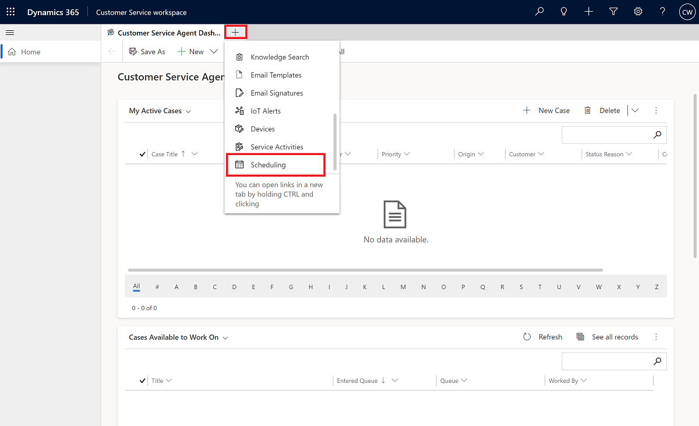
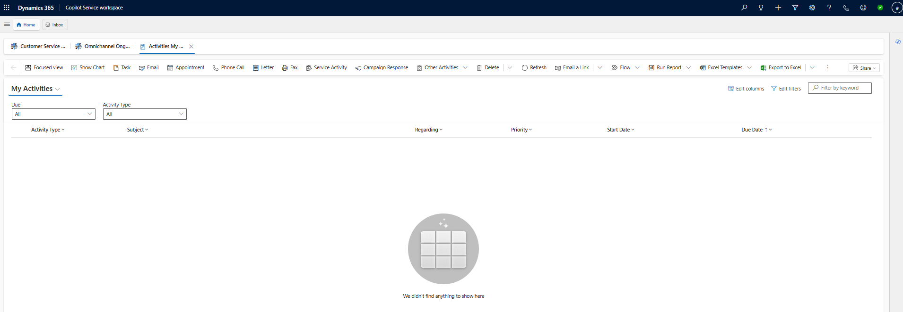
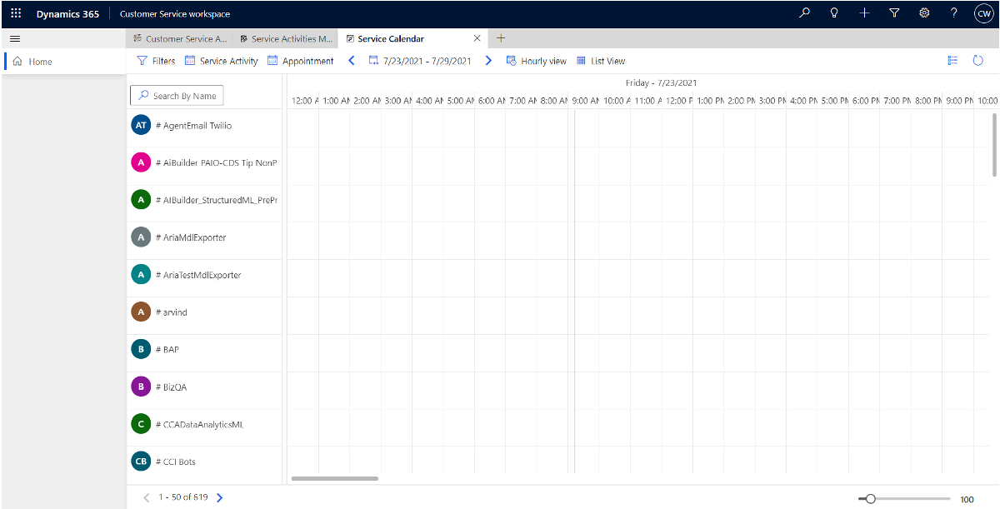

# Service scheduling overview

Unified Interface-based service scheduling has replaced the legacy service scheduling experience.

The following topics contain information about legacy service scheduling features: 

- Create or change a service

- Schedule a service activity 

- Add facilities and equipment  

- Create resource groups

- Use sites to manage your service locations 

- Navigate to the Service Calendar  

- Set up a business closure 

> [!Note]
> To set up a business closure, navigate to the [Admin portal](https://admin.powerplatform.microsoft.com/), as shown in the following screen.

   

You can also set up service scheduling in Dynamics 365 Customer Engagement (on-premises) 9.1. More information: [New features in Dynamics 365 Customer Engagement (on-premises)](../../customerengagement/on-premises/whats-new.md)

## Access service scheduling in Copilot Service workspace

Service scheduling is available in the Copilot Service workspace app.
 
   - Select the ≡ icon to expand the menu to view a list of forms, views, and activities, and then select either **Service Activities** or **Scheduling** to open the feature in a new tab.

  > [!div class=mx-imgBorder]
  > 

   - **Service Activities**

     > [!div class=mx-imgBorder]
     > 

   - **Scheduling**

     > [!div class=mx-imgBorder]
     > 

### Related information

[Create or edit a service](uci-create-edit-service.md)  
[Add facilities and equipment](uci-add-facilities-equipment.md)  
[Schedule a service activity](uci-schedule-service-activity.md)  
[Create resource groups](uci-create-resource-groups.md)  
[Use sites to manage your service locations](uci-create-sites.md)  
[Navigate the service calendar](uci-navigate-service-calendar.md)   

[!INCLUDE[footer-include](../../includes/footer-banner.md)]
