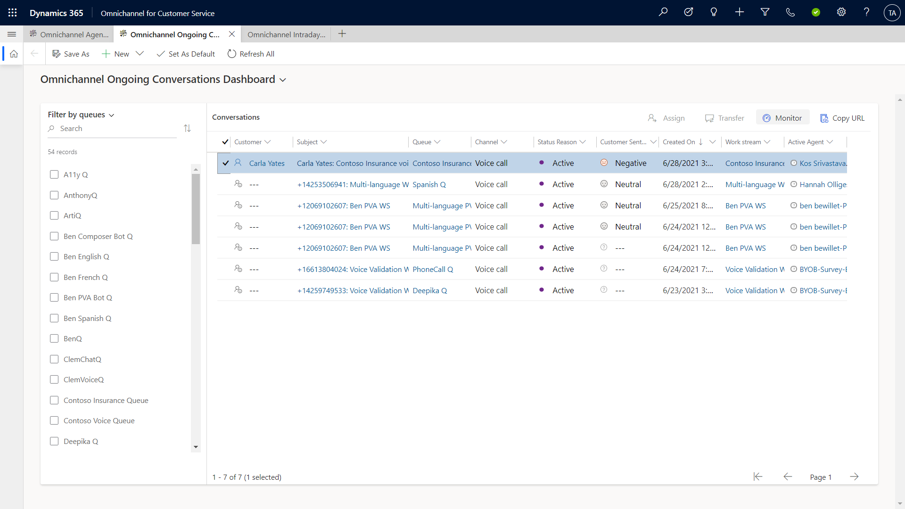
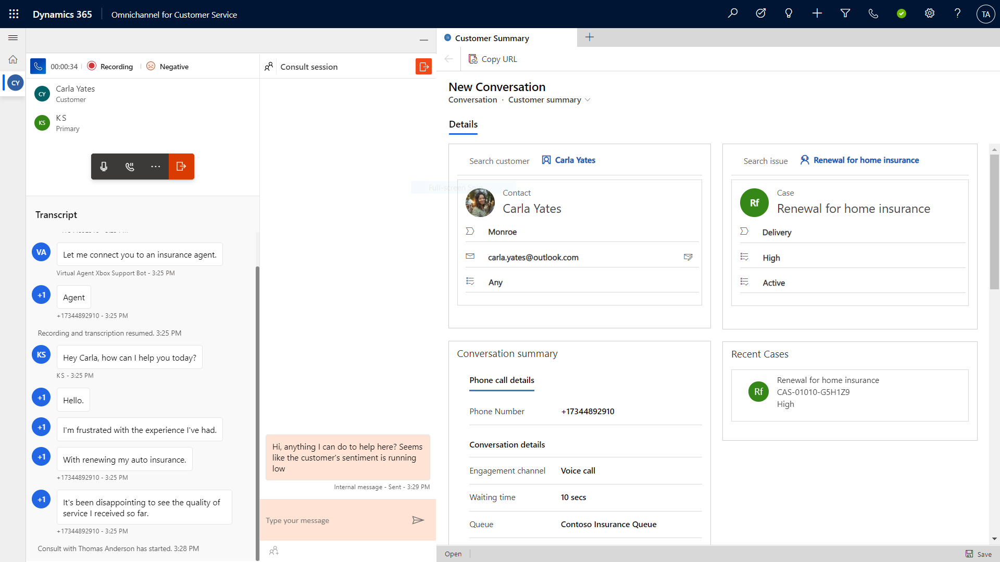
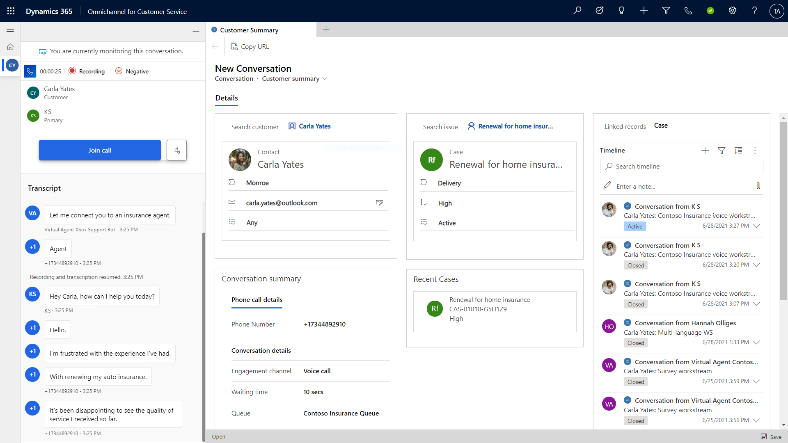

# Monitor calls in the voice channel

[!INCLUDE[cc-feature-availability](../../includes/cc-feature-availability.md)]

As a supervisor, you can monitor the calls between your customer service representatives (service representatives) and their customers without interrupting them. This monitoring helps you identify which calls need attention. You can monitor the conversations without being seen as a participant by the service representative or customer, and then step into conversations when more support is needed.

## Prerequisites

To monitor calls in the voice channel, you must have the **Omnichannel Supervisor** role. This role grants you the ability to join and consult in ongoing conversations.

## Monitor ongoing conversations

On the **Omnichannel Ongoing Conversations** dashboard, you, as a supervisor, can view a list of active conversations, including customer sentiment analysis for each call.

> [!div class="mx-imgBorder"]
> 

To find out details about an individual conversation:

- On the **Omnichannel Ongoing Conversations dashboard**, select the conversation in the list of active conversations, and then select **Monitor**.

## Consult with a representative during a conversation

As a supervisor, you can privately consult with a representative by sending them messages that are hidden from the customer. Consulting on a call doesn't affect your capacity.

> [!div class="mx-imgBorder"]
> 
> 
## Join conversation (barge)

If needed, select **Join call** to enter the conversation and speak with the service representative, customer, or chat with the service representative privately. When you join a conversation, the service representative receives a notification that you joined.

> [!div class="mx-imgBorder"]
> 

When you join a conversation, you get access to call controls that you can use to capture details about the conversation, pause the conversation if needed, and engage with the representative and customer as needed.

### Related information

[Introduction to the voice channel](../administer/voice-channel.md)  
[Set up the voice channel](../administer/voice-channel-install.md)  
[Set up outbound calling](../administer/voice-channel-outbound-calling.md)  
[Route incoming calls to representatives](../voice-channel-route-queues.md)  
[Add Azure Bot Service for conversational IVR](../voice-channel-azure-bot-service.md)  
[View voice calls usage](../administer/voice-channel-usage.md)  
[Configure post-call survey](../administer/voice-channel-survey.md)  

[!INCLUDE[footer-include](../../includes/footer-banner.md)]
