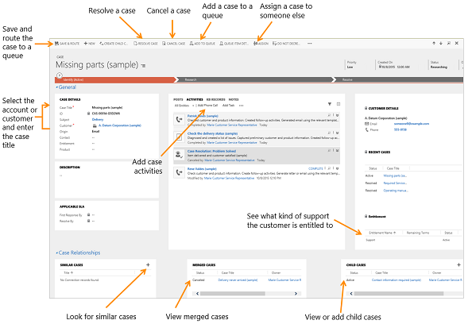
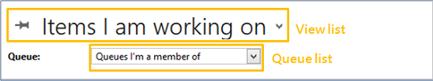
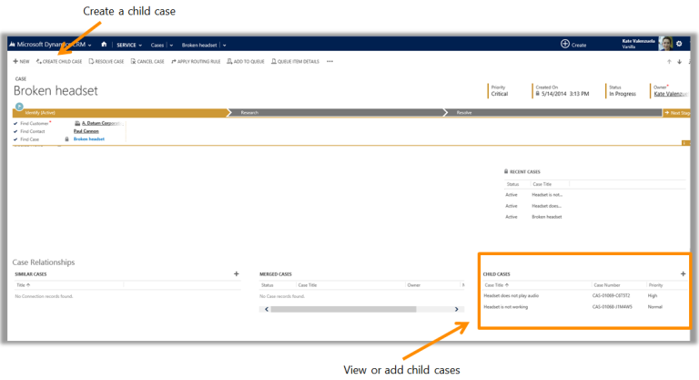

# Introduction to Customer Service app

Dynamics 365 Customer Service unifies the way people experience your business, making information available across engagements so your agents offer the consistency and personalization your customers expect.  

This User's Guide shows customer service agents how to use the application. 
  
> [!IMPORTANT]
> This User Guide covers instructions for the the Customer Service app (legacy web client). To learn about the  Customer Service Hub app built on the Unified Interface framework, see [User Guide (Customer Service Hub)](user-guide-customer-service-hub.md). To learn more, see[Basics Guide](../basics/basics-guide.md).

## Create and manage a case

Keep track of your customer requests and issues by creating support cases in Dynamics 365 Customer Service. When a customer contacts support with a question or problem, you can quickly check if there is an existing case or open a new case and start tracking the issue. You can also escalate, reassign, or put a case back into the service queue if you don’t have enough information or time to work on it.  
  
 Before you provide support, you can also check the customer’s entitlements. Entitlements are like contracts that tell you what kind of support a customer is eligible for. You can see if the support terms are based on number of hours or cases, support channel, or based on the product or service that the customer has purchased.  
  
 To help you select the right status of a case, your admin may have set things up so that you only see a limited set of statuses based on the current status of a case. For more information on the available list of case statuses, contact your administrator.  
  
   
  
### Create a case  
  
1. [!INCLUDE[proc_service_cases](../includes/proc-service-cases.md)]  
  
2. Select **New Case**.  
  
3. Find the customer:  
  
    1. Select the **Customer** lookup button. By default, this field shows both account and contact records. Or, type a few letters and press **Enter** to search for records that contain the letters. When you select an existing customer, the customer details will show the contact details, along with recent cases and activities for the customer.  
  
    2. If a customer record doesn’t exist, select **New** in the inline lookup results to create a new record.  
  
4. Select the **Contact** lookup button and select an existing contact for the case or select **New** in the inline lookup results to create a new contact record.  
  
5. Before you create a new case, check if there is an existing case:  
  
    1. From the **Identify** area of the process bar, select the **Find Case** lookup button and then select a case from the list of cases.  
  
    2. If a case doesn’t exist, select **New** in the inline lookup results to create a new case record.  
  
6. In the **Case title** field, type a subject or descriptive name to identify the case.  
  
7. To track your conversation with the customer, add activities. 
  
8. To see what kind of support you should provide the customer, select the **Entitlements** lookup button and select an active entitlement.  
  
    > [!NOTE]
    > If your manager has set default entitlements for a customer, a default entitlement is automatically associated with a case when:  
    >
    > - A case is created  
    > - A case is updated and the customer, contact, or product field has changed  
    > - When a case is created and an entitlement is applied to it (or when the case gets resolved), the entitlement terms from the associated entitlement are decremented. However, if you don’t want the entitlement terms to be decremented for a case, from the command bar select **Do not decrement entitlement terms**.  
  
9. Fill in the other details that apply to the case, and then select **Save**.  
  
### Find a solution from similar cases

 You can look at resolved cases to see if they can help you resolve the open case you’re working on. For example, if the subject of the case you’re working on is “Service outage,” you could look for resolved cases with the same subject to get help with your current case.  
  
1. [!INCLUDE[proc_service_cases](../includes/proc-service-cases.md)]  
  
2. In the list of active cases, open the case you’re looking for.  
  
3.  When the case is open, to find similar cases, select **Case Relationships** to expand the menu.  
  
4.  For **Similar Cases**, select (**+**) **Add Connection record**.  
  
5. From the **Find Similar Cases** dialog box, use the search to find similar cases.  
  
     Select a different subject to see the cases with that subject. You can also search for cases by typing the keyword in the search box, and then select the **Search** button. When you use a search keyword, it searches on the title of the case and shows the matching results.  
  
6.  When you find a similar case, select the case to review the case activities, posts, and notes.  
  
    Typically, a phone call, task, or case resolution activity has the information about how the case was resolved.  
  
7.  Once you find the case that has the information you need, select the case, and then select **Found a Solution**.  
  
    The case you select is added to the **Similar Cases** area for the case you’re working on.  
  
### Resolve a case
  
1. [!INCLUDE[proc_service_cases](../includes/proc-service-cases.md)]  
  
2. In the list of active cases, open the one you want to resolve.  
  
3.  On the command bar, select **Resolve case**.  
  
   > [!IMPORTANT]
   >  Before you resolve a case, make sure that all the case activities are closed. Otherwise, you’ll get a message saying that you still have open activities associated with the case, which will be canceled if the case is resolved.  
  
4. In the **Resolve Case** dialog box, in the **Resolution Type** list, select how the case was resolved.  
  
5. In the **Resolution** box, type a short explanation of the resolution.  
  
    The actual time spent on all activities for this case, as recorded in the **Duration** box in each activity, is filled out automatically in the **Total Time** box.  
  
6. In the **Billable Time** list, select the amount of time spent on the case to be billed to the customer.  
  
    If this case is linked to a contract or entitlement, the billable time will be subtracted from the allotted minutes for that contract.  
  
7.  Select **Resolve**.  
  
    A case resolution activity is created and shown in the **Activities** area. The resolution activity contains information about a resolved case, including the resolution and total time spent on the case. You can reactivate a resolved case at any time.  
  
### Cancel a case

 All case activities must be closed before you can cancel a case.  
  
1. [!INCLUDE[proc_service_cases](../includes/proc-service-cases.md)]  
  
2.  In the list of active cases, open the case that you want to cancel, and then on the command bar, select **Cancel Case**.  
  
3. In the **Confirm Cancellation** dialog box, select the case status:  
  
   - **Canceled**: This means the case is canceled and it will no longer be assigned to you.  
  
   - **Merged**: This means the case is merged into another case. When the case is merged, the case activities will be moved to the case it was merged into.  
  
4.  Select **Confirm**.  
  
### Reassign a case

 If you don’t have enough information to resolve a case, or if you think another member in your team has expertise on the subject, you can assign the case to another user or team.  
  
1. [!INCLUDE[proc_service_cases](../includes/proc-service-cases.md)]  
  
2. Select the case that you want to reassign.  
  
3.  On the command bar, select **More Commands** , and then select **Assign**.  
  
4.  Select the **Lookup** button , and select who you want to assign the case to.  
  
5.  Select **Assign**.  
  
### Add a case to a queue

 If you think another group in your team has the expertise on the subject, you can move the case to a queue so that someone else can pick it up.  
  
1. [!INCLUDE[proc_service_cases](../includes/proc-service-cases.md)]  
  
2. Select the case that you want to add to a queue.  
  
3. Select the **More Commands** , and select **Add to Queue**.  
  
4.  Select the **Lookup** button , select the queue that you want to add the case to, and then select **Add**.
  
### Save and route a case

 When you create a new case, you can save it and route it with a single select using the **Save & Route** button.  
  
1. [!INCLUDE[proc_service_cases](../includes/proc-service-cases.md)]  
  
2. Open a case record.  
  
3.  On the command bar, select **Save & Route**.  
  
4.  In the **Route Case** dialog box, select **Route**.  
  
    The case is routed based on the active routing rule set.  
  
   > [!IMPORTANT]
   > - The **Save & Route** button is available only on active cases.  
   > - The **Apply Routing Rule** button that was earlier available on the case form is now available in the list of records for applying the routing rule on multiple cases.

   > [!Note]
   > When two agents simultaneously add cases to the queue, then the system creates two queue items instead of a single queue item.

## Add an activity to a case

The activity and notes area helps you keep track of all the interactions with your customers. Record all important conversations with the customer or the communication with your team members regarding a record in Dynamics 365 Customer Service. Add a phone call, task, notes, email, or appointments right within the case, account, contact, lead, or opportunity records without navigating to a different area and opening another form.  
  
 All activities that you add from within a record appear in the **Activities** area. If the **Regarding** field of an activity is set, the activity appears in the activity wall of the regarding record. You can filter the list to show just the activities that are in progress or the ones that are overdue. Select or tap the inline **Complete** link to close the activity as **Completed**.  
  
   
  
### Add a phone call
  
1.  Open the record you want to add the activity to.  
  
2.  If you do not see the **Add Phone Call** area open in the middle of the page, select **Activities** > **Add Phone Call**.  
  
3.  In the Description area, provide a summary of the conversation with the customer. You must fill in this area before you can save the phone call.  
  
     The **Call With** field is automatically populated with the customer name you select in the account or contact field. You can select a different contact, account, lead, or user record if required.  
  
4.  By default, the direction is set to **Outgoing**. You can change it to **Incoming** by selecting or tapping the **Phone Support** button in the list of case records. To select multiple records, select **Look Up More Records**, and then in the **Look Up Records** dialog box, select the records.  
  
5.  Select the **Left voice mail** check box if you make an outgoing call to a customer and leave a voice mail for them. You can also select this check box if a customer leaves a voice mail message when they call you.  
  
6.  Select **OK** to save the activity.  
  
> [!NOTE]
>  By default, every phone call activity that you add in context of a record is marked Completed when the record is saved at least once. However, if you add a phone call activity to an unsaved record, or if you create a new activity and then set the **Regarding** field of the activity to another entity record, the activity is set to an Open state. You can select the **Complete** link to close the activity as **Completed**. The **Complete** link is available only after you save the case record at least once.  
  
### Add a task  
  
1. Open the record you want to add the activity to.  
  
2.  In the middle of the page, select **Activities** > **Add Task**.  
  
3. [!INCLUDE[proc_handy_infotips](../includes/proc-handy-infotips.md)]  
  
4.  The **Owner** field is set to the current user by default. If you want to reassign the task, select the lookup icon, and then select another user or team.  
  
5.  Select **OK** to save the task.  
  
### Add an email

 To add an email activity to a record, you must first save the record you are adding the activity to.  
  
1. Open the record you want to add the activity to.  
  
2. In the middle of the page, select **Activities** > **More Commands**  > **Email**.  
  
3. [!INCLUDE[proc_handy_infotips](../includes/proc-handy-infotips.md)]  
  
4. To save the record, select **Save**.  
  
5. To add an attachment to the email, under **Attachments**, on the right, select **+**.  
  
6. To use a template for the email body, in the email editor, select **Insert Template**, and then select the template.  
  
7. To attach an article to the email, in the email editor, select **Insert Article**, and then add the article.  
  
8. Select **Save**.
  
### Add an appointment

 To add an appointment activity to a record, you must first save the record you are adding the activity to.  
  
1. Open the record you want to add the activity to.  
  
2. In the middle of the page, select **Activities** > **More Commands**  > **Appointment**.  
  
3. [!INCLUDE[proc_handy_infotips](../includes/proc-handy-infotips.md)]  
  
4. To save the record, select **Save**.  
  
### Add notes

 You can also easily add notes in the activities area. And if you’re on the latest version Dynamics 365 Customer Service, you have the benefits of using OneNote to take or review customer notes from within your records. For more information on OneNote, see: [Set up OneNote integration](../admin/set-up-onenote-integration-in-dynamics-365.md).  
  
 This doesn’t replace the current Notes feature, but gives you another way to access notes stored in OneNote.  
  
   
  
1. Open the record you want to add the activity to.  
  
2. In the middle of the page, select **Notes** or **OneNote**. Then do one of the following:  
  
- In the **Notes** area, start typing your notes.  
  
- In the **OneNote** area, select a notebook to make entries.  
  
    
  
  > [!NOTE]
  > The notebook is stored in the associated SharePoint folder for the record. If there is more than one associated folder, the notebook is created in the first folder. For more information see, [Set up OneNote integration](../admin/set-up-onenote-integration-in-dynamics-365.md).  
  
### Create an activity and associate it with a customer

 You can also create an activity from the Activity area and then link it to a customer or support case.  
  
1. Go to your work area.  
  
2. [!INCLUDE[proc_activities](../includes/proc-activities.md)]  
  
3. On the command bar, select and add an activity. [!INCLUDE[proc_handy_infotips](../includes/proc-handy-infotips.md)]  
  
4. Use the **Regarding** field on the activity form to associate it with a customer or support case.    

## Find what's assigned to you in a queue

Quickly see the items assigned to you or that are available to work on by using queues in Dynamics 365 Customer Service. Think of them as to-do lists that help you organize your work.  
  
### Find the queue items

 Use the View list and Queue list to filter and find items in queues.  
  
1. [!INCLUDE[proc_service_queues](../includes/proc-service-queues.md)]  
  
2. Select a view and a filter to see the items that you want.  
  
     
  
#### Find all cases in selected queues  
  
1. To see all cases from the selected queue, in the **View** list, select **All Cases in Selected Queues**.  
  
2. In the **Queue** list, choose one of the following options to filter cases based on queues:  
  
    - \<Individual Queues>  
  
    - All Queues  
  
    - All Public Queues
  
    - Queues I’m a member of  
  
#### Find all items in queues  
  
1.  To see all cases from the selected queue, in the **View** list, select **All Items in Selected Queues**.  
  
2.  In the **Queue** list, choose one of the following options to filter cases based on queues:  
  
    - \<Individual Queues>  
  
    - All Queues  
  
    - All Public Queues.  
  
    - Queues I’m a member of  
  
#### Find cases that are available to work on  
  
1.  To see only the cases that no one else is working on, in the **View** list, select **Cases Available to Work On**.  
  
2.  In the **Queue** list, choose one of the following options to filter items based on queues:  
  
    - \<Individual Queues>  
  
    - All Queues  
  
    - All Public Queues  
  
    - Queues I’m a member of  
  
#### Find cases that you’re working on  
  
1.  To see only the cases that you’re currently working on, in the **View** list, select **Cases I am Working on**.  
  
2.  In the **Queue** list, choose one of the following options to filter the cases based on queues:  
  
    - \<Individual Queues>  
  
    - All Queues  
  
    - All Public Queues  
  
    - Queues I’m a member of  
  
#### Find items available to work on  
  
1.  To see only items (activities and cases) that no one else is working on, in the **View** list, select **Items available to work on**.  
  
2.  In the **Queue** list, choose one of the following options to filter items:  
  
    - \<Individual Queues>  
  
    - All Queues  
  
    - All Public Queues  
  
    - Queues I’m a member of  
  
#### Find items that you’re working on  
  
1.  To view only items that you’re currently working on, in the **View** list, select **Items I am working on**.  
  
2.  In the **Queue** list, choose one of the following options to filter items:  
  
    - \<Individual Queues>  
  
    - All Queues  
  
    - All Public Queues  
  
    - Queues I’m a member of  
  
### Pick an activity or case to work on  
  
1. In the **View** list, select one of the views that show the items or cases available to work on.  
  
2. Select the case or item that you want to work on, and on the command bar, select **Pick**.  
  
   You also have an option to remove the item from the queue once you pick it up.  
  
   When you pick an activity or a case, it gets assigned to you. The **Worked By** field (in the list of queue items) is also set to you if you leave the activity or case in the queue.
  
### Release an item or case that you’re working on so someone else can pick it up  
  
1. In the **View** list, select one of the views that show the items or cases you’re working on.  
  
2. Select the case or item that you want to release, and on the command bar select **Release**.  
  
   When you release an item, your name is removed from the **Worked By** field, and the item is no longer assigned to you; it’s assigned to the queue owner.  
  
### Route an activity or case to another queue or assign to a different user or team  
  
1. Select the case that you want to move to another queue, and on the command bar select **Route**.  
  
2. To move an activity or case to a different queue, select **Route**, and select a queue.  

    -OR-

    To assign the activity or case to another user or team to work on, select **User/Team**, and select the user or team. When you assign the activity or case to someone else to work on, the **Worked By** field is set to that user or team. You also have the option to remove the item from the queue.

### Remove an activity or case from a queue  
  
1.  In the **View** list, select one of the views that show the items you want to remove.  
  
2.  Select the activity or case, and on the command bar, select **Remove**.
 
## Assign an activity to a user or queue

If you want another person in your organization to work on an activity, you can assign the activity to that person or move it to another queue.  
  
### Assign to another user or team  
  
1. [!INCLUDE[proc_activities](../includes/proc-activities.md)]  
  
2. In the list of activities, select the activity you want, and on the command bar, select **More Commands** , and then select **Assign**.    
  
3. In the **Assign to another user or team** field, select **Lookup**, and select the user or team you want to assign the activity to.  
  
    If you don’t see the user or team you are looking for, select **Lookup**, and then select **Look Up More Records**. From the **Look for** drop-down list, select **User** or **Team**. In the **Search** box, type the name, select the search button, and then select the name to select it. select **Add**.  
  
4. Select **Assign**.  
  
### Add to a queue  
  
1. [!INCLUDE[proc_activities](../includes/proc-activities.md)]  
  
2. In the list of activities, select the activity you want, select **More Commands**  on the command bar, and then select **Add to Queue**.
  
3. In the **Queue** field, select **Lookup**, select the queue you want to route the activity to, and then select **Add**.

## Merge similar cases

Eliminate redundancies between similar cases in Dynamics 365 Customer Service by merging them into one case. When a customer opens multiple cases about the same issue (through different support channels), or when multiple customers from the same account call in about the same issue, you can merge those cases into one case so everything’s visible in one place.  
  
For example, when a customer or multiple customers from the same account submit a case on the web and also call in about the same issue, you can merge the cases into one case instead of keeping track of multiple cases.  
  
When a case is merged, the state of the case is changed to canceled, and the status is changed to merged. This is because it is merged into another case and all of the open case activities, emails, and attachments are now associated with the case it was merged into. By default you can merge up to 10 cases at a time.  
  
 A few things to remember when you merge cases with parent and child relationships:  
  
- When you merge a case that has child cases, those child cases become child cases of the parent case they were merged into.  
  
- You can only merge a child case into another child case if both of the child cases have the same parent case.  

To merge similar cases:

1. [!INCLUDE[proc_service_cases](../includes/proc-service-cases.md)]  
  
2. In the list of active cases, select the cases you want to merge. You must select at least two active cases.  
  
3.  On the command bar, select **Merge Cases**.  
  
4.  In the **Merge Cases** dialog box, from the list of cases, select the case the other cases will be merged into, and then select **Merge**.  
  
5. To see the merged case, open the case it was merged into, and you’ll find the merged case listed under **Case Relationships** > **Merged Cases**.  

## Create and manage parent and child cases

You can manage multiple cases more efficiently if you use parent and child cases in Dynamics 365 Customer Service. When you need to track a case where work needs to be done by other departments or when you need to track the same issue for multiple customers, you can open a primary case called the parent case, and then create secondary cases called child cases.  
  
 For example, if you get a service request to install new electrical and gas connections, this requires work to be done separately by the gas and electric department. In this situation, you can open two child cases, one for the gas and the other for the electric department. The original case is marked as the parent case. Once the child cases are resolved, you can then close the parent case.  
  
 Similarly, you can create parent and child cases when multiple customers call in about the same issue, for example, a network outage. Instead of creating a new case for each customer, you can create a parent case to track the main network outage with the Network Operations team, and then create child cases when customers call in about the issue.  
  
> [!NOTE]
>
> - By default, child cases will not appear in the **Regarding** lookup option of an activity. If you want the child cases to be displayed in the lookup, you can customize the filter conditions of the **Case Lookup View** in the customizations setting of Customer Service.
> - A child case can’t have a child case and a parent case can't be a child of another case.

  
  
### Create a new child case

 When you need to create a child case for the case you’re working on, you can quickly do this from the Case form.  
  
> [!IMPORTANT]
> A case can have up to 100 child cases.  
  
1. [!INCLUDE[proc_service_cases](../includes/proc-service-cases.md)]  
  
2. When the case form is open, do one of the following:  
  
    -  On the command bar at the top, select **Create Child Case**.  
  
    -  Or, choose to expand **Case Relationships**, and next to **Child Case**, select **(+) Add Case** **record**.  
  
3.  Next, fill in the necessary case information for the child case, and then select **Save**.  
  
4.  To see the child case that was just created, from the parent case, select **Case Relationships**, and you’ll see the child case listed under **Child Cases**.  
  
### Associate a parent case to a child case

 You can create a case and then associate it as child case.  
  
> [!NOTE]
> A child case can’t have a child case.  
  
1. [!INCLUDE[proc_service_cases](../includes/proc-service-cases.md)]  
  
2. Then, do one of the following:  
  
   #### From your active list of cases, do this:  
  
   1.  Select the cases that you want to associate as parent and child case(s). You must select at least two cases.  
  
    2.  On the command bar at the top, select **Associate Child Cases**.  
  
    3.  In the **Set Parent Child Relationship** dialog box, from the list of cases, select the case that you want to make the parent case, and then select **Set**.  
  
   #### From an open case, do this:  
  
    1.  From the open case form, choose to expand **Case Relationships**, and next to **Child Case**, select (**+**) **Add Case record**.  
  
    2.  Select the **Lookup** button, and then find the case you want associate as the child case.  
  
### Associate a child case to a parent case

 You can associate a parent case to a case from the Case form.  
  
1. [!INCLUDE[proc_service_cases](../includes/proc-service-cases.md)]  
  
2. Open the case that you want to link a parent case to.  
  
3.  From the case form, select the **Parent Case** and use the search to find a case that you want to associate as the parent case for this case.  
  
### Resolve a case with a parent and child relationship

 Depending on your settings, a case with a parent and child relationship can be closed in one of the following ways:  
  
-   When all the child cases are resolved, you can then close the parent case.  
  
-   When you resolve the parent case, it will then resolve all the active associated child cases.  
  
-   A parent and child case can be closed independently of each other. This is the default setting.

> [!IMPORTANT]
>  Sometimes, resolving a case action might be blocked based on your current case status. This is because your admin may have set things up so that you only see a limited set of statuses to choose from based on the current status of a case. For more information about the available list of case statuses, contact your administrator.  

#### Resolve a case
  
1. [!INCLUDE[proc_service_cases](../includes/proc-service-cases.md)]  
  
2. In the list of active cases, open the one you want to resolve.  
  
3.  On the command bar, select **Resolve case**.  
  
   > [!IMPORTANT]
   >  Before you resolve a parent case with active child cases, make sure that all the case activities are closed. Otherwise, you’ll get a warning stating that you need to manually close the open activities or the system will automatically cancel the open activities when the case is resolved. Also, performance may be slow when you close a parent case with lots of active child case associated with it.  
  
4. In the **Resolve Case** dialog box, in the **Resolution Type** list, select how the case was resolved.  
  
5. In the **Resolution** box, type a short explanation of the resolution.  
  
    The actual time spent on all activities for this case, as recorded in the **Duration** box in each activity, is filled out automatically in the **Total Time**  
  
6. In the **Billable Time** list, select the amount of time spent on the case to be billed to the customer.  
  
    If this case is linked to a contract or entitlement, the billable time will be subtracted from the allotted minutes for that contract.  
  
7.  Select **Resolve**.  
  
    A case resolution activity is created and shown in the **Activities** area. A case resolution activity contains information about a resolved case, including the resolution and total time spent on the case. You can reactivate a resolved case at any time.  

### See also

[Understanding how data is organized](../basics/how-data-organized.md)    
[Find your way around Dynamics 365 Customer Service](../basics/find-your-way-around-dynamics-365-customer-engagement-enterprise.md)  
[What are business processes?](../basics/what-are-business-processes.md)  
[Set up OneNote integration (for admins)](../admin/set-up-onenote-integration-in-dynamics-365.md) 
  
 

[!INCLUDE[footer-include](../includes/footer-banner.md)]