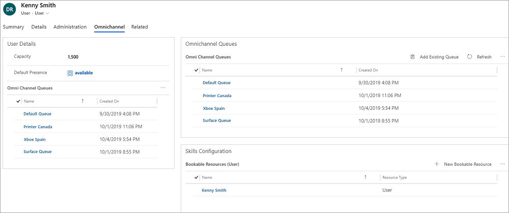

# Manage users in Omnichannel for Customer Service

[!INCLUDE[cc-use-with-omnichannel](../includes/cc-use-with-omnichannel.md)]

All users who are assigned the **Omnichannel administrator**, **Omnichannel supervisor**, or **Omnichannel agent** security role are enabled to use Omnichannel for Customer Service.

For more information on how to create users and assign security roles, see [Assign roles and enable users for Omnichannel for Customer Service](add-users-assign-roles.md).

Navigate to **Queues & Users > Users** to view the list of Omnichannel for Customer Service users in the **Omnichannel Users** view.

> [!div class=mx-imgBorder]
> 

## Manage a user in Omnichannel for Customer Service

1. Sign in to the Omnichannel Administration app.

2. Select **Users** under **Queues & Users**.

3. Double-click a user from the list. For example, **Kenny Smith** is the user (agent).

4. Select the **Omnichannel** tab.

5. Specify the following in the user page.

    | Section | Field | Description | Example value |
    |---------------|---------------------|---------------------|-------------------------------------------------|
    | User Details | Capacity | Allocate a value that indicates the capacity of the agent. For information: [Capacity](#capacity). | 100 |
    | User Details | Default Presence | Assign a default presence status for agent. This is the status that the agent is logged in with, in the Omnichannel for Customer Service app. |

6. Select **New Bookable Resource** under the **Skills Configuration** section. The **New Bookable Resource** page appears.

7. Specify the name of agent in the **Name** field.

8. Select **Save**.

> [!div class=mx-imgBorder]
> 

### Capacity

Capacity is the arbitrary scale that you choose and set for each of the work streams corresponding to the channels. The capacity assigned to the agent must be a multiplier of the capacity unit that you have defined for the associated work stream. Check the capacity unit defined for the work streams to determine the value that must be assigned to your agents. For example, if the capacity unit is 1 for a workstream and you want an agent to be able to take up to 3 conversations simultaneously, the capacity that you assign to the agent should be 3 units. Similarly, if your capacity unit is 5 for the work stream and you want the agent to be able to take up to 3 conversations simultaneously, you should assign 15 units as the capacity for the agent.

### See also

[Work with queues in Omnichannel for Customer Service](queues-omnichannel.md)  
[Configure and manage presence status](presence-custom-presence.md)  

[!INCLUDE[footer-include](../includes/footer-banner.md)]