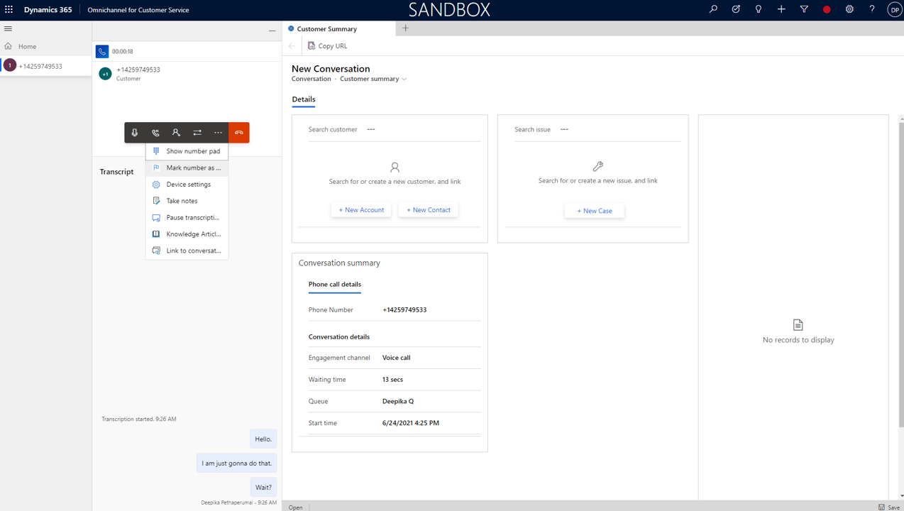
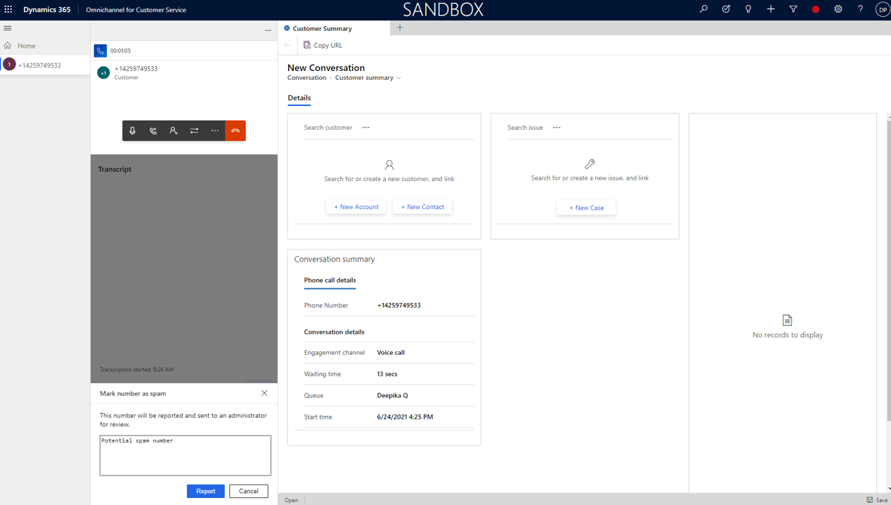

# Use the voice channel in the agent dashboard 

> [!INCLUDE[cc-use-with-omnichannel](../includes/cc-use-with-omnichannel.md)]

> [!IMPORTANT]
> [!INCLUDE[cc-preview-feature](../includes/cc-preview-feature.md)]
>
> [!INCLUDE[cc-preview-features-definition](../includes/cc-preview-features-definition.md)]
>
> [!INCLUDE[cc-preview-features-expect-changes](../includes/cc-preview-features-expect-changes.md)]
>
> [!INCLUDE[cc-preview-features-no-ms-support](../includes/cc-preview-features-no-ms-support.md)]
>
> [!INCLUDE[cc-preview-features-send-us-feedback](../includes/cc-preview-features-send-us-feedback.md)]

<!--
> [!div class="mx-imgBorder"]
> 

For a guided walkthrough, check out the following video.

> [!VIDEO 
https://microsoft.sharepoint.com/:v:/t/CRMHOME/ua/EcxIBAEagJdKtkFer7rhItYBZJl_iNg-vtinvyAtaPeq3Q?e=W1tbR7]

See the video on [Agent experience using the voice channel in Dynamics 365 Customer Service](https://microsoft.sharepoint.com/:v:/t/CRMHOME/ua/EcxIBAEagJdKtkFer7rhItYBZJl_iNg-vtinvyAtaPeq3Q?e=W1tbR7) for more details.
-->

## Accept a call

## View call transcript

## Call controls

- Mute
- Hold
- Consult
- Transfer (to agent or queue)
- End

## View customer information

## Sentiment analysis

## Call transcription

## Knowledge article suggestions

## Topic discovery

| Number reference in image | Function | Description |
| --- | --- | --- |
|  1 |  Mute  |    | 
|  2 | Hold   |    | 
|  3 |  Consult  |     | 
|  4 |  Transfer  |    | 
|  5 |  End call  |    | 

## Mark a phone number as spam

As an agent, if you receive a phone call that you want to flag as spam, you can do so by selecting the 

You can add notes that'll help your administrator review and block numbers​. After you mark a number as spam, it goes into the pending review tab on the Blocked numbers (preview) page. 

Un mark spam number within same call​.
<!--
> [!div class="mx-imgBorder"]
> 
> [!div class="mx-imgBorder"]
> 

> [!div class="mx-imgBorder"]
> 
-->

[!INCLUDE[footer-include](../includes/footer-banner.md)]