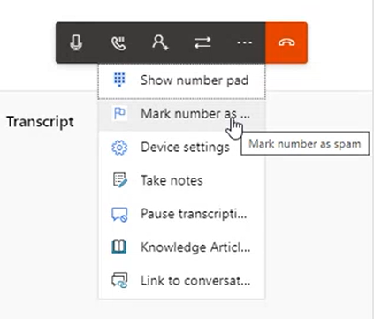

# Use agent dashboard and call controls in the voice channel

[!INCLUDE[cc-use-with-omnichannel](../includes/cc-use-with-omnichannel.md)]

The voice channel in Omnichannel for Customer Service is integrated directly with Dynamics 365 by way of the agent dashboard. The dashboard offers you a consolidated view of the calling interface, the customer summary, case history, and timeline. The dashboard helps you provide quick, effective, and proactive solutions to customer issues. The agent experience in the voice channel is similar to the chat and other channels, which reduces agent training time and costs.

## Make and receive customer calls

You can call a customer by using the phone dialer on the **Active Conversation** page or the **Launch dialer** button on the menu. More information: [Call a customer](voice-channel-call-customer.md)

When a customer calls your business, an intelligent bot receives the incoming call. The bot gathers basic information about the customer issue and then transfers the call to you for further action. You'll receive a notification about the incoming call on your agent desktop so you can accept it. The following section describes the call controls and other features you can use during your conversation.

## Call controls

The conversation panel in the agent dashboard includes the following call controls that you can use when you call or answer phone calls from customers.

> [!div class="mx-imgBorder"]
> 

- **Mute**: Mute your microphone so your voice isn't audible to the customer.
- **Hold**: Put the customer on hold; the customer will hear the hold music. You can keep only one caller on hold at a time.
- **Consult**: Select this option to consult with a participant. You can consult with or bring another agent or supervisor into the call. You can have a *public* consultation, where the customer is actively involved in the conversation. Or you can have a *private* consultation, where you can put the customer on hold before you talk to your peers or supervisor.

  > [!NOTE]
  > When you initiate a consult, you are the primary agent and the new participant has a consult role. Select **Transfer** next to the participant to transfer the call to the consulting agent or supervisor. Once the call is transferred, you are the consulting agent and can leave the call without ending the call. The consulting agent becomes the primary agent. If the primary agent leaves the call, the call will end for the customer.

- **Transfer**: Select this option is to transfer the call to an agent, queue, a Teams user, or an external phone number. After you transfer the call, the agent to whom the call is transferred is the primary agent and you'll no longer be on the call.
    During a transfer to the queue, the customer is automatically put on hold. When you transfer a call to another agent, your number is displayed on the caller ID. The transcription and recording of transferred calls will continue if the administrator has enabled the [option](voice-channel-configure-transcripts.md#enable-call-recording-and-transcription-for-voice). You can disable recording from the dashboard. See: [Transfer and consult scenarios](voice-channel-transfer-consult.md)
- **End**: End the call.
- **Dialpad**: Select this option to dial an extension number. If you must use the dial pad to send a response while navigating an IVR, select the dial pad icon next to the external participant in the participant list.
- **Mark spam**: [Report the incoming call as spam](#report-a-phone-number-as-spam). If you happened to accidentally mark a number as spam, you can select the **Unmark as spam** option.
- **Device settings**: Configure your microphone and speaker settings.
- **Take notes**: Make note of important information or specific details from your conversation with the customer. It's in addition to the call recording and transcription that happen during the conversation.
- **Pause recording and transcription**: If you don't want to capture some details of the conversation—such as bank details, billing, or payment information—you can temporarily pause the transcription and resume it later.
- **Knowledge Articles**: Get a list of knowledge base articles pertaining to the conversation that you can use to resolve the customer issue.
- **Link to conversation**: You can link another conversation, case, customer, or knowledge article to the conversation.

  > [!NOTE]
  > The **Link to conversation** button is disabled after you end the voice call. Open account or contact on a new tab and select **Link to conversation** to link record (customer or case) to conversation.

- **Transcription**: When the transcription and recording service is enabled by your administrator, the conversation between you and the customer is automatically transcribed in real time, which means that you as an agent don't need to take notes during the call. This feature also helps your supervisor or agent (in a call transfer) to see the call history.
- **Sentiment analysis**: The transcript also powers *live* sentiment analysis. This means that you or your supervisor can instantly view and gauge the customer's mood and feeling via the sentiment icons.

## Report a phone number as spam

You can report a phone number as a spam call while you're on the call by using the call controls on the conversation panel. A notification is then sent to your administrator for review and further action.

To report a phone number as spam, select **Mark spam**.

You can add notes to help your administrator review and block numbers. After you mark a number as spam, it goes into the pending review tab on the **Blocked numbers** page.

## How to avoid call disconnection

Avoid the following actions to prevent call drops:

- Refresh your browser or select browser bookmark icons when you're in an active call. When you select refresh, even if you select cancel on the confirm refresh dialog, the page is unloaded. You'll be disconnected from the call, and the customer will hear hold music until you rejoin the call from the **My work items** section of **Omnichannel Agent Dashboard**. If you're disconnected from your browser for a longer duration than a few minutes, the call is reassigned to another agent in the queue.
- Open other apps that will need access to the microphone. It will result in loss of your audio connection, and the customer won't be able to hear you.
- Open the Customer Service workspace or Omnichannel for Customer Service app in more than one tab in the browser. It causes issues in agent presence.
- Close the session directly to end call. If you do, the conversation moves from active to wrap up. Then if you close the session, the state goes from wrap up to closed. So, we recommend that you go through the conversation status route and select the **End** button and then close the session to take care of the wrap-up activities.

## Best practices

- Make sure that you have enabled notifications, and audio and video options in the browser.
- When your shift ends, ensure that you sign out and close your browser through which you access Customer Service workspace. Doing so helps avoid work items being incorrectly assigned to you.
- When you face network or hardware issues, the application displays error or warning messages on the communication panel. Use the information in the messages to resolve the problems. More information: [Use diagnostic messages to troubleshoot call issues](/troubleshoot/dynamics-365/customer-service/omnichannel-for-customer-service/use-diagnostic-messages-in-call-issues)

### See also

[Overview of the voice channel](voice-channel.md)  
[Enable voice consult with Microsoft Teams users](voice-consult-microsoft-teams-user.md)  
[Call a customer](voice-channel-call-customer.md)  

[!INCLUDE[footer-include](../includes/footer-banner.md)]
