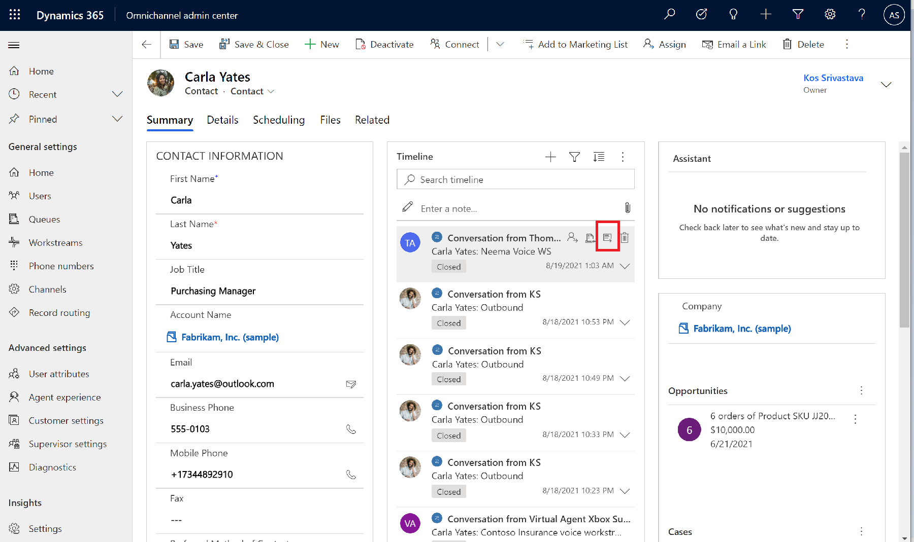

# Preview: Use the voice channel in the agent dashboard 

[!INCLUDE[cc-use-with-omnichannel](../includes/cc-use-with-omnichannel.md)]

> [!IMPORTANT]
>
> [!INCLUDE[cc-preview-feature](../includes/cc-preview-feature.md)]
>
> [!INCLUDE[cc-preview-features-definition](../includes/cc-preview-features-definition.md)]
>
> [!INCLUDE[cc-preview-features-expect-changes](../includes/cc-preview-features-expect-changes.md)]
>
> [!INCLUDE[cc-preview-features-no-ms-support](../includes/cc-preview-features-no-ms-support.md)]
>
> [!INCLUDE[cc-preview-features-send-us-feedback](../includes/cc-preview-features-send-us-feedback.md)]>

## Introduction

One of the main value propositions of the Omnichannel for Customer Service voice channel is that it's integrated directly with Dynamics 365; this integration is presented by way of the agent dashboard. The dashboard offers the agent a consolidated view of the calling interface, the customer summary, case history, and timeline. This helps the agent provide quick, effective, and proactive solutions to customer issues. At the same time, the agent experience in the voice channel is similar to the chat, SMS, and other social channels, thereby reducing any agent training time and costs.

## Make and receive customer calls

You can call a customer either using the phone dialer on the customer summary page or the launch dialer button on the Omnichannel for Customer Service menu bar. More information: [Call a customer](voice-channel-call-customer.md)

When a customer calls your business, the incoming call is received by an intelligent bot. The bot gathers basic information about the customer issue and then transfers the call to you for further action. You'll receive a notification about the incoming call on your agent desktop so you can accept it. The following section describes the call controls and other features you can use during your conversation.

## Call controls

The conversation panel in the agent dashboard includes the following call controls that you can use when you call or answer a phone call from a customer.

> [!div class="mx-imgBorder"]
> 

- **Mute**: Select to mute your microphone so your voice isn't audible to the customer.
- **Hold**: Select to put the customer on hold; the customer hears the hold music.
- **Consult**: Select to consult or bring in another agent or supervisor into the call. You can have a *public* consultation where the customer is actively involved in the conversation. You can also have a *private* consultation where you can put the customer on hold before you talk to your peers or supervisor.
- **Transfer (to agent or queue)**: Select to transfer the call to another agent or queue. During a transfer to queue, the customer is automatically put on hold.
- **End**: Select to end the call.
- **Show number pad**: Select to open the number pad, so you can dial an extension number, when required.
- **Mark number as spam**: Select to [report the incoming call as spam](#report-a-phone-number-as-spam). If you happened to accidentally mark a number as spam, you can select the **Unmark as spam** option.
- **Device settings**: Configure your microphone and speaker settings.
- **Take notes**: You can take any important or specific notes regarding your conversation with the customer. Note that this is in addition to the call recording and transcription that happen during the conversation.
- **Pause transcription**: If you don't want to capture some details of the conversation, such as bank details, billing, or payment information, you can temporarily pause the transcription and later resume it.
- **Knowledge Articles**: Select this option to get a list of knowledge base articles pertaining to the conversation that you can use to resolve the customer issue.
- **Link to conversation**: You can link another conversation, case, or knowledge article to the conversation.
- **Transcription**: When transcription and recording service is enabled by your administrator, all of the conversation between you and the customer is automatically transcribed in real time, which means that the you as an agent don't need to take notes during the call. This feature also helps your supervisor or agent (in case of a call transfer) to see the call history.
- **Sentiment analysis**: The transcript also powers *live* sentiment analysis. This means that you or your supervisor can instantly view and gauge the customer mood and feeling via the sentiment icons.

## Report a phone number as spam

When you receive a phone call and want to report the number as spam *while on the call*, you can do so immediately via the call controls on your conversation panel. A notification is then sent to your administrator for review and further action.

To report a phone number as spam, select the ellipsis to open more actions, and then select **Mark number as spam**.

You can add notes to help your administrator review and block numbers. After you mark a number as spam, it goes into the pending review tab on the **Blocked numbers (preview)** page.

## View call recordings and transcripts

If your administrator has enabled the ability to view call recordings and transcripts, when conversations between agents and customers end, both supervisors and agents can view the recordings and transcripts of those conversations, play back the recordings, and view the sentiment analysis and other analytics related to the conversations.

> [!NOTE] 
> Many countries and states have laws and regulations that apply to the recording of PSTN, voice, and video calls, and may require that users first consent to the recording of their communications. It is your responsibility to use the call recording capabilities in compliance with the law. Before using call recording features, you must obtain consent from the parties of recorded communications in a manner that complies with all applicable laws for each participant.

There are a couple of ways to access recordings and transcripts from completed calls in the Omnichannel admin center app:

**From the Users option on the sitemap**:

1. On the Omnichannel admin center sitemap, select **Users**, and then select the user whose conversations you want to view.
2. Select the **Related** tab, and then select **Conversations** from the dropdown menu.
3. To view all conversations, select **All conversations** from the dashboard dropdown menu. (Alternatively, you can select **Closed conversations**.)
4. Select the closed conversation for which you want to access the recording and transcript.
  
   > [!div class="mx-imgBorder"]
   > 

**From a contact (customer)**:

1. Select the name of the contact, and then from the Timeline, hover over the closed conversation you want to view. The icon menu is displayed on the top-right of the conversation.
2. Select the **Open Record** icon.

  > [!div class="mx-imgBorder"]
  > 

### Call recording and transcript controls

The **Details** tab of the Conversation Form displays call recording details.

> [!div class="mx-imgBorder"]
> 

**Recording playback**

- **Play**:  Select the button to listen to the conversation audio. 
- **Rewind** or **Fast forward**: Select the buttons to either rewind in 10-second increments or fast-forward in 30-second increments.
- **Volume**: Move the slider to adjust the volume to your desired level.
- **Download audio**: Download an .mp4 audio file of the complete conversation.
- **Speed**: From the dropdown menu, select the playback speed of the conversation, whether slower or faster. **Normal** is the default, and is the speed in which the conversation was recorded.
- **Conversation scroll bar**: Move the scroll bar to any point of the conversation, or listen to it from beginning to end. When you select a location in the recording visualization, the transcript also moves to same place in the conversation.
- **Sentiment**: Colors and emojis help you quickly analyze the sentiment of the conversation. Green equals positive sentiment, red equals negative sentiment, and grey equals neutral sentiment.

**Transcript**

- **Search**: Enter keywords in the search field to locate desired sections of conversation.
- **Download transcript**: Open an HTML file of the conversation transcript in your browser.

Admin toggle to turn on voice recording and transcript as part of voice channel modern admin app

Leverage of conversation control for displaying transcript ​

One code base for transcript control​

> [!div class="mx-imgBorder"]
> 

### Prerequisites

Enable the new transcript experience

> [!div class="mx-imgBorder"]
> 

Enable transcripts and recordings for each phone number in a workstream.

> [!div class="mx-imgBorder"]
> 

> [!Note]
>

>[!TIP] 
> 

### See also

[Overview of the voice channel](voice-channel.md)

[!INCLUDE[footer-include](../includes/footer-banner.md)]
