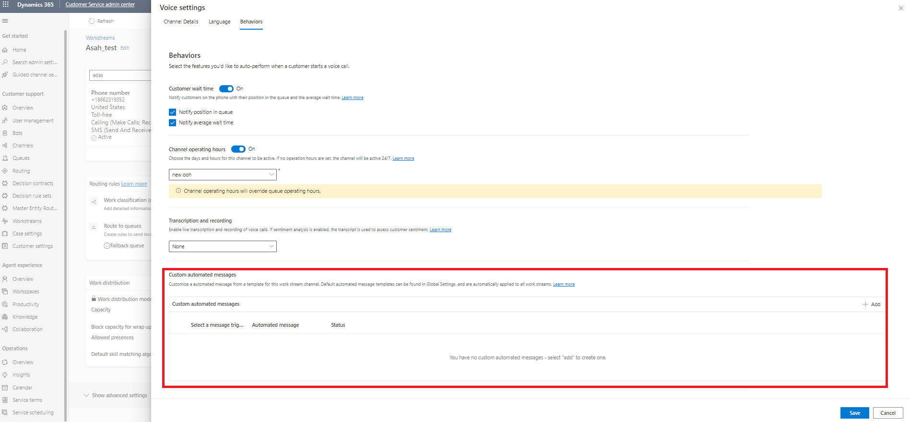

# Configure automated greeting messages

Configure automated messages to greet customers once the call connects. The configured greeting message is played with system voice message.

> [!Note]

> If the bot is enabled, ensure that automated greeting message and the bot message are different.

## Enable automated greeting message for voice

1. In Customer Service admin center, select the workstream for which you want to enable automated greeting message.

1. In the **Phone number** section, next to the pencil icon, select **Edit**.

1. On the **Voice settings** page, select the **Behaviors** tab.
   > [!div class="mx-imgBorder"]
   > 

1. In the **Custom automated messages** section, select **Add**.

1. Select the **Select a message trigger** dropdown menu, and then select **Greeting Message for Async Channels and Voice**.

1. Enter the greeting message in **Custom automated messages** and select **Confirm**.

1. Select **Save**.

### See also

[Overview of the voice channel](voice-channel.md)
[Configure call recording, transcription, and real-time translation](voice-channel-configure-transcripts.md)