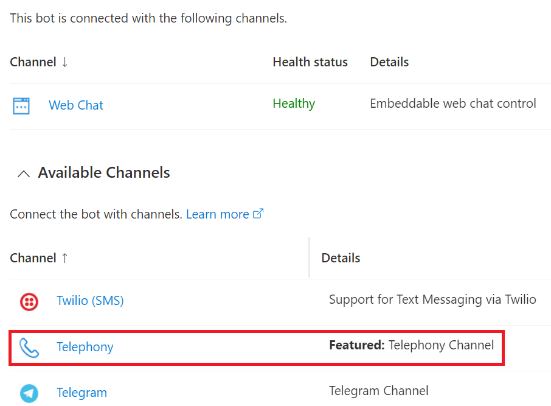
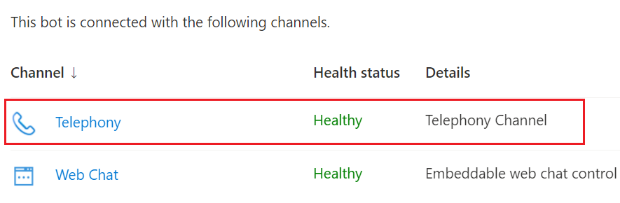

# Configure Azure bots for voice

[!INCLUDE[cc-use-with-omnichannel](../includes/cc-use-with-omnichannel.md)]

## Introduction

In Omnichannel for Customer Service, you can seamlessly integrate your Azure bot with all chat and voice channels. You can connect a speech resource to the bot using Azure Cognitive Services. You can also transfer chat and voice conversations from bots to human agents.

This topic describes how you can configure Azure bots to enable voice services.

## Prerequisites

The following prerequisites must be met to configure the Azure bot for the voice channel.

- Have a bot that's built using [Microsoft Bot Framework](https://dev.botframework.com) and registered with [Azure Bot Service](/azure/bot-service/bot-service-quickstart-registration?view=azure-bot-service-4.0&preserve-view=true).  

    To create an Azure bot resource, see [Create Azure bot resource](/azure/bot-service/bot-service-quickstart-registration?view=azure-bot-service-4.0#create-the-resource&preserve-view=true) section in the Bot Framework SDK documentation. Be sure to note the values of the Microsoft App ID and the bot handle.
- [Enable the bot for Telephony](https://github.com/microsoft/botframework-telephony/blob/main/EnableTelephony.md).

## Configure Azure bots for voice

After you've checked for the prerequisites, perform the following steps to integrate your Azure bots with Omnichannel for Customer Service and then configure the bot for the voice channel.

1. [Connect your Azure bot resource to Telephony channel](#connect-your-bot-resource-to-telephony-channel).
1. [Configure the bot user as an omnichannel agent](configure-bot.md#configure-the-bot-user-as-an-omnichannel-agent).
1. [Configure routing rules and context variables](configure-bot.md#configure-routing-rules).
1. [Add the bot user to a voice workstream](#add-bot-user-to-a-voice-workstream).
1. [Set escalation rules](#set-escalation-rules) as required.

### Connect your bot resource to Telephony channel

Perform the following steps to connect and register your bot with the Telephony channel.

1. Open the [Azure portal](https://portal.azure.com), and then select your bot resource.

2. Under **Settings**, select **Channels**. The list of available channels is displayed.
    > [!div class=mx-imgBorder]
    > 

3. Select **Telephony** and then select **Create a connection**.
4. In the **New connection** dialog, do the following:
    1. **Type**: Select **Omnichannel for Dynamics Customer Service** from the dropdown list.
    1. **Subscription**: Select a subscription from the dropdown list.
    1. **Azure Cognitive Services**: Select an existing Cognitive Services resource from the dropdown list or create a new one.
    1. **Default Locale**: Select a locale from the dropdown list.
    1. Select **Connect**. The **Omnichannel** telephony channel is now listed in the Bot connection column.
    1. Select the **Omnichannel** channel, select **Apply**, and then refresh the page.
        The **Telephony** channel will now appear in the list of available channels for your resource.
        > [!div class=mx-imgBorder]
        > 

## Add bot user to a voice workstream

To enable the bot to answer incoming calls, you must add the bot to a corresponding workstream for accepting voice calls.

1. In Customer Service admin center or Omnichannel admin center, open the workstream related to your voice channel.

1. Expand **Advanced Settings**, and in **Smart assist bots**, select **Add bot**. The **Add a bot** dialog opens.

1. Select an existing bot from the dropdown list and select **Save and close**.

Now, if there's a valid phone number associated with the workstream, the bot will automatically receive and respond to the phone call.

## Privacy notice

You understand that your data may be transmitted and shared with external systems and that your data may flow outside of your organization's compliance boundary (even if your organization is in a Government Cloud environment). For example, your messages will be shared with the bot which could be interacting with a third-party system based on the integration done by you. For more information on how we process your data, please refer to the [Microsoft Privacy Statement](https://privacy.microsoft.com/privacystatement).

### See also

[Overview of the voice channel](voice-channel.md)  
[Understand and create workstreams](create-workstreams.md)  
[Enable a bot to escalate and end conversation](bot-escalate-end-conversation.md)  
[Context variables for a bot](context-variables-for-bot.md)  
[Enable bot context NuGet package](enable-bot-context.md)   

[!INCLUDE[footer-include](../includes/footer-banner.md)]
