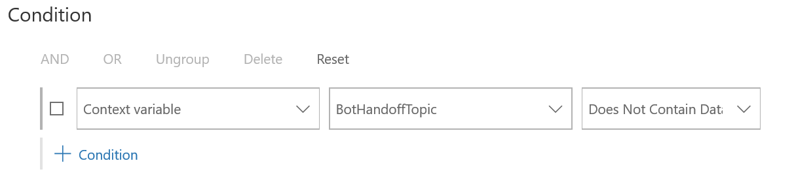

# Add Azure Bot Services for conversational IVR

[!INCLUDE[cc-use-with-omnichannel](../includes/cc-use-with-omnichannel.md)]

> [!IMPORTANT]

> [!INCLUDE[cc-preview-feature](../includes/cc-preview-feature.md)]

>

> [!INCLUDE[cc-preview-features-definition](../includes/cc-preview-features-definition.md)]

>

> [!INCLUDE[cc-preview-features-expect-changes](../includes/cc-preview-features-expect-changes.md)]

>

> [!INCLUDE[cc-preview-features-no-ms-support](../includes/cc-preview-features-no-ms-support.md)]

>

> [!INCLUDE[cc-preview-features-send-us-feedback](../includes/cc-preview-features-send-us-feedback.md)]

## Introduction

A bot is a program that provides automated responses in a conversational manner to a customer. It can also help resolve customer queries by using case deflection. A bot can also collect basic information from a customer and then provide it to a customer service agent to work further on the issue raised by the customer.  

A bot eases the load on your customer service agents by handling basic queries. This saves your agents' time so they can work on more complex issues. You can configure your bots to escalate the query to a human agent as required, or when requested by the customer.

In Omnichannel for Customer Service, you can integrate a bot to start the conversation with a customer, provide automated responses, and then shift the conversation to a human agent if required.

When you integrate an Azure bot with Omnichannel for Customer Service, you get the following capabilities for bot conversations:

- Seamlessly integrate your Azure bot with all *chat and voice* channels without needing to add channel-specific code in the bot.
- *Connect speech resource to the bot using Azure Cognitive Services.*
- Transfer bot conversations *(both chat and voice)* to human agents, and include the full context of the conversation.
- Analyze the bot transcript that's available in Microsoft Dataverse after the *chat or voice call* is completed.
- Configure routing rules to selectively route incoming requests to bots based on context, such as issue type or customer type. For example, you can route low-complexity issues to bots, or route the conversation to a sales or support bot based on the webpage browsing history of the customer.
- Monitor the bot conversations in real time by using the supervisor dashboard, which includes details such as customer sentiment.
- Use historical dashboards to get insights into the effectiveness of the bots through metrics such as resolution rate, escalation rate, resolution time, escalation time, and average sentiment.
- Configure routing rules to use bots in *post-conversation* surveys.
- Repurpose bots to be smart assist bots and provide recommendations to agents.

## Prerequisites

1. You must have a bot that's built using Microsoft Bot Framework and registered with Azure Bot Service.

    To create an Azure bot resource, see [Create Azure bot resource](https://docs.microsoft.com/azure/bot-service/abs-quickstart?view=azure-bot-service-4.0&tabs=csharp#create-the-resource) section in the Bot Framework SDK documentation. Be sure to note the values of the Microsoft App ID and the bot handle.

2. You must add the Azure bot service to conversational IVR.

    To create a bot resource that's enabled for cognitive services and also supports the Direct Line speech channel, perform the following steps:
    
    1. [Create a Cognitive Services resource using the Azure portal](https://docs.microsoft.com/azure/bot-service/bot-service-channel-connect-directlinespeech?view=azure-bot-service-4.0#add-the-direct-line-speech-channel) to enable cognitive services such as text-to-speech or speech-to-text capabilities. Note the location/region and key values.
    
    2. Then, [add the Cognitive Services speech resource you created in the earlier step to the Direct Line Speech channel](https://docs.microsoft.com/azure/bot-service/bot-service-channel-connect-directlinespeech?view=azure-bot-service-4.0#add-the-direct-line-speech-channel).

## Integrate a bot with Omnichannel for Customer Service

To integrate a bot with Omnichannel for Customer Service, you must do the following steps:

1. Create a bot user as an application user with the Omnichannel agent role.

2. Add the bot user to one or more queues or workstreams.
    > [!NOTE]
    > Bots can escalate conversations to agents only if they are a part of push-based workstreams.

3. Enable a bot to escalate or end conversations.

4. Set escalation rules, as required.

### Assign a bot user as application user

**To assign a bot user as an application user**

1. Open Omnichannel admin center and go to **Advanced Settings** > **Security** > **Users**.

2. In the **Users** dropdown list, select **Application Users**, and then select **New**.

3. In the New User dropdown list, select **Application User**.

4. On the **New User** summary page, enter or select the following information:
    - **User Name**: User name of the bot. Note that this name won't be displayed in the chat widget.
    - **Application ID**: An application ID for any valid (non-expired) application created in Azure Active Directory (Azure AD) under the same tenant. This ID is not used by the bot in Omnichannel for Customer Service.
    - **Full Name**: Name of the bot to be displayed in the *chat widget or conversation.*
    - **Primary Email**: Enter a dummy email address. This email address is not used by the bot in Omnichannel for Customer Service.
    - **User type**: Select **Bot application user**.
    - **Bot application ID**: Enter the Microsoft App ID from Azure AD that you noted earlier.
    - **Bot handle**: Enter the bot handle from the Bot profile settings.
    - **Cognitive Services Subscription Key**: Enter the KEY 1 or KEY 2 value from the [cognitive speech service resource](voice-channel-azure-bot-service.md) that you created earlier.
    - **Cognitive Services Region**: Enter the Location/Region value from the cognitive speech service resource that you created earlier.

5. Select **Save and Close**.

6. Select **Manage Roles** on the command bar.

7. In the **Manage User Roles** window, select **Omnichannel agent**, and then select **OK**.

    > [!IMPORTANT]
    > By default, the bot user is assigned the same capacity as other users. You must assign the maximum capacity to the bot user among all users in a queue or workstream, if you want the bot to handle the customer queries first. The capacity of a bot user is however not reduced when a query is handled by it.

### Add bot user to queues

Queues distribute the incoming customer queries among bots and agents. You must ensure that the bot user has the highest capacity among all users in the queue. This ensures that the bot user receives the customer query first.

> [!NOTE]
> The bot works with the chat widget, workstreams, and queues created in Omnichannel for Customer Service.

You can add a bot user to specific queues or workstreams where you want the bot to handle the customer queries first. Alternatively, you can also create a queue or workstream with the bot user only. If you create a queue with the bot user only, ensure that the routing rules are set in a way that customer queries are sent to this queue first. This ensures that the bot acts as a first line of defense for all queries.

An agent can transfer a chat to a bot by adding the bot to a queue, and then transferring the chat to the queue. Please note that the chat cannot be transferred to the same bot. You can also set escalation rules to allow a bot to send customer queries to a customer service agent. More information: [Set escalation rules](#set-escalation-rules)

#### Add bot user to a voice or phone call workstream

To enable the bot to answer incoming calls, you must add the bot to a corresponding workstream for accepting voice calls.

1. In Omnichannel admin center, under **General Settings**, select **Workstreams**.

2. Open the workstream related to your voice channel, and under **Advanced Settings** > **Smart assist bots**, select **Add bot**. The **Add a bot** dialog opens.

3. Select an existing bot from the dropdown list and select **Save and close**.

Now, if there's a valid phone number associated with that workstream, the bot will automatically receive and respond to the phone call.

### Enable a bot to escalate and end conversations

In Omnichannel for Customer Service, you can program a bot to route a conversation to a human agent, or end the conversation if the customer is not responding. For more information about how you can program bots to escalate or end conversations, see [Engage a bot](bot-escalate-end-conversation.md#engage-a-bot).

#### Set escalation rules

Escalation rules allow you to create rules for the bot to escalate the queries to the appropriate agent. For escalation rules, you must create a context variable and appropriate routing rules to route the customer queries.

If the bot escalates the customer query, it is routed to the appropriate queue as per the defined routing rule. If the customer query in redirected to the same queue, another agent in the queue will pick the conversation as per the capacity. For information on working with queues, see [Work with queues in Omnichannel for Customer Service](queues-omnichannel.md).

#### Create a context variable

You must create a context variable for the bot to handle customer queries appropriately. The context variable is used in routing incoming customer queries to appropriate bots and agents. For information on creating context variables, see [Understand and create workstreams](create-workstreams.md).

#### Create routing rules

Routing rules route the incoming customer queries to their respective queues. Each routing rule has a condition and a destination queue. If the condition is evaluated as true, the customer query is routed to the destination queue. For bots, the condition is built by using the context variable.

Bots are developed to receive customer queries first, gain information about the query, and then pass the query to a human agent if required. To achieve this behavior, you must add a bot user to the queue and configure routing rules in a way that the incoming customer queries are routed to the queue with the bot user.

Be sure to map the routing rules to the correct queues so that the queries are routed appropriately. For information on creating a routing rule, see [Create and manage routing rules](routing-rules.md).

## Sample configuration to integrate a bot

This sample provides exact steps and configuration values to integrate a bot and then escalate the query to a human agent. In this sample, three queues and three routing rules will be created. A bot user is added to one queue, and agents are added to two other queues. Routing rules are defined in such a way that whenever a customer initiates a chat, it will be sent to the bot first and then escalated to a human agent as per the conditions defined in the routing rules. The workstream used in this sample is **ChatWorkStream**.

1. Follow the instructions in [Create a bot user](configure-bot.md#create-a-bot-user) to create a bot user.

2. Follow the instructions in [Add a bot user to the queues](configure-bot.md#add-a-bot-user-to-the-queues) to create three queues and add users as follows:
    - **BotQueue**: Add the bot user to this queue.
    - **CreditCardQueue**: Add agents to handle credit card&ndash;related queries.
    - **HomeLoanQueue**: Add agents to handle home loan&ndash;related queries.

3. Follow the instructions in [Set escalation rules](#set-escalation-rules) to create escalation rules. Let's say you create a context variable named **BotHandoffTopic** in the **ChatWorkStream** workstream.

4. Create three routing rules in the **ChatWorkStream** workstream in the following order:
    - **BotRule**: Specify the workstream and queue as **ChatWorkStream** and **BotQueue**, respectively. Add the condition as follows:
        > [!div class=mx-imgBorder]
        > 
    - **CreditCardRule**: Specify the workstream and queue as **ChatWorkStream** and **CreditCardQueue**, respectively. Add the condition as follows:
        > [!div class=mx-imgBorder]
        > 
    - **HomeLoanRule**: Specify the workstream and queue as **ChatWorkStream** and **HomeLoanQueue**, respectively. Add the condition as follows:
        > [!div class=mx-imgBorder]
        > 

When a chat is initiated by a customer, the query is routed to the bot through the **BotRule** routing rule. If the bot escalates the query, it is sent to the appropriate agent as per the configured routing rules. The bot needs to send the correct context variable and its value in the escalation request to route the query appropriately. For more information on setting up of context variable and escalation request, see [Enable a bot to escalate and end conversation](bot-escalate-end-conversation.md).

## Bot sessions usage

Each Chat and Digital Messaging license receives an entitlement of 50 chatbot sessions for use with Microsoft Bot Framework bots. These sessions are pooled at the tenant level and expire at the end of each month. Additional chatbot sessions will require purchase of Chatbot Sessions Add-on.

> [!NOTE]
> For more information on Chatbot licenses and pricing, see the Dynamics 365 licensing guide [here](https://go.microsoft.com/fwlink/p/?LinkId=866544).

### What is a bot session?

A bot session can be defined as a conversation in which a bot is invoked. The bot can be invoked in the beginning, during, or at the end of a conversation.

- If two different bots are invoked in the same conversation, it is counted as one.
- A conversation with a bot that's escalated to a human agent is counted as a bot conversation.

> [!NOTE]
> If smart assist is enabled, the bot conversations do not include smart-assist conversations.

### Purchase additional chatbot sessions

Chatbot Session add-ons entitle customers with Chat or Digital Messaging to an additional 100 chatbot sessions for use with Microsoft Bot Framework bots, pooled at the tenant level. Additional chatbot sessions expire at the end of each month.

You can purchase additional bot conversations from Microsoft 365 admin center.

1.	Sign in to [Microsoft 365 admin center](https://admin.microsoft.com) with the global administrator credentials.

2.	Go to **Billing** > **Purchase Services**, and select **Add-ons**.

3.	Under **Add-ons**, select **Dynamics 365 for Customer Service Chatbot session add-on**.

4.	Select the number of add-ons required and complete the purchase.

## Privacy notice

You understand that your data may be transmitted and shared with external systems and that your data may flow outside of your organization's compliance boundary (even if your organization is in a Government Cloud environment). For example, your messages will be shared with the bot which could be interacting with a third-party system based on the integration done by you. For more information on how we process your data, please refer to the [Microsoft Privacy Statement](https://privacy.microsoft.com/privacystatement).

### See also
[Overview of the voice channel](voice-channel.md)  
[Understand and create workstreams](create-workstreams.md)  
[Work with queues in Omnichannel for Customer Service](queues-omnichannel.md)  
[Create and manage routing rules](routing-rules.md)  
[Add a chat widget](add-chat-widget.md)  
[Enable a bot to escalate and end conversation](bot-escalate-end-conversation.md)  
[Context variables for a bot](context-variables-for-bot.md)  
[Enable bot context NuGet package](enable-bot-context.md)  
[Create an application user](../powerapps/developer/data-platform/use-multi-tenant-server-server-authentication#create-a-multi-tenant-web-application-registered-with-your-azure-ad-tenant)  

[!INCLUDE[footer-include](../includes/footer-banner.md)]
