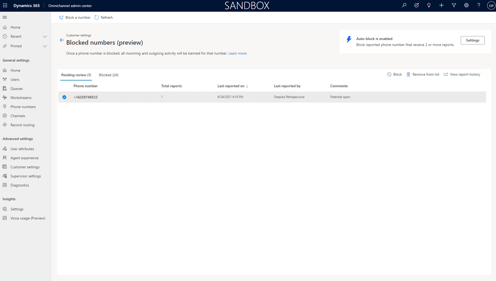
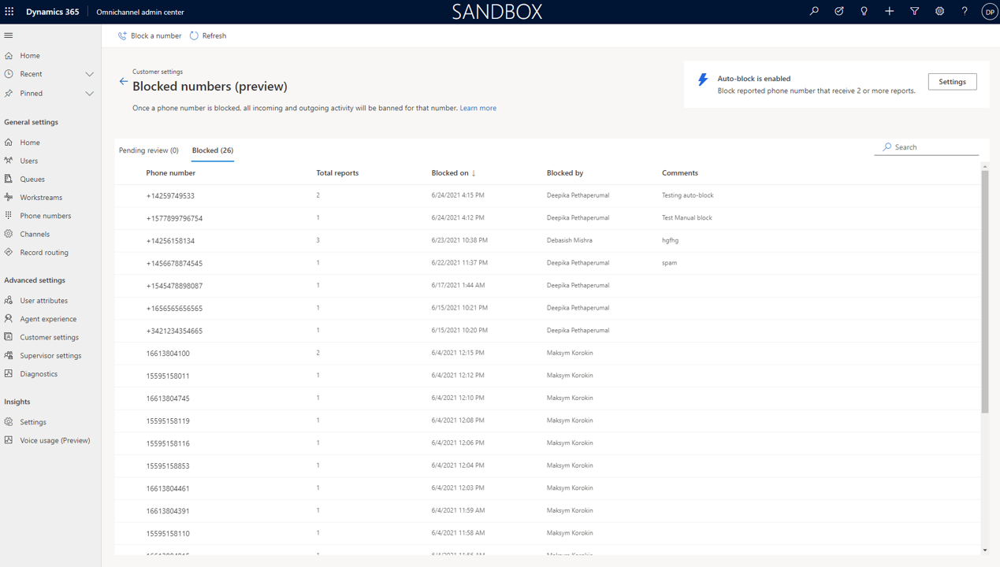
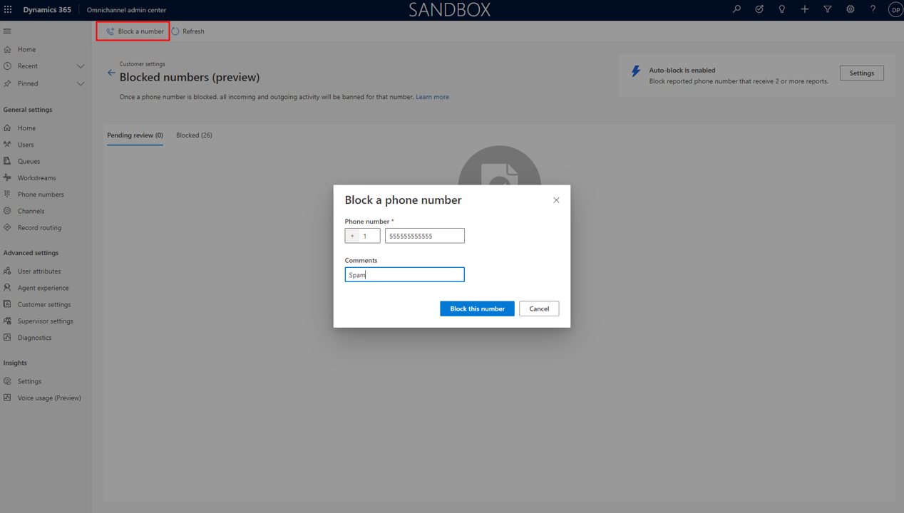
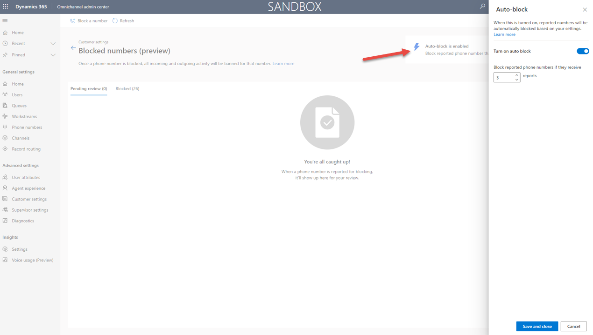

# How to block spam numbers

> [!INCLUDE[cc-use-with-omnichannel](../includes/cc-use-with-omnichannel.md)]

> [!IMPORTANT]
> [!INCLUDE[cc-preview-feature](../includes/cc-preview-feature.md)]
>
> [!INCLUDE[cc-preview-features-definition](../includes/cc-preview-features-definition.md)]
>
> [!INCLUDE[cc-preview-features-expect-changes](../includes/cc-preview-features-expect-changes.md)]
>
> [!INCLUDE[cc-preview-features-no-ms-support](../includes/cc-preview-features-no-ms-support.md)]
>
> [!INCLUDE[cc-preview-features-send-us-feedback](../includes/cc-preview-features-send-us-feedback.md)]

// powerpoint: https://microsoft-my.sharepoint-df.com/:p:/p/deepikap/EbZQUBgs6vlOlqVYPCpa4QgBcTfW7dKPaAakl5hApAqP0A
// video: https://msit.microsoftstream.com/video/5a970840-98dc-b561-c9ea-f1ebd507930f 

In Omnichannel for Customer Service, you can block phone numbers that your agents receive as part of their incoming customer calls. As an administrator, you can mark phone numbers as spam so your agents can engage with actual customers​, instead of unsolicited or irrelevant calls that don't correspond to your line of business. This capability for admins to control which calls can be received by your agents helps improve efficiency of agents​. It also helps to prevent long waits of actual customers in queues​. Your agents and supervisors can also flag incoming phone calls as spam, that you can later review and mark as spam.

## Manage spam numbers

## Review phone numbers marked as SPAM (Supervisor)

The admin can review the record by clicking view report history​
Look at all spam reports by looking through the call details, notes etc.​

They can choose to visit the conversation history page to review the conversation or even the recordings.​

Then they choose to either block the number or remove the number from pending review aka. Potential spam number​

Once they click on block number, it gets added to blocked list​

Anyone calling from that number will no longer reach the queue thereby the agents. Thereby improving agent’s productivity ​

1. In the site map of Omnichannel admin center, select **Customer settings** under the **Advanced settings** menu.
   
2. In the **Customer experience** area, select **Blocked numbers (preview)**, and then select **Manage**.
Select **Block a number**.

3. On the **Blocked numbers (preview)** page, You can view the Pending review list and the set of blocked numbers.

- click on a pending block request to see basic details and the ability to view the related call. 

> [!div class="mx-imgBorder"]
> 

> [!div class="mx-imgBorder"]
> 

## Manually block a phone number

> [!div class="mx-imgBorder"]
> 

## Auto block phone numbers 

Block numbers based on number of reports

Block a number through auto block option​

Set conditions and it gets directly added to blocked list when condition is met​

Saves admin time from reviewing every single record​

Remove3s bottle-neck from admins when there are too many reports/records​

Helps during surge in spam calls from different numbers

> [!div class="mx-imgBorder"]
> 

[!INCLUDE[footer-include](../includes/footer-banner.md)]