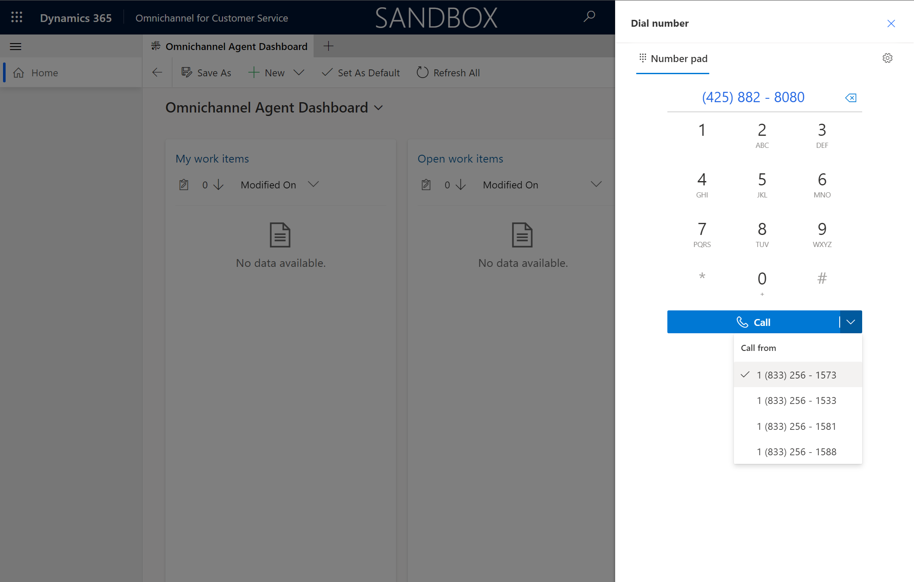
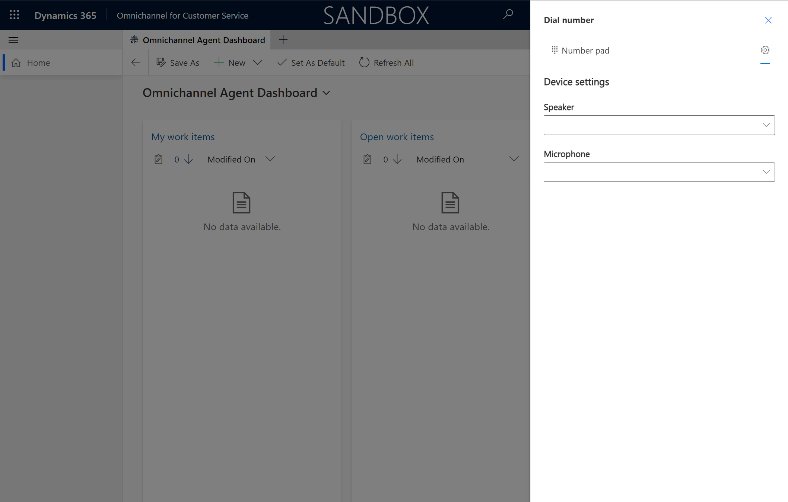

# Call a customer

## Prerequisites

[Set up Outbound Calling](voice-channel-outbound-calling.md)

## Call from dialpad

> [!div class="mx-imgBorder"]
> 

## Call from contact 

> [!div class="mx-imgBorder"]
> 

## Configuration considerations

### See number calling from

> [!div class="mx-imgBorder"]
> 

### Choose device settings

> [!div class="mx-imgBorder"]
> 

## Additional Notes