# Handle Call Overflow

// video 1: https://msit.microsoftstream.com/video/1e910840-98dc-b561-c1ad-f1ebd2b63bf5

Your organization can set conditions for when a call

1. exceeds a defined number of calls waiting in the queue
2. is recevied outside call center operation hours

## Prerequisites
- Agents
- Phone number

> [!Note]
>

>[!TIP] 
> 

> [!div class="mx-imgBorder"]
> 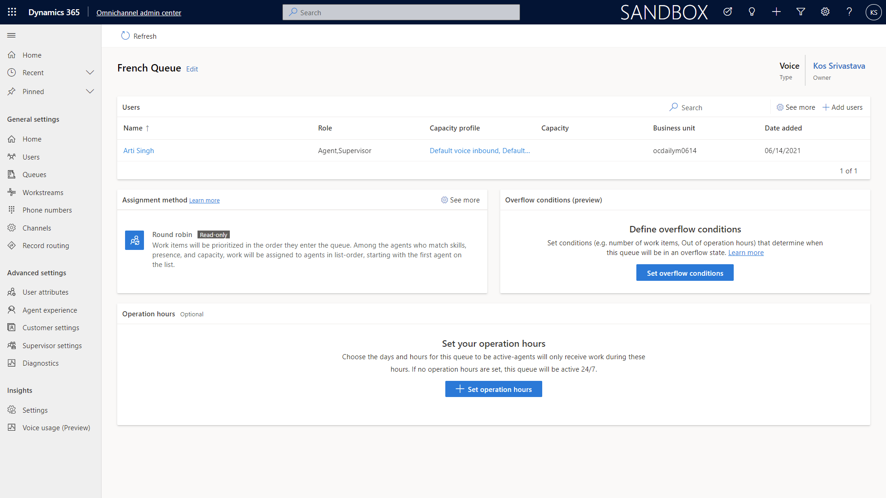

## Select an existing voice queue or create a new one

Type = Voice

> [!div class="mx-imgBorder"]
> 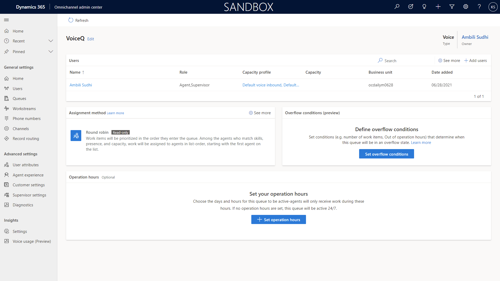

Assign agents to the queue

## Define operation hours (if applicable)

> [!div class="mx-imgBorder"]
> 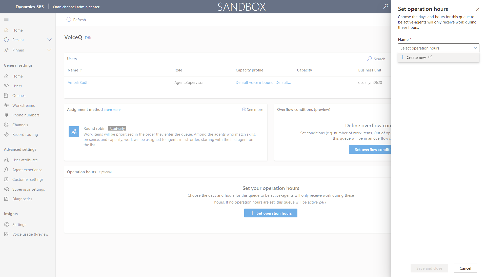

> [!div class="mx-imgBorder"]
> 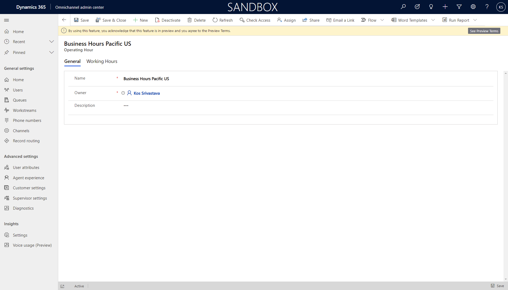

> [!div class="mx-imgBorder"]
> 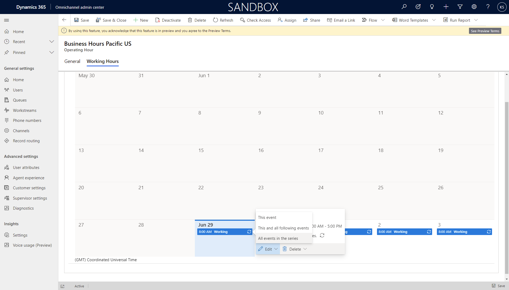

> [!div class="mx-imgBorder"]
> 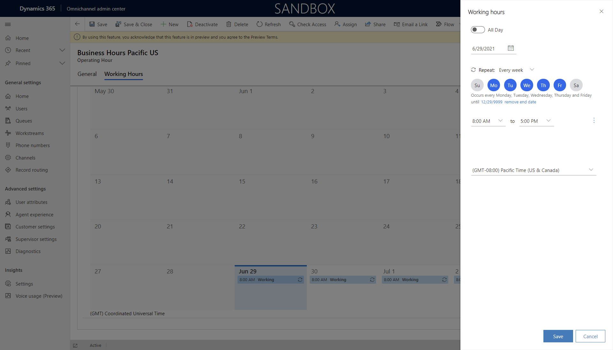

> [!div class="mx-imgBorder"]
> 

> [!div class="mx-imgBorder"]
> 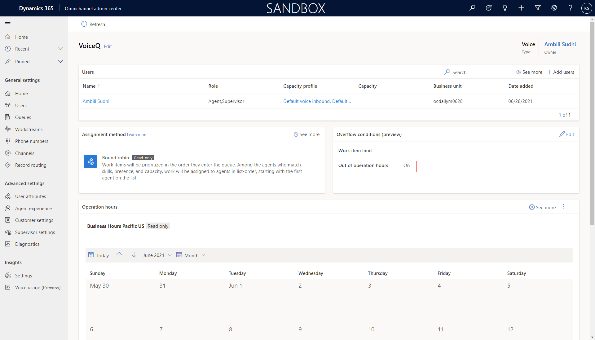

If operation hours are not edited, they will be 24 hours by default. 

## Define Overflow conditions

> [!div class="mx-imgBorder"]
> 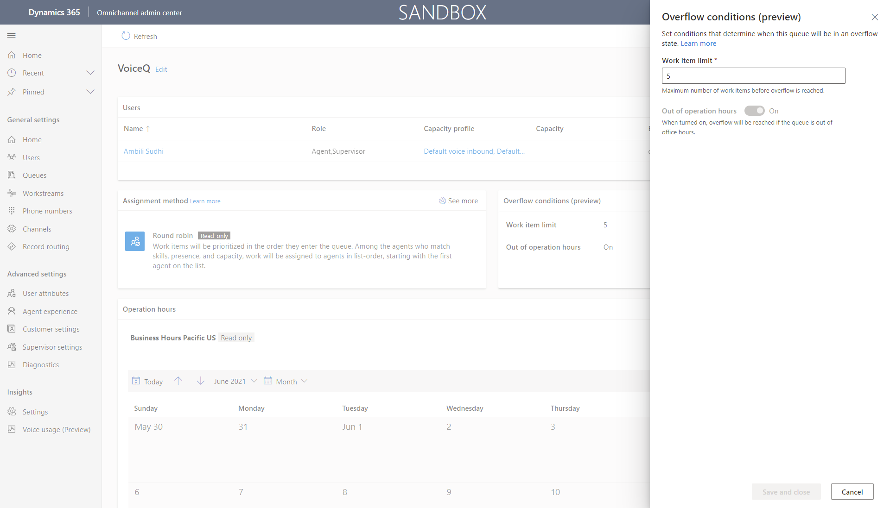

- Work item limit

- Out of operation hours 

The overflow condition respects OR logic. If either the work item limit is exceeded OR the call is received outside of working hours then the overflow actions will be taken.

If you do not want work hours to influence overflow conditions and actions, then remove work hours.

> [!div class="mx-imgBorder"]
> 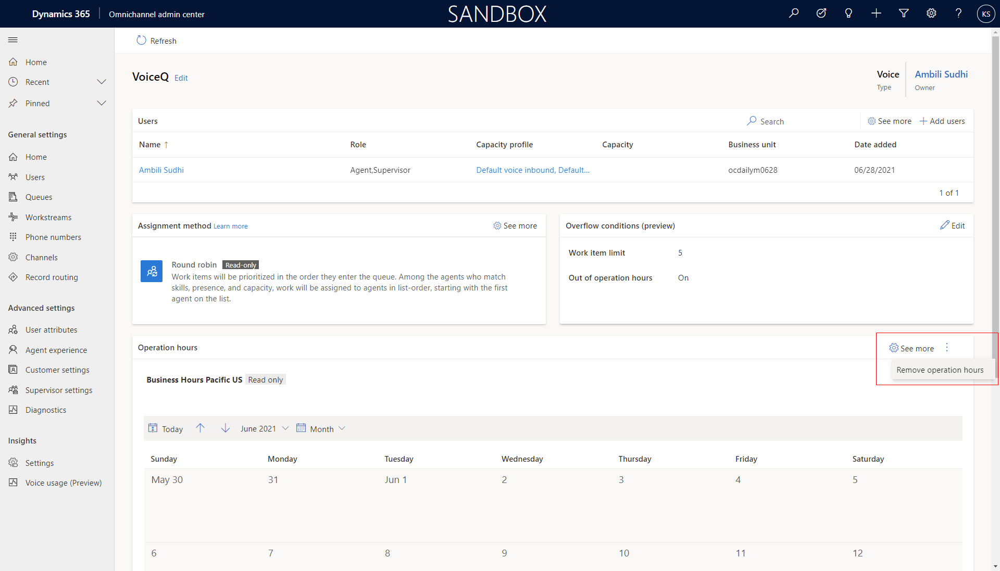

## Enter Overflow action in workstream

> [!div class="mx-imgBorder"]
> 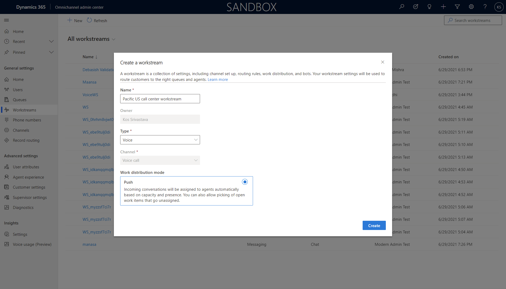

> [!div class="mx-imgBorder"]
> 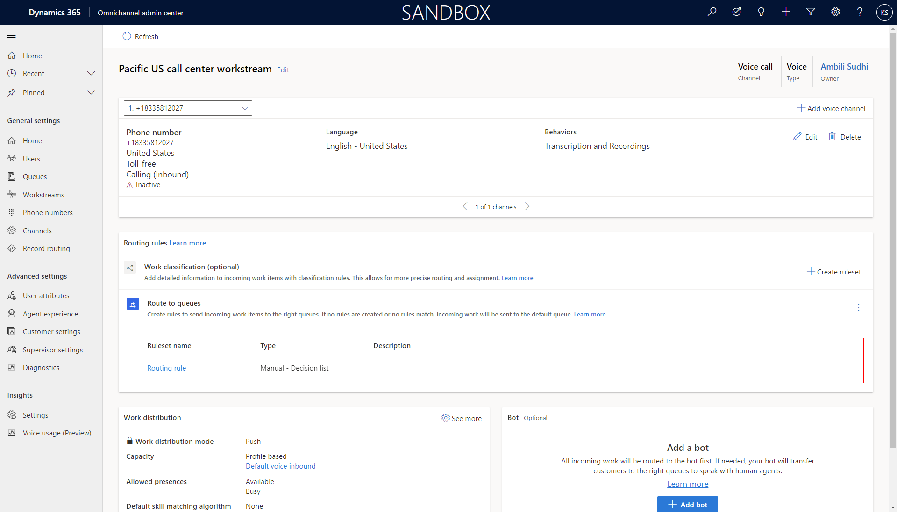

Default - waits for next available agent

End call - ends call and delivers automated message.

Transfer to external number

> [!div class="mx-imgBorder"]
> 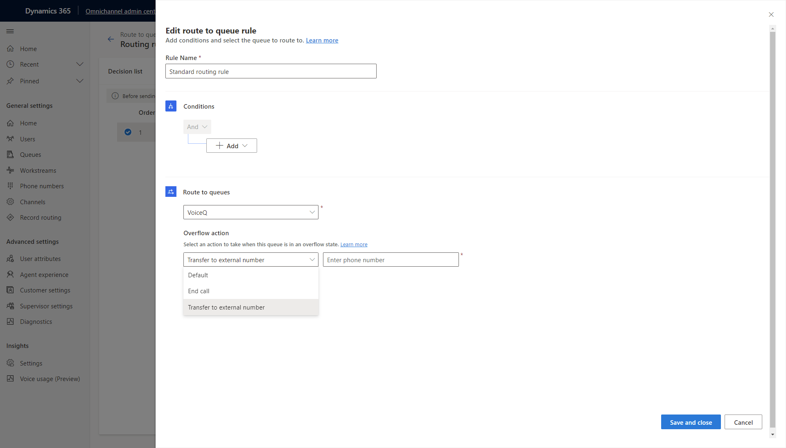

## Configuration considerations

### Edit automated messages for End Call overflow action

When the End Call overflow action is executed, an automated message is delivered to the customer notifying them the conversation is ending. 

To edit the end call automated message go to **Customer settings > Automated messages** and find the automated message for the _Voice call_ channel where the _Message trigger_ is "End Conversation due to overflow". 

Then edit the _Localized text_ as needed.

> [!div class="mx-imgBorder"]
> 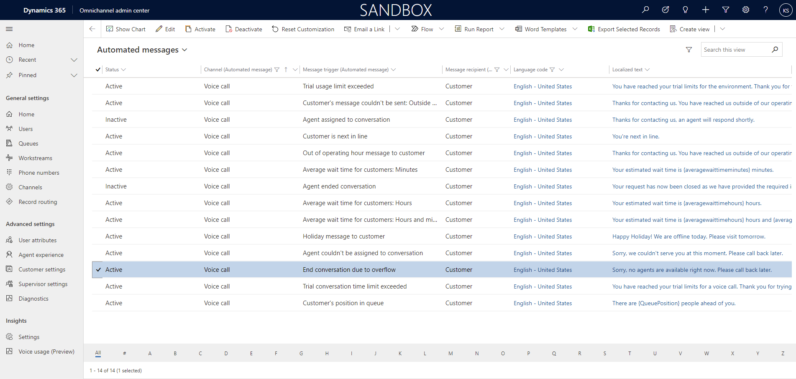

