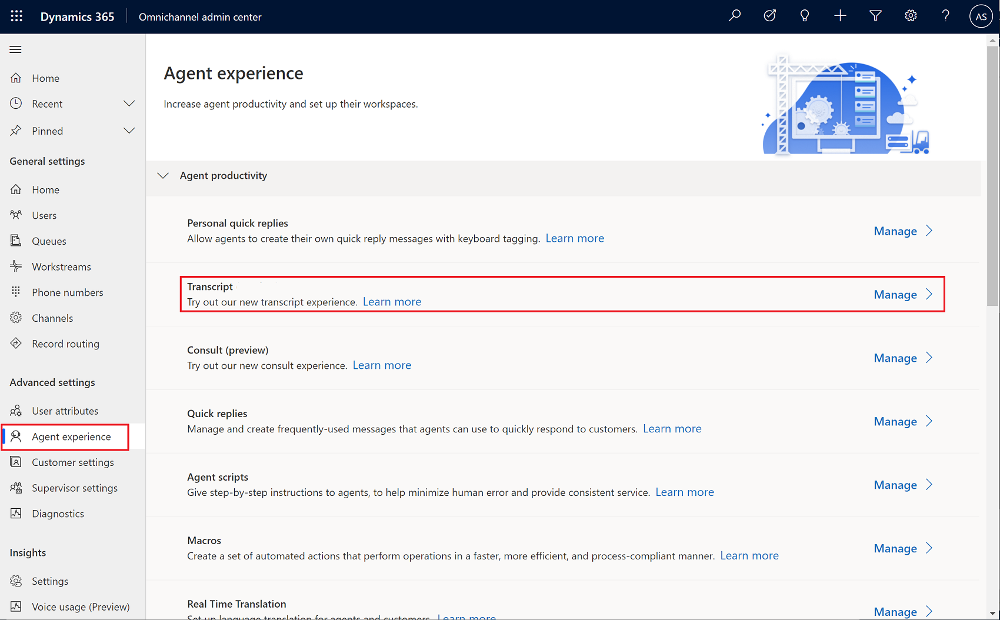
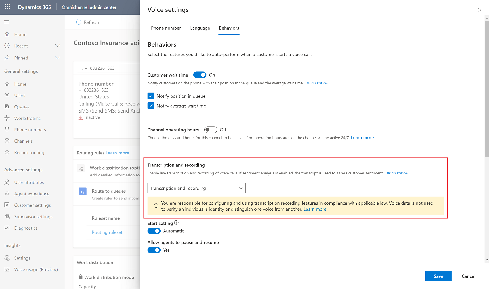
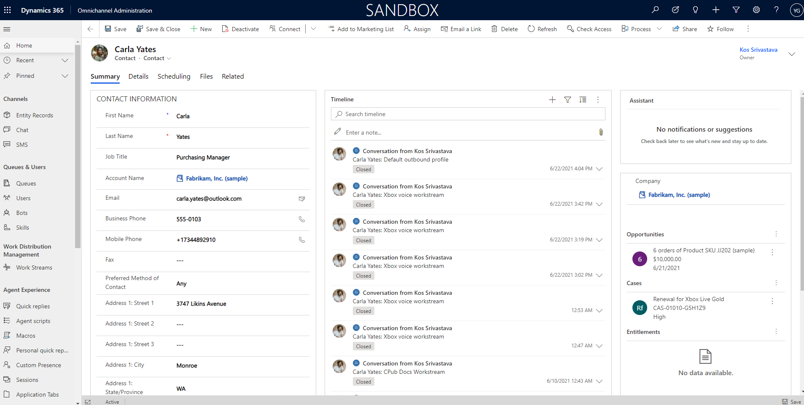

# Call recording and transcripts

New conversation form page, including recording playback, transcript, and overview and analytics tabs​

Admin toggle to turn on voice recording and transcript as part of voice channel modern admin app

Leverage of conversation control for displaying transcript ​

One code base for transcript control​

> [!div class="mx-imgBorder"]
> 

## Prerequisites

Enable the new transcript experience

> [!div class="mx-imgBorder"]
> 

Enable transcripts and recordings for each phone number in a workstream.

> [!div class="mx-imgBorder"]
> 

> [!Note]
>

>[!TIP] 
> 

## Go to a closed conversation

### From a user (agent)
Go to Users > Conversations > all conversations view

> [!div class="mx-imgBorder"]
> 

### From a contact (customer)

Go to Contact > Timeline > conversations

> [!div class="mx-imgBorder"]
> 

## View the conversation recording and transcript

Recording playback is available when the conversation is closed. The conversation is closed when both the agent and csutomer end the call. 

New UI design to align with modern admin, fluent UI​

Advanced playback features, including ​

Sentiment highlights​
    Green - positive
    Grey - neutral
    Red - negative

Click to scroll ​

Volume, speed, fast forward and rewind controls​

Conversation insight for voice channel (messaging channels will come in Oct)​

One united transcript views to be leveraged by other features​

Adaptive cards displaying in Transcript​

One download including both transcript and attachments

conversations recordings and transcripts are stored in CDS

Playback the call recording

Skip ahead or rewind

Adjust volume

> [!div class="mx-imgBorder"]
> 

Selecting a location in the recording visualization will move to the transcript location below. 

## Step 2:

## Configuration considerations
## Additional Notes
