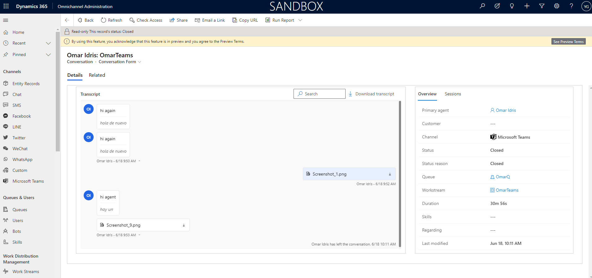

# Call recording and transcripts

New conversation form page, including recording playback, transcript, and overview and analytics tabs​

Admin toggle to turn on voice recording and transcript as part of voice channel modern admin app

Leverage of conversation control for displaying transcript ​

Same UX experience for C1, richer experience, eg, new webchat layout, markdown…​

One code base for transcript control​

New UI design to align with modern admin, fluent UI​

Advanced playback features, including ​

Sentiment highlights​

Click to scroll ​

Volume, speed, forward/backward controls​

Conversation insight for voice channel (messaging channels will come in Oct)​

One united transcript views to be leveraged by other features​

Adaptive cards displaying in Transcript​

One download including both transcript and attachments

## Prerequisites
> [!Note]
>

>[!TIP] 
> 

> [!div class="mx-imgBorder"]
> 

> [!div class="mx-imgBorder"]
> 

> [!div class="mx-imgBorder"]
> 

> [!div class="mx-imgBorder"]
> 

> [!div class="mx-imgBorder"]
> 

## Step 1:

> [!div class="mx-imgBorder"]
> 

## Step 2:

## Configuration considerations
## Additional Notes