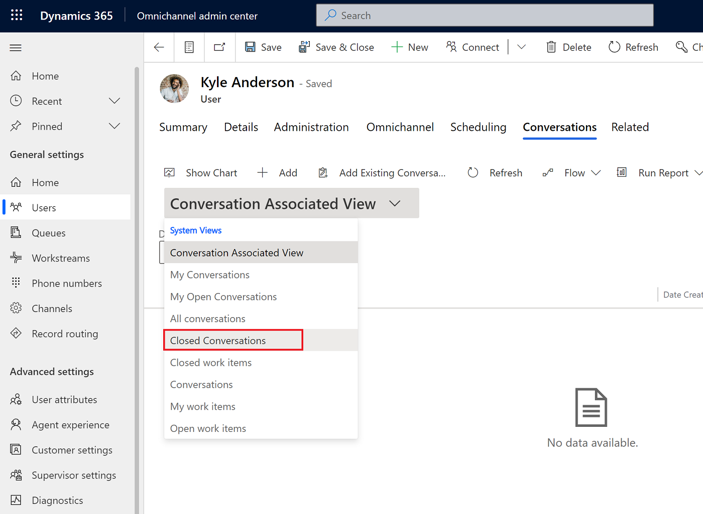

# Configure call recordings and transcripts in the voice channel 

[!INCLUDE[cc-use-with-omnichannel](../includes/cc-use-with-omnichannel.md)]

## Introduction

As an administrator, you can enable live transcription and recording of calls, which allows agents and supervisors to view transcripts of customer calls.

> [!NOTE]
> Many countries and states have laws and regulations that apply to the recording of PSTN, voice, and video calls, and may require that users first consent to the recording of their communications. It is your responsibility to use the call recording capabilities in compliance with the law. Before using call recording features, you must obtain consent from the parties of recorded communications in a manner that complies with all applicable laws for each participant.

## Enable call recordings and transcripts for voice

1. In the Omnichannel admin center, under **General settings** on the sitemap, select **Workstreams**.
2. Select the workstream for which you want to enable recordings and transcripts.
3. In the **Phone number** section, next to the pencil icon, select **Edit**.
4. On the **Voice settings** page, select the **Behaviors** tab.
   > [!div class="mx-imgBorder"]
   > 
5. In the **Transcription and recording** section, select the **Transcript and recording** dropdown menu, select either **Transcription** or **Transcription and recording**, depending on your preference.
6. Under **Start setting**, set the toggle to **Automatic** if you want calls to be automatically recorded and transcribed when they begin, or **Manual** if you want allow agents to choose when they start recording and transcribing their calls.
7. Set **Allow agents to pause and resume** if you want to allow agents to control the portions of conversations that they record and transcribe.
8. Select **Save**.

## View call transcripts

You can view the call transcriptions in Omnichannel admin center.

1. In the Omnichannel admin center, under **General settings** on the sitemap, select **Users**, and then select the user whose conversations you want to view.
2. Select the **Related** tab, and then select **Conversations** from the dropdown menu.
3. Select **Closed conversations** from the dashboard dropdown menu.

   > [!div class="mx-imgBorder"]
   > 

4. Select the conversation for which you want to access the recording and transcript.
  
   > [!div class="mx-imgBorder"]
   > 

### See also

[Overview of the voice channel](voice-channel.md)  
[Agent experience: View call recordings and transcripts](voice-channel-agent-experience.md)  

[!INCLUDE[footer-include](../includes/footer-banner.md)]
