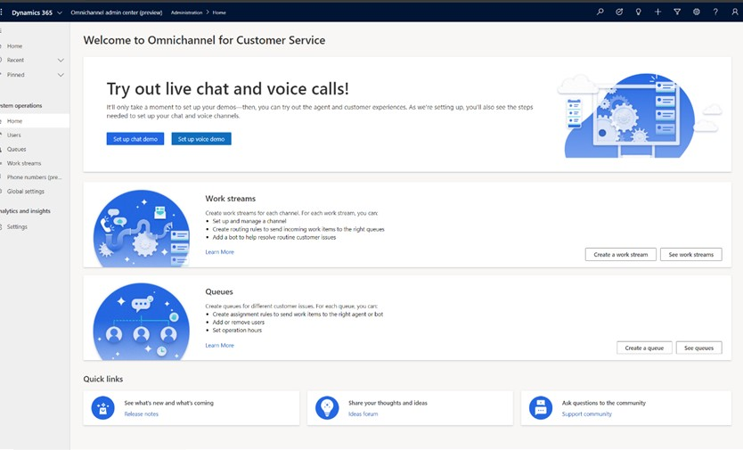
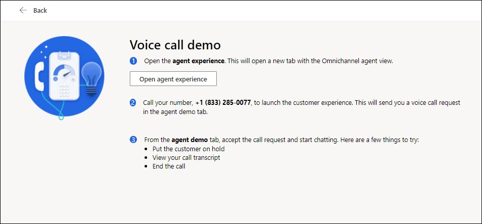
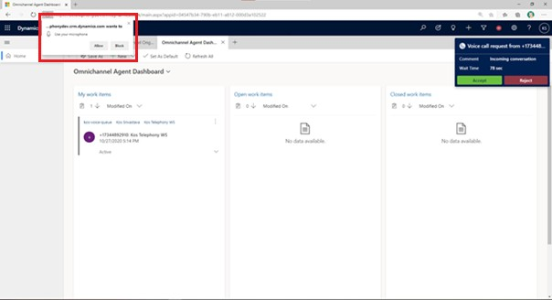

# Make and receive your first phone call

[!INCLUDE[cc-use-with-omnichannel](../includes/cc-use-with-omnichannel.md)]

When you want to try the voice channel for the first time in your org, the system sets it up for you to have the first-run experience. The tasks in this section take you through the automatic setup steps.

## Set up voice demo

1. In the **Omnichannel admin center** app, go to the Home page.

    

1. On the **Try out live chat and voice calls** page, select **Set up voice demo**. You're directed to the setup page. The demo set up is automatic; however, you can watch the progress on the **We're setting up your voice demo** page.

    > [!Note]
    > If someone in your org has already tried the first run experience, you'll see **Try voice** instead of **Set up voice demo**.

1.  After the demo is set up, the **Try out voice** page displays the option to **Open voice demo** and the settings that have been configured.

## Try out voice

1. On the **Try out voice** page, select **Open voice demo**.

    

1. On the **Voice call demo** page, select **Open agent experience**. The Omnichannel for Customer Service app opens on a new tab.

2. Follow the instructions that appear on the **Voice call demo** page to try the agent and customer experience.

3. Use a phone to initiate a call to the number listed on the **Voice call demo** page.

    > [!IMPORTANT]
    > In the Omnichannel for Customer Service app, when the call comes in, you may be prompted for microphone permissions. Select **Allow** on the pop-up window.

    

1. Select **Accept** on the incoming phone call to receive the call as an agent, and try the following through the call controls:

    - Mute and hold

    - See live call transcription and sentiment

    - Take notes (in the overflow)

    - Consult and transfer if other Omnichannel for Customer Service agents are signed in to the same environment

## View the demo settings

Perform the following steps to see the settings that have been automatically configured by the system for the voice demo:

1. On the **Try out live chat and voice calls** page, select **Try voice**.

2. On the page that appears, select **View** for each step to see the settings that have been automatically configured as part of the demo.

3. If you select **View** in the **Workstream, Phone number acquisition, or Voice channel** area, the workstream, routing rule, and work distribution settings that were configured as part of the demo setup are displayed.

4. If you select **View** in the **Queue** area, the queue information is displayed.

### See also

[Call a customer](voice-channel-call-customer.md)  
[Overview of the voice channel](voice-channel.md)  
[Use agent dashboard and call controls in the voice channel](voice-channel-agent-experience.md)  

[!INCLUDE[footer-include](../includes/footer-banner.md)]

