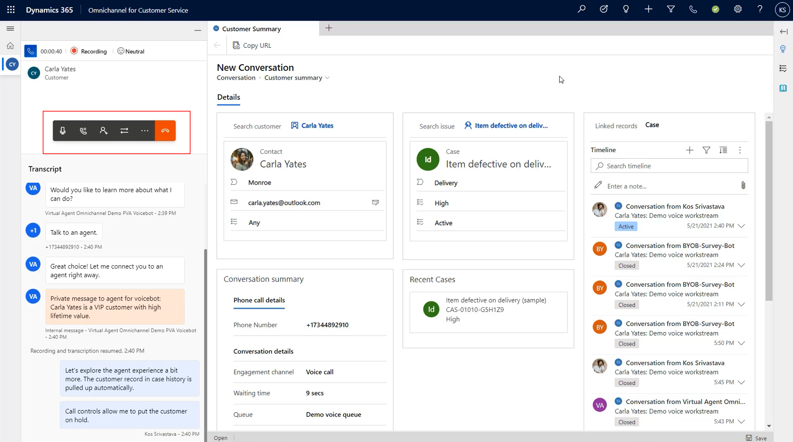

# Inbound calling

// Use the following videos for help in writing this doc
// Video references
// https://microsoft-my.sharepoint.com/:v:/p/kausri/EWPcqqb09OtKkN6_x5KhCy4B5WfyrPRN_yoU_Ez23Eswag?e=d3cseJ

// https://msit.microsoftstream.com/video/9c970840-98dc-869d-c827-f1ebc890b85b

## Prerequisites

- Agent
- Queue
- Phone Number
- Workstream 

## Make a call

Customers call the phone number for the support team. This number is typically posted on a website and within a mobile app. 

## Accept a call

> [!div class="mx-imgBorder"]
> 

[Manage notification settings and templates](https://docs.microsoft.com/dynamics365/app-profile-manager/notification-templates)

## Call controls

> [!div class="mx-imgBorder"]
> 

- Mute
- Hold
- Consult
- Transfer (to agent or queue)

## Set up inbound calling

Set up first run expereince
Open Voice demo

Phone Number

### Phone Numbers

> [!div class="mx-imgBorder"]
> 

### Language

> [!div class="mx-imgBorder"]
> 

> [!div class="mx-imgBorder"]
> 

### Behaviors

> [!div class="mx-imgBorder"]
> 

### Routing Rules

> [!div class="mx-imgBorder"]
> 

> [!div class="mx-imgBorder"]
> 

## See also
- Add a Power Virtual Agent Bot
- Unified routing

