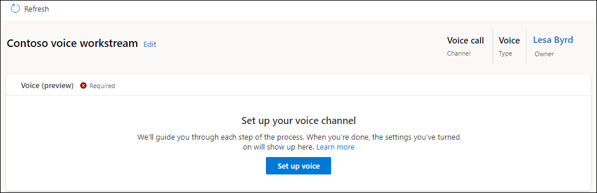
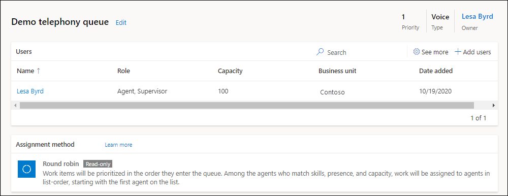

# Set up inbound calling

[!INCLUDE[cc-use-with-omnichannel](../includes/cc-use-with-omnichannel.md)]

Configure inbound calling to set up the voice channel in Customer Service. You can enable your customer service representatives to communicate with customers on the phone to resolve issues using the voice channel.

## Prerequisites

Ensure that the following prerequisites are met:

- Voice channel is provisioned. More information: [Provision Omnichannel for Customer Service](omnichannel-provision-license.md)
- Unified routing is enabled. More information: [Provision unified routing](provision-unified-routing.md)

## Set up a voice workstream

Do the following to configure a workstream for voice:

1. On the left pane, select **Workstreams**, and then on the **Create a workstream** dialog, enter the following.

2. Enter the following details for the workstream:

    - **Name:** An intuitive name, such as Contoso voice workstream.
    - **Type:** Select **Voice**.

    > [!Note]
    > By default, **Owner** and **Channel** are predefined and unavailable, and only push is available for work distribution mode.

3. Select **Create**. The workstream that you created is displayed.

    

## Configure a voice channel

To configure the voice channel, you'll need to associate the workstream with a phone number for routing the calls. You can view the list of available phone numbers by selecting **Phone numbers** in the left pane. To get a new number, you can select **Add number** on the **Phone numbers** page. More information: [Acquire a phone number](#acquire-a-phone-number)

1. Go to the workstream that you created, and on the page that appears, select **Set up voice**.

2. On the **Phone number** page, select a number from the list, and select **Next**.

    > [!NOTE]
    - Only those numbers are displayed that have inbound calls enabled and are not already associated with any other workstream. Use the steps in [Acquire a phone number](#acquire-a-phone-number) if you want to configure a new number.
    - The voice channel only supports anonymous inbound calls that use Direct Routing.

3. On the **Language** page, select **Add primary language** and perform the steps to configure the primary language. More information: [Allow customers to choose a language](voice-channel-multi-language-contact-center.md)

4. On the **Behaviors** tab, turn on the **Customer wait time** toggle, and select the following options:

   - Notify position in queue
   - Notify average wait time

5. Turn on the **Channel operating hours** toggle, and select an operating hour record. More information: [Configure operating hours for your business](create-operating-hours.md)

6. Configure the settings for transcription and recording of the calls in the **Transcription and recording** area. More information: [Configure call recordings and transcripts](voice-channel-configure-transcripts.md)

7. Select **Add** for **Custom automated messages**, then select a default template message as the trigger, and then enter the custom automated message text. For information about automated messages, see [Configure automated messages](configure-automated-message.md)

8. Turn on the **Call transfer to external phone number** toggle to allow agents to transfer the call to an external number.

    :::image type="content" source="media/voice-channel-workstream-summary.png" alt-text="Summary settings of the voice channel workstream":::

9. Turn on the toggle for **Consult with Microsoft Teams user** to enable the agents to consult other agents on Microsoft Teams. More information: [Voice consult with a Microsoft Teams user](voice-consult-microsoft-teams-user.md)

10. On the **Summary** page, select **Save and close**.

The phone number is associated with the workstream.

:::image type="content" source="media/voice-workstream-configured.png" alt-text="Configured workstream for voice":::

## Acquire a phone number

Do the steps mentioned in [Manage phone numbers](voice-channel-manage-phone-numbers.md) to acquire a phone number.

## Create queues for voice channels

In Customer Service, work items are assigned to a queue and agent with the help of unified routing. Unified routing is an intelligent, scalable, and enterprise grade routing and assignment capability that can assign the incoming work item to the best suited queue and agent while adhering to work item requirements and matching them with the agent's capabilities using round robin routing. More information: [Overview of unified routing](overview-unified-routing.md)

In this section, we'll cover information on how to create a queue for the voice channel and routing rules to evaluate conditions and assign work items.

### Create a queue for the voice channel

In the left pane, select **Queues**, and then complete the following steps to create a queue for the voice channel:

1. On the **Queues** page, select **New**, and on **Create a queue** dialog, enter the following details.

    - **Name**: Specify a name.
    - **Type**: Select **Voice**.
    - **Group number**: Enter a number.

1. Select **Create**. The queue is created.

1. On the queue page, select **Add users**, and on the **Add users** flyout menu that appears, select the users and select **Add**.

   > [!NOTE]
   >
   >  - You can add only those users who are configured for unified routing.
   >  - After 20 minutes of being added to a queue, agents must refresh their dashboards to be able to receive calls.

   

### Configure call overflow for the voice queue

With call overflow, you can reduce the wait time for customer calls by setting options for voice queues. More information: [Manage overflow](manage-overflow.md)

### Assignment rules for a queue

By default, the assignment method for a voice queue is round robin. In the round robin method, work items will be prioritized in the order they enter the queue. Among the agents who match skills, presence, and capacity, work will be assigned to agents in the order they're listed. The agent listed on the top is assigned first. You can also choose highest capacity or create custom assignment methods. More information: [Assignment methods](assignment-methods.md)

For a simple and quick voice call routing, you don't need to set up any rules for unified routing. By default, all the incoming voice calls will be routed to the "default voice queue" and will be assigned to the agents with the round robin assignment method.

## Configure routing rules for the voice workstream

Go to the workstream for which you've configured the voice channel and do the following steps:

1. In the **Routing rules** area, in the **Route to queues** option, select **Create ruleset**.

2. On the **Create route-to-queues ruleset** dialog, provide a name and description, and then select **Create**.

3. On the page that appears, select **Create rule**.

4. On the **Create rule** page, enter a rule name, and in **Conditions**, define the set of conditions using the conversation entity and related entity attributes.

5. In **Route to queues**, select the queue that you created and to which the voice call must be routed when the conditions specified are met.

6. To configure percentage-based distribution of work items, see [Percentage-based allocation of work to queues](configure-route-to-queue-rules.md#percentage-based-allocation-of-work-to-queues)

7. Select **Create**. The rule is created and appears in the list of rules.

8. Create as many rules as your business requires.

## Configure work classification rules

You can configure work classification rules for the voice workstream to add detailed information to incoming work items. This information can be used to route the calls optimally. More information: [Configure work classification](configure-work-classification.md)

### See also

[Overview of voice channel in Omnichannel for Customer Service](voice-channel.md)  
[Overview of unified routing](overview-unified-routing.md)  
[Assignment methods](assignment-methods.md)  
[Set up outbound calling](voice-channel-outbound-calling.md)  
[Configure outbound and inbound profiles](configure-outbound-inbound-profiles.md)  
[Manage phone numbers](voice-channel-manage-phone-numbers.md)  
[Use voicemail to handle overflow of calls](voice-channel-voicemail.md)  

[!INCLUDE[footer-include](../includes/footer-banner.md)]
