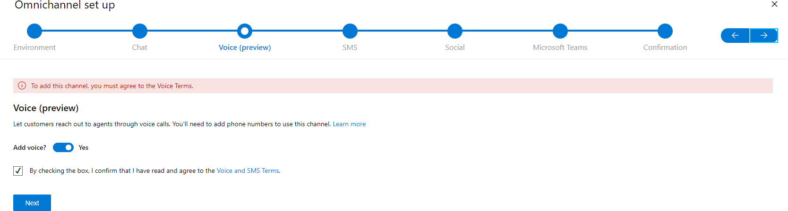

# Preview: Provision the voice channel

[!INCLUDE[cc-use-with-omnichannel](../includes/cc-use-with-omnichannel.md)]

> [!IMPORTANT]
> [!INCLUDE[cc-preview-feature](../includes/cc-preview-feature.md)]
>
> [!INCLUDE[cc-preview-features-definition](../includes/cc-preview-features-definition.md)]
>
> [!INCLUDE[cc-preview-features-expect-changes](../includes/cc-preview-features-expect-changes.md)]
>
> [!INCLUDE[cc-preview-features-no-ms-support](../includes/cc-preview-features-no-ms-support.md)]
>
> [!INCLUDE[cc-preview-features-send-us-feedback](../includes/cc-preview-features-send-us-feedback.md)]

## Prerequisites

Make sure that the following prerequisites are met:

- [Prerequisites for provisioning Omnichannel for Customer Service](omnichannel-provision-license.md#prerequisites).
- Sign up for the voice channel through the private preview program.
- The **Global Tenant Admin** and **Dynamics 365 System Admin** permissions for your organization.

## Set up the voice channel

To set up the voice channel, you will perform the steps for provisioning Omnichannel for Customer Service. More information: [Provision Omnichannel for Customer Service](omnichannel-provision-license.md)

1. On the **Omnichannel set up** page, from the **Select an environment** dropdown list, select the environment you identified when you opted in to the private preview program.

    > [!Note]
    > If you choose an environment other than the one you identified for the private preview, the provisioning flow will be different and you won't be able to see the voice channel features.

2. Make sure that **Add voice** is toggled to **Yes**, and select the checkbox to accept the terms.

    

3. Confirm your selections, and then select **Finish**. The installation begins.

## Get the required security roles

After the installation is complete, perform the tasks in [Assign roles and enable users for Omnichannel for Customer Service](add-users-assign-roles.md) to assign the following security roles to your users:

- Common Data Service User
- Customer Service Representative
- Omnichannel administrator
- Omnichannel supervisor
- Omnichannel agent
- Productivity tools user
- Productivity tools administrator

## Sign in to the Omnichannel admin center app

As an administrator, you will perform all configuration and setting up tasks in the Omnichannel admin center app as follows:

1. Sign in to Dynamics 365.

2. On the Apps page, select **Omnichannel admin center** app. The following page appears.

> [!div class="mx-imgBorder"]
> 

### See also

[Overview of voice channel in Omnichannel for Customer Service](voice-channel.md)  
[Configure unified routing for the voice channel](voice-channel-route-queues.md)  
[Overview of unified routing](overview-unified-routing.md)  