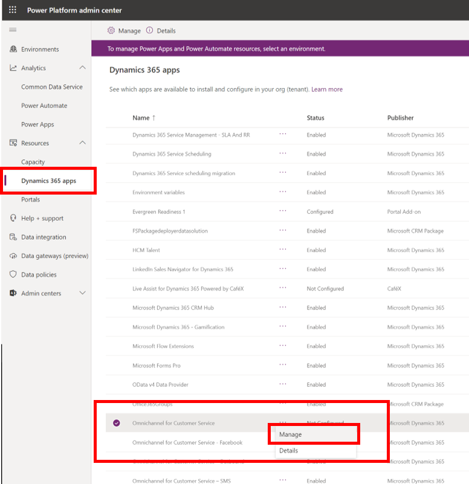
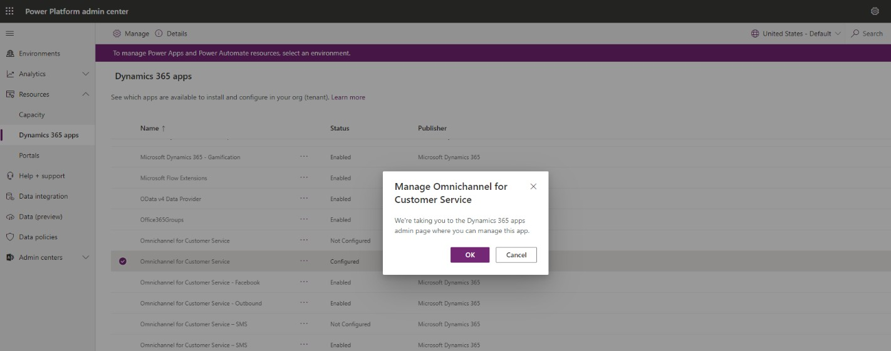
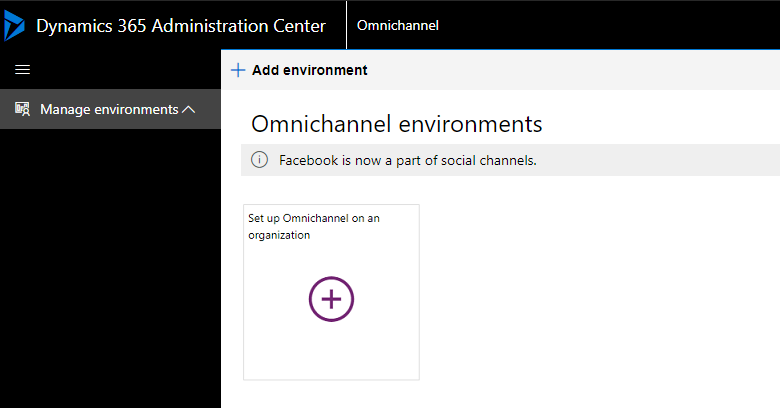
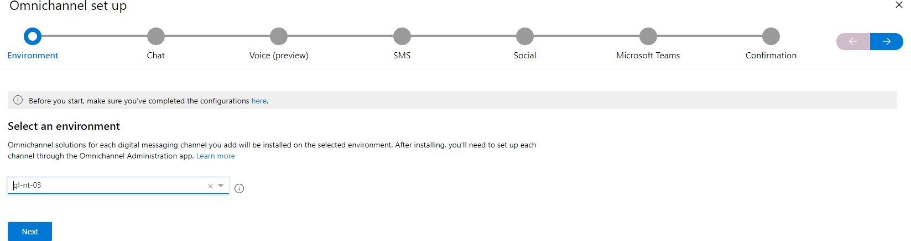
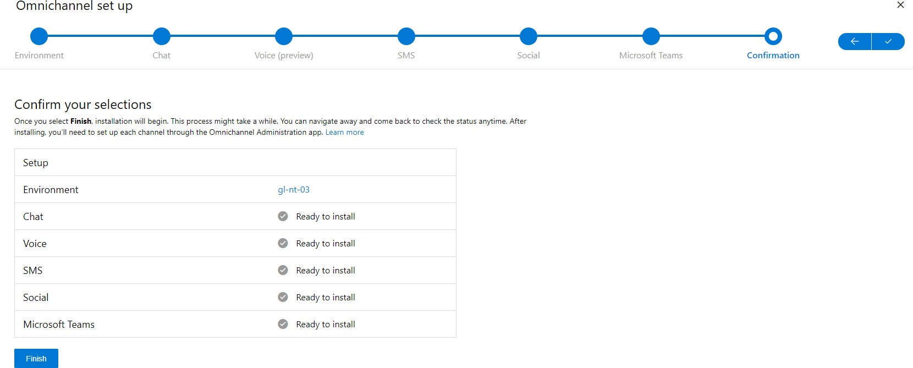
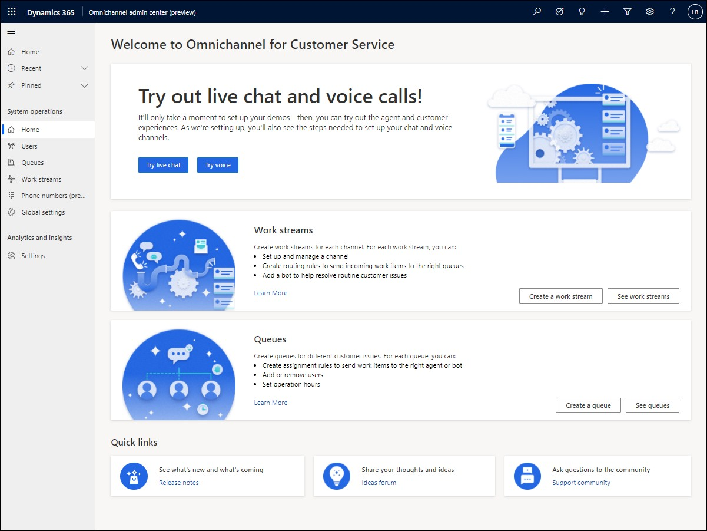

# Install and provision the voice channel

# Step 1: Install the voice channel preview

1.  In **Power Platform Admin Center**, on the **Environments** page, select the environment in which you want to set up the voice channel.

2.  In the left pane, expand **Resources**, and select **Dynamics 365 Apps**.

3.  On the **Dynamics 365 apps** page, select **More commands** beside **Omnichannel for Customer Service**, and then select **Manage**.

> [!div class="mx-imgBorder"]
> 

1.  On the **Manage Omnichannel for Customer Service** message, select **OK**. The **Dynamics 365 Administration Center | Omnichannel** page is displayed on a new tab.

> [!div class="mx-imgBorder"]
> 

1.  On the **Manage Omnichannel Instances** page, select **Add Org** to add an organization. Omnichannel is set up on the organization environment that you add here.

> [!div class="mx-imgBorder"]
> 

1.  On the **Omnichannel set up** page, from the **Select an environment** drop-down list, select the environment you identified when you opted in to the private preview program.

**Note:** If you choose an environment other than the one you identified for the private preview, the provisioning flow will be different and you won't be able to see the voice channel features.

> [!div class="mx-imgBorder"]
> 

1.  Select the channels you want to install in your environment, make sure that **Add voice** is toggled to **Yes**, and select the check box to accept the terms.

1.  Confirm your selections, and then select **Finish**. The installation begins.

## Get the required security roles

After the installation is complete, perform the tasks in [*Assign roles and enable users for Omnichannel*](https://docs.microsoft.com/dynamics365/omnichannel/administrator/add-users-assign-roles) [*for Customer Service*](https://docs.microsoft.com/dynamics365/omnichannel/administrator/add-users-assign-roles) to assign yourself the following security roles:

-   Common Data Service User
-   Customer Service Representative

-   Omnichannel administrator

-   Omnichannel supervisor

-   Omnichannel agent

-   Productivity tools user

-   Productivity tools administrator

## Sign in to Omnichannel admin center (preview) app

As an administrator, you will perform all configuration and setting up tasks in the Omnichannel admin center (preview) app as follows.

1.  Sign in to Dynamics 365.

2.  On the Apps page, select **Omnichannel admin center (preview)** app. The following page appears.

> [!div class="mx-imgBorder"]
> 

